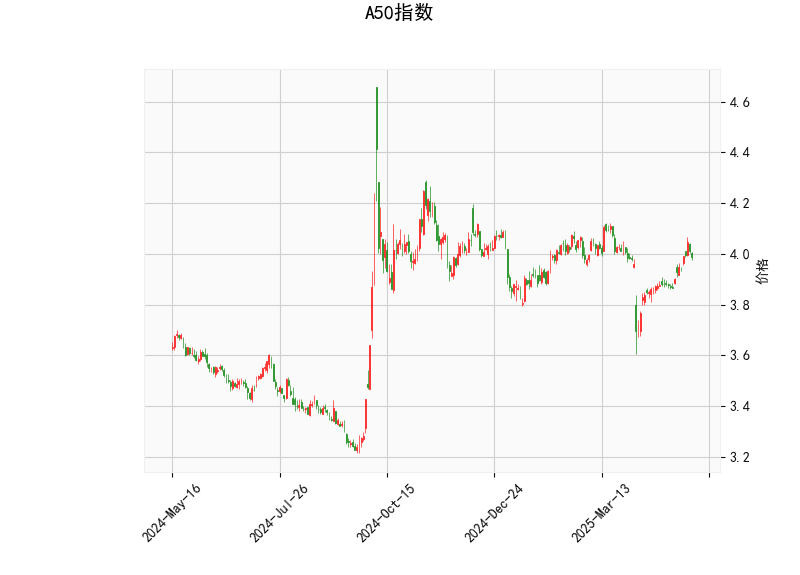

### A50指数的技术分析结果分析

#### 1. 总体概述
A50指数当前价格为3.989，基于提供的指标显示，市场呈现出中性偏多头的态势，但存在潜在的反转风险。RSI和MACD指标均显示出一定的上涨动能，而布林带表明价格处于相对稳定的区间内。然而，K线形态中的Hikkake模式暗示了可能的短期反转信号。以下是对各指标的详细分析。

#### 2. 关键指标分析
- **RSI（相对强弱指数）**：当前值为58.95。这表明A50指数处于中性偏多头状态，通常RSI高于50代表买方力量占优，但未达到70的超买阈值，因此短期内没有强烈的卖出信号。RSI的这一水平暗示市场可能继续小幅上涨，但如果RSI快速接近70，可能需要警惕回调风险。
  
- **MACD（移动平均收敛散度）**：MACD线（0.023）高于信号线（0.006），且直方图（0.017）为正值，这是一个典型的看涨信号。MACD的正直方图表示短期均线向上穿越长期均线，暗示价格可能进一步上涨。然而，如果MACD直方图开始收窄或转为负值，将是潜在的看跌预警。

- **布林带（Bollinger Bands）**：上轨为4.147、中轨为3.958、下轨为3.769。当前价格（3.989）位于中轨上方但未触及上轨，这表明价格处于布林带的正常波动范围内，市场相对稳定。价格接近上轨可能预示着短期上行压力，但如果跌破中轨（3.958），则可能触发下行趋势。布林带的宽度显示当前波动率中等，如果价格持续在中轨与上轨之间震荡，将维持盘整格局。

- **K线形态**：检测到Hikkake模式（CDLHIKKAKE）。这是一种常见的反转形态，通常在上涨趋势中出现，暗示潜在的下行反转风险。Hikkake模式可能表示市场多头陷阱，如果后续K线确认反转（如价格跌破近期低点），则投资者需谨慎。结合其他指标，这可能是一个短期卖出信号的早期迹象。

#### 3. 整体市场解读
综合以上指标，A50指数短期内显示出看涨倾向（RSI和MACD支持），但Hikkake模式的出现增加了不确定性。市场可能处于一个盘整阶段，价格在布林带中轨与上轨之间波动。如果外部因素（如经济数据或全球事件）推动价格向上突破上轨，上涨动能将加强；反之，如果Hikkake模式得到验证，价格可能回落至下轨附近。总体而言，当前技术面偏向中性，需密切关注后续K线形态和指标变化。

### 近期可能存在的投资或套利机会和策略分析

#### 1. 潜在投资机会
- **看涨机会**：基于RSI（58.95）和MACD的正信号，如果价格能稳定在中轨以上并向上测试上轨（4.147），这可能是一个买入机会。短期内，A50指数若突破上轨，可能吸引更多多头资金，推动进一步上涨。建议投资者在RSI未超买（<70）的情况下，考虑小仓位买入指数相关产品（如ETF或期货）。

- **风险管理**：Hikkake模式的潜在反转风险较高。如果价格跌破中轨（3.958），这可能触发回调，投资者应设置止损位（如在3.900附近）。总体风险中等，适合风险偏好中性的投资者。

#### 2. 套利机会
- **跨市场套利**：A50指数作为中国A股50大蓝筹股的代表，可能与相关期货（如A50期货）或期权存在价差。如果现货价格（3.989）与期货价格出现偏差，投资者可以进行现货-期货套利。例如，如果期货价格高于现货（反映市场预期上涨），则可卖出期货并买入现货锁定收益。但需注意，Hikkake模式的反转风险可能放大价差波动，需实时监控。

- **期权策略**：利用布林带的波动性，进行期权套利。例如，购买看涨期权（Call Option）以捕捉潜在上行突破，同时购买看跌期权（Put Option）作为对冲Hikkake反转风险。这可以构建一个价差中性策略（如牛市价差或铁蝶式），在价格小幅波动时获利。当前价格在中轨附近，隐含波动率可能较低，提供较好的入场点。

#### 3. 推荐策略
- **短期策略**： 
  - **多头策略**：若MACD直方图继续扩大和RSI保持在50-70区间，建议买入A50相关资产，目标价位设在上轨（4.147）附近。止损设在中轨以下（3.900），以控制Hikkake反转风险。
  - **空头策略**：如果K线确认Hikkake反转（如连续阴线），考虑卖出或做空，目标价位下移至下轨（3.769）。这适合风险厌恶者。

- **中长期策略**：观察整体趋势，避免短期波动。结合基本面因素（如中国经济数据），如果RSI和MACD持续看涨，可转为持仓策略。套利者可利用自动化工具监控价差，执行低风险套利交易。

- **风险提示**：所有策略需结合市场流动性、市场情绪和全球事件（如中美贸易动态）评估。Hikkake模式的潜在反转可能导致快速回调，建议控制仓位不超过总资金的30%，并定期复盘指标变化。

总体而言，近期A50指数的投资机会以短期多头为主，但需警惕反转风险；套利机会则聚焦于衍生品价差。投资者应根据个人风险承受能力调整策略，并持续跟踪技术指标。