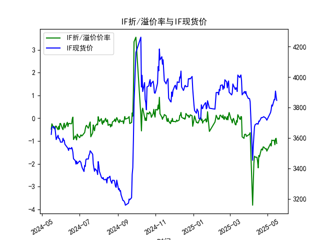
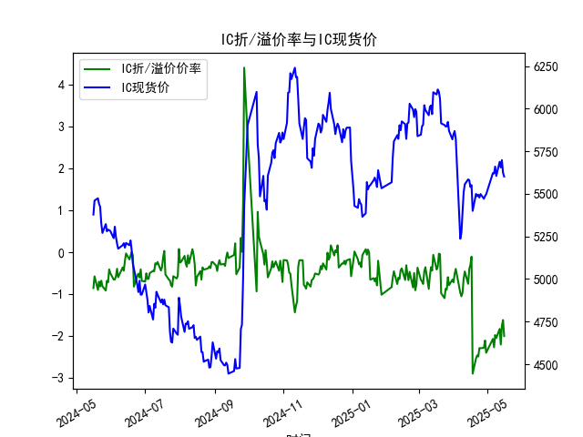
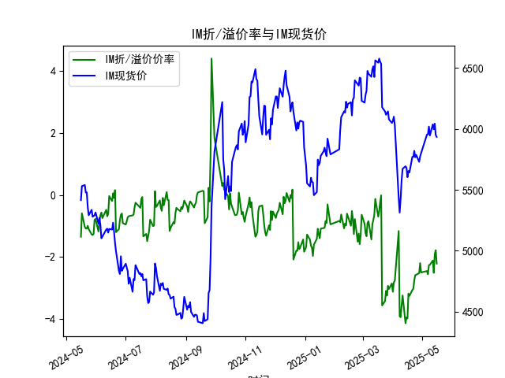

|            |   IF折/溢价率 |   IF现货价 |   IH折/溢价率 |   IH现货价 |   IC折/溢价率 |   IC现货价 |   IH折/溢价率 |   IH现货价 |
|:-----------|--------------:|-----------:|--------------:|-----------:|--------------:|-----------:|--------------:|-----------:|
| 2025-04-16 |     -2.17398  |     3690.8 |     -0.296286 |     5540.4 |     -0.296286 |     5540.4 |      -3.98173 |     5603   |
| 2025-04-17 |     -1.63358  |     3710.6 |     -0.104562 |     5551.2 |     -0.104562 |     5551.2 |      -3.18113 |     5653.8 |
| 2025-04-18 |     -1.68913  |     3708.8 |     -2.89029  |     5400   |     -2.89029  |     5400   |      -3.25269 |     5642   |
| 2025-04-21 |     -1.36545  |     3733.2 |     -2.52696  |     5499.8 |     -2.52696  |     5499.8 |      -3.06818 |     5770   |
| 2025-04-22 |     -1.34653  |     3733   |     -2.45739  |     5486   |     -2.45739  |     5486   |      -3.02072 |     5769.6 |
| 2025-04-23 |     -1.39646  |     3734   |     -2.48358  |     5495   |     -2.48358  |     5495   |      -2.75012 |     5820   |
| 2025-04-24 |     -1.25668  |     3736.8 |     -2.28117  |     5478   |     -2.28117  |     5478   |      -2.58556 |     5767.4 |
| 2025-04-25 |     -1.26205  |     3739.2 |     -2.28499  |     5498.6 |     -2.28499  |     5498.6 |      -2.57433 |     5786.6 |
| 2025-04-28 |     -1.34913  |     3730.6 |     -2.27382  |     5471   |     -2.27382  |     5471   |      -2.51923 |     5729   |
| 2025-04-29 |     -1.33181  |     3724.8 |     -2.10005  |     5487.2 |     -2.10005  |     5487.2 |      -2.19842 |     5773.6 |
| 2025-04-30 |     -1.44197  |     3716.2 |     -2.39398  |     5497   |     -2.39398  |     5497   |      -2.49939 |     5801.4 |
| 2025-05-06 |     -1.11177  |     3766.2 |     -2.06144  |     5622   |     -2.06144  |     5622   |      -2.45329 |     5953.2 |
| 2025-05-07 |     -1.2169   |     3785   |     -2.26234  |     5620.2 |     -2.26234  |     5620.2 |      -2.55739 |     5955.2 |
| 2025-05-08 |     -0.957625 |     3816   |     -1.97107  |     5660   |     -1.97107  |     5660   |      -2.2617  |     6018.8 |
| 2025-05-09 |     -0.976471 |     3808.6 |     -2.04348  |     5604.8 |     -2.04348  |     5604.8 |      -2.25057 |     5945.2 |
| 2025-05-12 |     -0.966676 |     3853   |     -1.82396  |     5688   |     -1.82396  |     5688   |      -2.1153  |     6037   |
| 2025-05-13 |     -1.16158  |     3851   |     -2.19778  |     5654.6 |     -2.19778  |     5654.6 |      -2.51032 |     5996.6 |
| 2025-05-14 |     -0.908163 |     3907.4 |     -1.74715  |     5697.8 |     -1.74715  |     5697.8 |      -1.90524 |     6043   |
| 2025-05-15 |     -0.880406 |     3872.8 |     -1.6149   |     5623   |     -1.6149   |     5623   |      -1.78364 |     5949   |
| 2025-05-16 |     -1.10785  |     3846   |     -1.99531  |     5601.8 |     -1.99531  |     5601.8 |      -2.21348 |     5933.8 |

### 1. 股指期货折/溢价率与现货价的相关性及影响逻辑

股指期货的折/溢价率（Basis Percent）是指期货价格相对于现货价格的百分比差值，通常用于衡量两者之间的价差。如果期货价格高于现货价格，则为溢价（正值）；如果低于，则为折价（负值）。这种率与现货价之间存在密切的相关性和影响逻辑，主要源于市场供需、预期和套利机制。

#### 相关性
- **正相关性在短期内表现明显**：折/溢价率往往随现货价波动而变化。现货价上涨时，期货价格通常也会跟随上涨，导致溢价率缩小或转为正值；现货价下跌时，期货价格可能滞后或进一步下行，导致折价率加深。数据显示（如IF、IH等指数），折/溢价率和现货价（CLOSE）在大多数时间呈现同步变动趋势，例如2024-05-16至2025-05-16期间，现货价波动时折/溢价率也相应调整。
- **非完美相关性**：虽然两者相关，但期货价格受持有成本（如融资利息、股息调整）和市场预期影响，可能导致短期偏差。例如，在预期经济下行时，期货可能出现更大折价，即使现货价相对稳定。

#### 影响逻辑
- **基础理论（无套利原理）**：根据期货定价理论，期货价格应等于现货价格加上持有成本（如存储费、融资成本）。如果折价率过大（负值增大），表示期货被低估，可能吸引投资者通过“买入期货、卖出现货”的套利策略获利；反之，如果溢价率过高，投资者可能“卖出期货、买入现货”。这会推动两者价格趋同。
- **市场因素影响**：
  - **预期与情绪**：如果市场预期现货价将下跌，期货可能提前折价（如IH在2025-05-16的-1.995313%）；反之，乐观预期可能导致溢价。现货价的实际变动会强化或修正这种预期。
  - **供需不平衡**：高流动性现货市场可能导致现货价短期波动，而期货市场受合约限制，容易出现折价（如IM的持续负值，平均在-1%至-2%）。
  - **经济周期**：在经济不确定期（如2024年底的波动），折价率加深往往与现货价下降相关，因为投资者风险厌恶导致期货需求减少。
  - **外部事件**：如政策变化或全球事件，会放大两者间价差。现货价作为基准，直接影响期货定价逻辑。

总体而言，折/溢价率是现货价的重要衍生指标，能揭示市场 inefficiencies，但长期来看，两者会通过套利机制回归均衡。

### 2. 基于数据分析判断近期投资机会

根据提供的数据，我分析了IF、IH、IC和IM四个股指期货的近1年数据（2024-05-16至2025-05-16），重点聚焦最近一周（2025-05-09至2025-05-16）的变化，尤其是2025-05-16（今日）相对于2025-05-15（昨日）的变化。数据显示，所有指数均处于折价状态，且折价率整体加深，现货价呈小幅下降趋势。以下是详细分析和判断。

#### 近期数据概述
- **最近一周关键数据摘要**（基于日期排序，仅列出相关指标）：

| 指数 | 日期       | 折/溢价率 (%) | 现货价 (CLOSE) | 与昨日变化（折/溢价率） | 与昨日变化（现货价） |
|------|------------|---------------|----------------|--------------------------|----------------------|
| IF   | 2025-05-09 | -0.822941    | 3870.6        | -                        | -                   |
| IF   | 2025-05-12 | -0.966676    | 3853.0        | 加深（-0.143735）       | 下降（-17.6）       |
| IF   | 2025-05-13 | -1.161584    | 3851.0        | 加深（-0.194908）       | 下降（-2.0）        |
| IF   | 2025-05-14 | -0.908163    | 3907.4        | 缩小（+0.253421）       | 上涨（+56.4）       |
| IF   | 2025-05-15 | -0.880406    | 3872.8        | 缩小（+0.027757）       | 下降（-34.6）       |
| IF   | 2025-05-16 | -1.107854    | 3846.0        | 加深（-0.227448）       | 下降（-26.8）       |
| IH   | 2025-05-09 | -1.494742    | 5644.0        | -                        | -                   |
| IH   | 2025-05-12 | -1.823960    | 5688.0        | 加深（-0.329218）       | 上涨（+44.0）       |
| IH   | 2025-05-13 | -2.197779    | 5654.6        | 加深（-0.373819）       | 下降（-33.4）       |
| IH   | 2025-05-14 | -1.747146    | 5697.8        | 缩小（+0.450633）       | 上涨（+43.2）       |
| IH   | 2025-05-15 | -1.614905    | 5623.0        | 缩小（+0.132241）       | 下降（-74.8）       |
| IH   | 2025-05-16 | -1.995313    | 5601.8        | 加深（-0.380408）       | 下降（-21.2）       |
| IC   | 2025-05-09 | -1.494742    | 5644.0        | -                        | -                   |
| IC   | 2025-05-12 | -1.823960    | 5688.0        | 加深（-0.329218）       | 上涨（+44.0）       |
| IC   | 2025-05-13 | -2.197779    | 5654.6        | 加深（-0.373819）       | 下降（-33.4）       |
| IC   | 2025-05-14 | -1.747146    | 5697.8        | 缩小（+0.450633）       | 上涨（+43.2）       |
| IC   | 2025-05-15 | -1.614905    | 5623.0        | 缩小（+0.132241）       | 下降（-74.8）       |
| IC   | 2025-05-16 | -1.995313    | 5601.8        | 加深（-0.380408）       | 下降（-21.2）       |
| IM   | 2025-05-09 | -1.953202    | 5988.6        | -                        | -                   |
| IM   | 2025-05-12 | -2.115305    | 6037.0        | 加深（-0.162103）       | 上涨（+48.4）       |
| IM   | 2025-05-13 | -2.510316    | 5996.6        | 加深（-0.395011）       | 下降（-40.4）       |
| IM   | 2025-05-14 | -1.905238    | 6043.0        | 缩小（+0.605078）       | 上涨（+46.4）       |
| IM   | 2025-05-15 | -1.783640    | 5949.0        | 缩小（+0.121598）       | 下降（-94.0）       |
| IM   | 2025-05-16 | -2.213479    | 5933.8        | 加深（-0.429839）       | 下降（-15.2）       |

- **总体趋势**：最近一周，所有指数的折/溢价率主要呈加深趋势（负值增大），现货价波动较大，但以下降为主。今日（2025-05-16）相对于昨日（2025-05-15）的变化尤为明显：折/溢价率进一步加深（例如IF从-0.880406%到-1.107854%，加深约0.23%），现货价普遍下降（IF下降26.8点，IH下降21.2点）。这表明市场可能在短期内转向看跌，折价率扩大可能源于投资者风险偏好下降。

#### 投资机会判断
- **可能存在的投资机会**：
  - **套利机会（主要）**：所有指数均在深度折价（折/溢价率在-1%至-2%），且今日折价率较昨日加深，这可能创造套利空间。例如，IF的折价率从-0.880406%加深到-1.107854%，表示期货被低估。投资者可考虑“买入期货、卖出现货”的策略，待价差收窄获利。但需注意，最近一周现货价的下降趋势可能放大风险，建议在折价率稳定后入场。
  - **IH和IC的相对机会**：这两者数据相似，今日折价率加深至-1.995313%，而现货价下降但幅度较小（-21.2点）。如果市场预期反弹（如经济数据改善），IH/IC可能有短期反弹机会，尤其若折价率从-2%附近回升。
  - **IM的潜在机会**：IM的折价率今日加深至-2.213479%，现货价微降（-15.2点），这与整体市场下行一致。若IM的折价率继续扩大至-2.5%以下，可能出现更明显的套利点，但当前缺乏明显信号。
  
- **风险与建议**：
  - **无明显多头机会**：近期数据显示折价率加深与现货价下降同步，表明市场情绪偏空（如2025-05-16的普遍负向变化），短期内可能无多头投资机会。今日相对于昨日的加深趋势强化了这一判断。
  - **关注点**：投资者应密切监控外部因素（如政策或经济数据），若折价率在未来1-2天内收窄（例如IF从-1.1%回升），可能信号反弹。总体谨慎，建议止损设置在现货价进一步下降5%时。
  - **综合评估**：基于数据，短期投资机会以套利为主，但风险较高（市场可能继续下行）。优先考虑IF和IH，由于其折价率变化更活跃。

