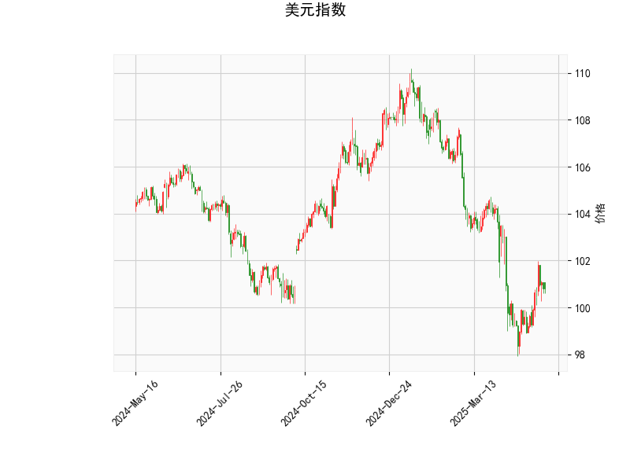

### 1. 美元指数的技术分析

美元指数当前价位为100.8196，基于提供的指标，我们可以从多个角度对其进行分析，以评估其短期趋势和潜在信号。

- **RSI（相对强弱指数）**: 当前值为49.73，处于中性区域（30-70之间）。这表明美元指数近期未出现明显的超买或超卖状态，市场力量相对平衡。但RSI接近50下方，暗示短期内可能存在下行压力或横盘整理，如果跌破30，将进入超卖区，可能预示反弹机会。

- **MACD（移动平均收敛散度）**: MACD线值为-0.26，信号线值为-0.60，柱状图（MACD Hist）为0.34（正值）。MACD线高于信号线（柱状图向上），这通常是一个看涨信号，表明短期内多头力量可能在增强。然而，整体MACD值仍为负，显示美元指数仍处于下行趋势中。需要关注MACD线是否能进一步上穿信号线，如果成功，可能触发反弹；反之，如果柱状图转为负值，可能会加剧弱势。

- **布林带**: 上轨为107.27，中轨为102.39，下轨为97.52。目前价格（100.82）位于中轨附近，表明美元指数处于相对中性的波动区间。价格靠近中轨但未触及下轨，暗示短期内可能维持震荡。如果价格跌破下轨（97.52），将进入超卖区域，可能引发技术性反弹；反之，如果向上突破中轨并接近上轨，将显示强势。

- **K线形态**: 检测到“CDLMATCHINGLOW”形态，这是一个典型的看跌K线模式，通常表示价格可能在低位形成双底或潜在反转信号。但在当前背景下，由于其他指标显示弱势，它更可能预示短期回调或横盘。如果后续K线形态出现多头确认（如阳线吞没），则可能逆转为反弹。

总体而言，美元指数当前呈现出弱势特征（RSI中性但偏下，MACD负值），但MACD柱状图的正值和K线形态的潜在反转信号暗示短期内存在反弹可能。美元指数可能在100-102区间震荡，投资者需关注全球经济数据（如美联储利率决策）和地缘政治事件，以判断是否转向强势。

### 2. 对近期A股和港股的投资或套利机会及策略分析

美元指数的弱势通常对新兴市场股票（如A股和港股）有利，因为它可能导致资金从美元资产流出，转向高增长市场，同时降低进口成本并支撑大宗商品价格，从而提振相关股票表现。基于上述分析，美元指数短期弱势或震荡，可能为A股和港股带来投资机会，但需警惕潜在反弹风险。以下是针对近期机会和策略的判断：

#### 投资机会判断
- **A股机会**: 
  - 如果美元指数继续弱势（例如跌破100关口），A股可能迎来反弹，尤其是科技、消费和新能源板块。这些板块受益于国内经济复苏和外资流入。当前A股估值相对合理（沪深300指数PE约12-15倍），结合政策支持（如稳增长措施），短期内可能出现估值修复行情。
  - 潜在风险：若美元指数反弹，可能会加强A股的波动性，特别是出口导向型股票（如机械制造）。

- **港股机会**:
  - 港股更直接受美元影响，作为国际市场，弱势美元可能吸引外资流入H股或中概股。近期，港股估值较低（恒生指数PE约10倍），且受益于中港互联互通机制。如果美元保持弱势，科技、金融和医疗板块（如腾讯、阿里等）可能有上涨空间。
  - 套利机会：A股与H股（港股中对应的A股公司股票）之间存在价差套利潜力。例如，如果A股某公司股价较H股高出明显溢价，可通过买入H股并卖出A股（或利用沪港通/深港通进行套利），预计价差收窄可带来1-5%的短期收益。

- **总体判断**: 近期（1-3个月内），若美元指数维持在100以下，A股和港股可能迎来10-15%的上涨空间。但需注意全球风险因素，如美联储加息预期可能逆转美元弱势，导致新兴市场回调。

#### 投资和套利策略建议
- **投资策略**:
  - **多头策略**: 在美元指数弱势期，建议逐步建仓A股和港股的核心资产ETF（如华夏沪深300ETF或恒生科技指数ETF）。优先选择防御性板块（如消费和医疗），以应对潜在波动。设定止盈止损位，例如若美元指数反弹至103以上，考虑减仓。
  - **波段操作**: 监控美元指数关键水平（如100和102）。如果跌破100，买入相关股票；如果反弹至上轨（107），则转向观望或轻仓。
  - **风险管理**: 分配资金比例，例如A股占总仓位40%、港股30%、美元相关资产20%，剩余10%现金待机。结合基本面分析，避免单纯依赖技术指标。

- **套利策略**:
  - **跨市场套利**: 关注A股和H股价差，例如比亚迪（BYD）A股 vs. H股。如果价差扩大（H股较A股低10%以上），可通过沪港通买入H股并等待价差收窄。预计操作周期为1-2周，目标收益3-5%。
  - **期权或衍生品**: 在港股市场，利用期权合约对冲美元风险。例如，买入看涨期权（Call Option）针对科技股，同时卖出看跌期权（Put Option）以锁定套利空间。适合经验丰富的投资者，注意交易成本。
  - **组合策略**: 将投资与套利结合，例如在买入A股的同时，进行H股套利，以实现多元化收益。总体风险控制在总仓位的20%以内。

总之，美元指数的弱势为A股和港股提供了短期投资窗口，但策略应以灵活性和风险控制为主。投资者需持续跟踪市场动态，如美国通胀数据和中国经济指标，以及时调整。任何投资均有风险，建议结合个人风险偏好和专业咨询。