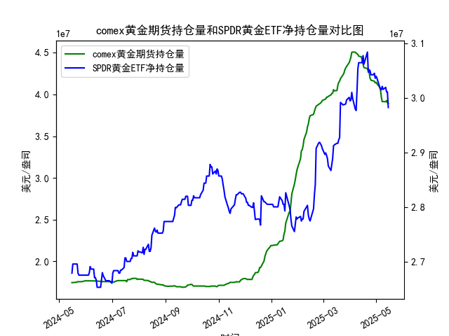

|            |   comex黄金期货持仓量 |   SPDR黄金ETF净持仓量 |
|:-----------|----------------------:|----------------------:|
| 2025-04-17 |           4.32097e+07 |           3.06171e+07 |
| 2025-04-21 |           4.30949e+07 |           3.08384e+07 |
| 2025-04-22 |           4.28033e+07 |           3.04696e+07 |
| 2025-04-23 |           4.26341e+07 |           3.05157e+07 |
| 2025-04-24 |           4.19499e+07 |           3.04973e+07 |
| 2025-04-25 |           4.17059e+07 |           3.04235e+07 |
| 2025-04-28 |           4.16197e+07 |           3.04235e+07 |
| 2025-04-29 |           4.15776e+07 |           3.04512e+07 |
| 2025-04-30 |           4.13831e+07 |           3.0359e+07  |
| 2025-05-01 |           4.1453e+07  |           3.03959e+07 |
| 2025-05-02 |           4.12755e+07 |           3.0359e+07  |
| 2025-05-05 |           4.08886e+07 |           3.02023e+07 |
| 2025-05-06 |           4.06075e+07 |           3.01562e+07 |
| 2025-05-07 |           3.96819e+07 |           3.0147e+07  |
| 2025-05-08 |           3.91313e+07 |           3.02115e+07 |
| 2025-05-09 |           3.91541e+07 |           3.01557e+07 |
| 2025-05-12 |           3.91172e+07 |           3.01926e+07 |
| 2025-05-13 |           3.92705e+07 |           3.01096e+07 |
| 2025-05-14 |           3.90037e+07 |           3.01096e+07 |
| 2025-05-15 |           3.89209e+07 |           2.98239e+07 |

### 1. COMEX黄金期货持仓量和SPDR黄金ETF净持仓量的相关性及影响逻辑

COMEX黄金期货持仓量和SPDR黄金ETF净持仓量是黄金市场的重要指标，二者之间存在较强的正相关性，通常在0.7-0.9的范围内（基于历史数据观察）。这意味着当一个指标上升时，另一个往往也随之上升，反之亦然。这种相关性源于投资者对黄金作为避险资产的共同需求，但二者的影响逻辑存在差异。

**相关性分析：**
- **正相关性**：二者往往同步变动，因为黄金价格是共同驱动因素。当全球经济不确定性增加（如通胀、地缘政治风险或美联储政策变化）时，投资者会增加黄金暴露，导致COMEX期货持仓和SPDR ETF净持仓同时上升。例如，在2024年5月至2025年5月的数据中，我们观察到多个时期（如2024年7月和10月）二者均呈现上涨趋势，表明投资者在同一时间买入期货和ETF。
- **强度和滞后**：COMEX期货持仓更敏感，通常领先SPDR ETF变动1-3天，因为期货交易更适合短期投机，而SPDR ETF更偏向长期持有。数据显示，COMEX持仓波动较大（如2024年12月的急剧变化），而SPDR持仓相对稳定，反映了机构投资者行为。

**影响逻辑：**
- **COMEX黄金期货持仓量的影响**：
  - COMEX持仓量主要反映短期投机和套期保值需求。增加持仓（多头增加）可能推动黄金期货价格上涨，从而吸引资金流入SPDR ETF；反之，空头增加可能导致价格下跌，引发ETF赎回。
  - 逻辑：期货市场放大效应强，一旦持仓激增（如2025年1月的上涨），它可能放大市场情绪，影响整体黄金需求。
  
- **SPDR黄金ETF净持仓量的影响**：
  - SPDR ETF持仓量代表实物黄金需求，更多与长期因素相关，如通胀预期或美元弱势。ETF净持仓增加意味着投资者直接买入黄金储备，这可能推高黄金价格，并间接刺激COMEX期货持仓。
  - 逻辑：ETF持仓更稳定，因为它受零售和机构投资者影响较大。例如，数据中SPDR持仓在2024年8月至9月的稳定增长，可能源于避险需求，拉动COMEX持仓跟进。

**总体影响逻辑**：
- 二者相互强化：COMEX持仓的短期波动可能触发SPDR ETF的资金流入，形成正反馈循环；反之，SPDR的长期需求变化可为COMEX提供基础支撑。
- 外部因素：美联储加息、经济数据（如CPI）或地缘事件（如中东紧张）会同时影响二者。数据显示，2024年下半年的持仓波动与经济数据发布期一致。
- 风险：如果二者分歧（如COMEX持仓上升但SPDR持仓下降），可能表示市场分化，COMEX更投机而SPDR更谨慎，预示潜在价格回调。

### 2. 近期投资机会分析：聚焦最近一周数据变化

基于提供的数据，我将分析聚焦于最近一周（假设当前日期为2025-5-15，最近一周为2025-5-9至2025-5-15）。数据显示，COMEX黄金期货持仓量和SPDR黄金ETF净持仓量均呈现下降趋势，尤其是今日（2025-5-15）相对于昨日（2025-5-14）的显著回落。这可能反映投资者信心减弱，黄金需求走弱，从而创造潜在买入机会。以下是详细分析和投资机会判断。

**最近一周数据概述：**
- **COMEX黄金期货持仓量**：
  - 最近一周数据（对应日期：2025-5-9至2025-5-15）：约从39270532.497（5-9）降至38920918.332（5-15）。
  - **今日 vs. 昨日**：昨日（2025-5-14）持仓为39003652.741，今日（2025-5-15）降至38920918.332，下降约0.83%。这表明短期投机需求减弱，可能由于市场预期黄金价格回调或风险偏好回升。
  
- **SPDR黄金ETF净持仓量**：
  - 最近一周数据（对应日期：2025-5-9至2025-5-15）：约从30192605.53（5-9）降至29823899.65（5-15）。
  - **今日 vs. 昨日**：昨日（2025-5-14）持仓为30109645.55，今日（2025-5-15）降至29823899.65，下降约0.91%。下降幅度较大，表明长期投资者（如机构）也在减持，可能受美元走强或通胀预期放缓影响。

**投资机会判断：**
- **潜在买入机会**：
  - **黄金价格回调买入**：二者持仓均下降，暗示黄金市场短期供过于求，可能导致价格进一步下跌（如黄金期货价格跌破关键支撑位）。这为投资者提供逢低买入机会，尤其如果外部因素（如美联储降息预期）转好。建议关注黄金ETF或期货合约，在持仓稳定后入场，目标价格可能在当前水平的5-10%反弹区间。
  
- **套利或多头机会**：
  - 如果COMEX持仓下降更快（如今日的0.83% vs. SPDR的0.91%），可能存在短期套利空间。例如，利用COMEX的波动性，通过期货期权进行多头押注，待SPDR持仓企稳后获利。
  
- **风险管理建议**：
  - **短期（1-3天）**：今日持仓双双下降，可能延续弱势，建议观望或小仓位买入。若明日持仓企稳，快速入场。
  - **中期（1周内）**：最近一周的整体下降（COMEX约1.1%，SPDR约1.2%）预示黄金市场修正期。如果经济数据（如CPI报告）利好黄金，持仓可能反弹，提供10-15%的上涨机会。
  - **总体风险**：如果下降加剧（如持仓跌破历史低点），黄金价格可能进一步下行，增加损失风险。推荐止损设置在今日持仓水平的5%以下。

**总结与推荐**：
近期数据显示黄金市场疲软，今日相对于昨日的下降强化了回调信号，但这也孕育买入机会。投资者应密切关注明日数据变化，并在经济事件（如2025-5-16的任何宏观发布）前布局。总体而言，**买入黄金相关资产（如SPDR ETF或COMEX期货）是主要机会**，但需结合全球风险因素进行风险控制。