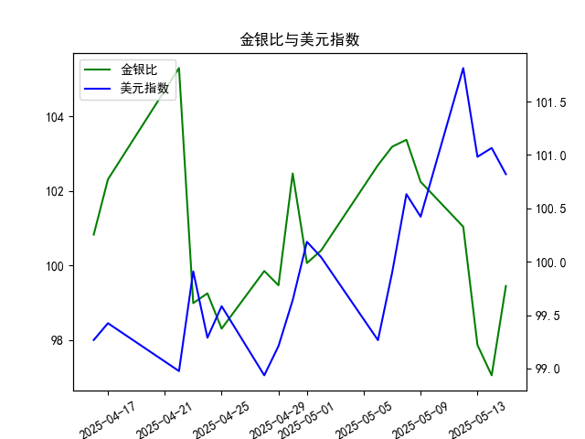

|            |    金价 |   银价 |   美元指数 |   金银比 |
|:-----------|--------:|-------:|-----------:|---------:|
| 2025-04-16 | 3322.9  | 32.955 |    99.2667 | 100.831  |
| 2025-04-17 | 3305.65 | 32.31  |    99.424  | 102.31   |
| 2025-04-22 | 3433.55 | 32.61  |    98.9757 | 105.291  |
| 2025-04-23 | 3262.95 | 32.96  |    99.9096 |  98.9973 |
| 2025-04-24 | 3314.75 | 33.395 |    99.288  |  99.2589 |
| 2025-04-25 | 3277.3  | 33.335 |    99.5836 |  98.3141 |
| 2025-04-28 | 3296.3  | 33.01  |    98.9357 |  99.8576 |
| 2025-04-29 | 3305.05 | 33.225 |    99.21   |  99.4748 |
| 2025-04-30 | 3302.05 | 32.225 |    99.6403 | 102.469  |
| 2025-05-01 | 3214.75 | 32.125 |   100.187  | 100.07   |
| 2025-05-02 | 3249.7  | 32.365 |   100.042  | 100.408  |
| 2025-05-06 | 3391.45 | 33.025 |    99.2654 | 102.693  |
| 2025-05-07 | 3392.25 | 32.875 |    99.9006 | 103.186  |
| 2025-05-08 | 3352.3  | 32.43  |   100.633  | 103.37   |
| 2025-05-09 | 3324.55 | 32.515 |   100.422  | 102.247  |
| 2025-05-12 | 3235.4  | 32.02  |   101.814  | 101.043  |
| 2025-05-13 | 3227.95 | 32.98  |   100.983  |  97.876  |
| 2025-05-14 | 3191.95 | 32.885 |   101.066  |  97.064  |
| 2025-05-15 | 3191.05 | 32.085 |   100.82   |  99.4561 |

# 1. 金银比与美元指数的相关性及影响逻辑

金银比（Gold/Silver Ratio）是黄金价格除以白银价格的比率，用于衡量黄金和白银的相对价值，通常反映市场对这两种贵金属的偏好。美元指数（USDX）则衡量美元对一篮子主要货币（如欧元、日元等）的汇率表现。两者之间存在间接相关性，主要通过以下逻辑影响：

- **相关性分析**：金银比和美元指数通常呈负相关关系。这是因为黄金和白银的价格主要以美元计价。当美元指数走强（美元升值）时，贵金属的价格往往下跌，因为它们对持有其他货币的投资者来说变得更昂贵，从而可能推高金银比（黄金相对白银更受欢迎作为避险资产）。反之，当美元指数走弱（美元贬值）时，贵金属价格通常上涨，白银（更依赖工业需求）可能比黄金上涨更快，导致金银比下降。

- **影响逻辑**：
  - **美元走强的影响**：美元指数上升时，投资者可能转向美元资产，减少对贵金属的配置。这可能导致黄金价格相对稳定（作为强力避险工具），而白银价格更易受工业需求影响而下跌，从而使金银比上升（例如，高于100时可能表示白银相对便宜）。
  - **美元走弱的影响**：美元指数下降时，通胀预期或地缘政治风险上升，投资者往往买入贵金属避险。白银的价格可能因工业复苏或需求反弹而更快上涨，导致金银比下降（低于100时可能表示黄金相对昂贵）。
  - **其他因素**：尽管美元是关键驱动因素，但金银比还受全球经济、通胀、利率和地缘事件影响。例如，在经济不确定期，黄金的避险属性可能放大其价格变动，从而间接强化与美元指数的关联。

总体而言，这种相关性并非绝对，短期波动可能因市场情绪而异，但长期看，美元指数的变动往往是预测金银比变化的重要参考。

# 2. 根据数据分析判断近期投资机会

基于提供的数据，我将焦点放在最近一周（从2025-05-08到2025-05-15）的金银比和美元指数变化上，尤其是今日（2025-05-15）相对于昨日（2025-05-14）的差异。数据显示，金银比从97.06（2025-05-14）上升至99.45（2025-05-15），而美元指数从101.06（2025-05-14）下降至100.81（2025-05-15）。以下是详细分析和可能的投资机会。

### 近期数据概述
- **金银比最近一周变化**（2025-05-08至2025-05-15）：103.37、102.24、101.04、97.87、97.06、99.45。
  - 整体趋势：金银比在最近一周内先下降（从103.37降至97.06），然后小幅反弹至99.45。这表明短期内白银相对黄金的价值有所提升，但反弹可能预示调整。
  - 今日 vs 昨日：金银比从97.06上升至99.45（约2.3%的增加），这可能反映市场情绪转向或美元弱化推动贵金属需求。
  
- **美元指数最近一周变化**（2025-05-08至2025-05-15）：100.63、100.42、101.81、100.98、101.06、100.81。
  - 整体趋势：美元指数在最近一周内波动较大，但总体趋于稳定，最终从101.06下降至100.81（约0.2%的减少），显示美元轻微走弱。
  - 今日 vs 昨日：美元指数下降，符合金银比上升的逻辑，因为美元贬值往往支持贵金属价格。

### 投资机会判断
基于上述变化，以下是近期可能存在的投资机会，主要从金银比和美元指数的互动角度分析。注意，投资机会基于历史数据推断，实际决策应考虑更广泛的市场因素，如通胀数据或全球事件。

- **买入白银的机会**：
  - **理由**：金银比最近一周从103.37降至97.06后反弹至99.45，表明白银可能正处于相对低估期（金银比低于100通常暗示白银更具吸引力）。今日的上升可能只是短期修正，如果美元继续走弱（如今日美元指数下降所示），白银价格可能进一步上涨。结合美元指数的轻微下降，这可能预示贵金属整体反弹。
  - **潜在收益**：如果金银比稳定在100以下，白银相对于黄金的涨幅可能更大，适合短期交易者或多元化组合。
  - **风险**：若美元指数反弹（如未来几天恢复上涨），金银比可能进一步上升，削弱白银的机会。

- **买入黄金的机会**：
  - **理由**：尽管金银比上升，但其仍处于相对低位（99.45），且美元走弱的环境通常利好黄金作为避险资产。今日金银比的反弹可能表示投资者正重新评估黄金的价值，尤其如果全球风险事件增多。
  - **潜在收益**：黄金在美元弱势期往往表现更稳健，如果最近一周的波动是短期调整，黄金可能迎来中期上涨。今日相对于昨日的变化（金银比上升但美元下降）暗示黄金价格可能企稳或反弹。
  - **风险**：如果金银比继续上升至100以上，黄金的相对吸引力可能减弱。

- **总体市场机会**：
  - **多头贵金属策略**：近期数据显示美元指数下降与金银比小幅上升的组合，可能预示贵金属市场短期反弹。投资者可考虑在金银比低于100时增持白银，或在美元指数保持弱势时加仓黄金ETF。
  - **卖出美元相关资产的机会**：美元指数的下降趋势可能持续，如果通胀或经济数据不支持美元，投资者可转向贵金属或相关衍生品。
  - **潜在时机**：聚焦明日或下周初的数据变化。如果金银比保持在99-102区间，买入机会将更明确；反之，若美元指数反弹至101以上，可能暂停行动。

### 总结与建议
近期投资机会主要围绕贵金属市场，受益于美元指数的轻微走弱和金银比的波动。今日相对于昨日的变化（金银比上升、美元下降）暗示短期买入白银或黄金的窗口，但需警惕市场波动。建议投资者监控下周数据（如2025-05-16若有），并结合其他指标（如通胀率）制定策略。风险管理至关重要，建议设置止损点以应对潜在逆转。