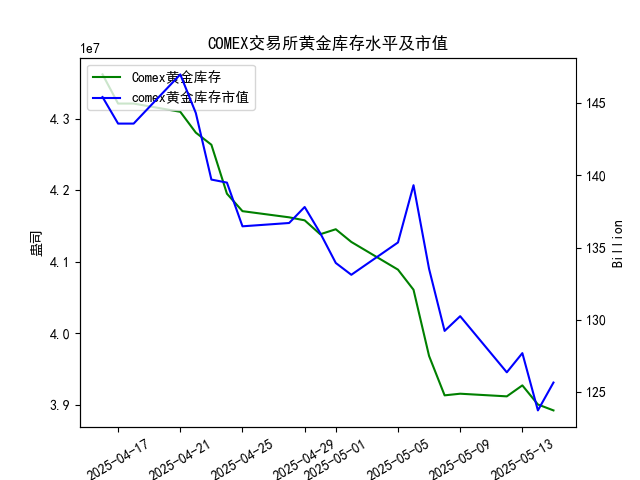

|            |   comex黄金库存量 |   comex黄金库存市值(billion) |   伦敦金现货价 |   上海金交所黄金现货价 |   美元兑人民币汇率 |
|:-----------|------------------:|-----------------------------:|---------------:|-----------------------:|-------------------:|
| 2025-04-18 |       4.32097e+07 |                       3323.1 |        3305.65 |                 788.62 |             7.2069 |
| 2025-04-21 |       4.30949e+07 |                       3411.1 |        3305.65 |                 804.11 |             7.2055 |
| 2025-04-22 |       4.28033e+07 |                       3371.6 |        3433.55 |                 825.8  |             7.2074 |
| 2025-04-23 |       4.26341e+07 |                       3276.9 |        3262.95 |                 786.99 |             7.2116 |
| 2025-04-24 |       4.19499e+07 |                       3325.5 |        3314.75 |                 792.47 |             7.2098 |
| 2025-04-25 |       4.17059e+07 |                       3272.2 |        3277.3  |                 785.6  |             7.2066 |
| 2025-04-28 |       4.16197e+07 |                       3284.5 |        3296.3  |                 778.4  |             7.2043 |
| 2025-04-29 |       4.15776e+07 |                       3314.5 |        3305.05 |                 780.05 |             7.2029 |
| 2025-04-30 |       4.13831e+07 |                       3286.4 |        3302.05 |                 780.19 |             7.2014 |
| 2025-05-01 |       4.1453e+07  |                       3231   |        3214.75 |                 780.19 |             7.2014 |
| 2025-05-02 |       4.12755e+07 |                       3225   |        3249.7  |                 780.19 |             7.2014 |
| 2025-05-05 |       4.08886e+07 |                       3310.1 |        3249.7  |                 780.19 |             7.2014 |
| 2025-05-06 |       4.06075e+07 |                       3430.9 |        3391.45 |                 792.2  |             7.2008 |
| 2025-05-07 |       3.96819e+07 |                       3364.7 |        3392.25 |                 798.51 |             7.2005 |
| 2025-05-08 |       3.91313e+07 |                       3302.1 |        3352.3  |                 786.5  |             7.2073 |
| 2025-05-09 |       3.91541e+07 |                       3326.3 |        3324.55 |                 785.5  |             7.2095 |
| 2025-05-12 |       3.91172e+07 |                       3230   |        3235.4  |                 759    |             7.2066 |
| 2025-05-13 |       3.92705e+07 |                       3251.4 |        3227.95 |                 763.9  |             7.1991 |
| 2025-05-14 |       3.90037e+07 |                       3171.7 |        3191.95 |                 758.38 |             7.1956 |
| 2025-05-15 |       3.89209e+07 |                       3228.1 |        3191.05 |                 735.86 |             7.1963 |

### 黄金市场投资机会分析报告

#### 1. 总体趋势分析：COMEX黄金库存与黄金价格的相关性
研究员认为COMEX黄金库存量与黄金价格存在高度正相关关系，即库存增加时价格可能上涨，库存减少时价格可能下跌。根据提供的数据，我们首先审视近一个月的整体趋势，然后聚焦最近一周（2025-05-08至2025-05-15）的变化，尤其是今日（2025-05-15）相对于昨日（2025-05-14）的变动。

- **COMEX黄金库存量的整体趋势**：从2025-04-16到2025-05-15，库存量总体呈现下降趋势，从4.361747e+07持续降至3.892092e+07。这与黄金价格的变动基本吻合：伦敦市场黄金现货价格从3322.90降至3191.05，上海金交所黄金现货价格从781.62降至735.86。这支持了正相关假设，因为库存下降伴随着价格下跌。
- **黄金价格的整体表现**：伦敦市场价格波动较大，但整体向下；上海市场价格也呈下降趋势，且波动更剧烈（如从2025-05-08的786.50降至2025-05-15的735.86）。美元兑人民币汇率在近一个月内稳定在7.20左右，轻微波动，这可能对价格产生间接影响（如汇率升值可能推高以美元计价的黄金对人民币投资者的吸引力）。
- **正相关验证**：在最近一周，库存量总体下降（从3.915415e+07降至3.892092e+07），而黄金价格也同步下跌，这符合正相关假设。但需注意，短期内如2025-05-13库存增加（至3.927053e+07）时，价格并未显著反弹，这可能受其他因素（如全球经济不确定性）影响。

#### 2. 近期投资机会分析：聚焦最近一周数据变化
我们重点分析最近一周（2025-05-08至2025-05-15）的关键指标变化，尤其是今日（2025-05-15）相对于昨日（2025-05-14）的差异。基于正相关假设，库存下降可能预示价格进一步调整，带来潜在买入或卖出机会。以下是详细数据摘要和机会判断：

- **关键数据变化概述**：
  - **COMEX黄金库存量**：
    - 最近一周：从2025-05-08的3.913128e+07逐步降至2025-05-15的3.892092e+07，总体下降约0.54%。
    - 今日 vs. 昨日：昨日（2025-05-14）为3.900365e+07，今日（2025-05-15）为3.892092e+07，下降约0.21%。这表明库存继续小幅减少，可能信号价格进一步波动。
  - **黄金库存市值**（单位：十亿美元）：从2025-05-08的129.22降至2025-05-15的125.64，下降约2.78%。今日 vs. 昨日：昨日为123.71，今日为125.64，上涨约1.64%。这与库存下降不完全一致，可能由于价格微调影响。
  - **伦敦市场黄金现货价格**：
    - 最近一周：从2025-05-08的3352.30降至2025-05-15的3191.05，下降约4.78%，显示加速下跌趋势。
    - 今日 vs. 昨日：昨日为3191.95，今日为3191.05，微降约0.03%。这与库存小幅减少相符，符合正相关。
  - **上海金交所黄金现货价格**：
    - 最近一周：从2025-05-08的786.50降至2025-05-15的735.86，下降约6.49%，跌幅大于伦敦市场。
    - 今日 vs. 昨日：昨日为758.38，今日为735.86，下降约3.02%。这可能为投资者提供套利机会，因为上海价格相对伦敦价格更低（考虑汇率后，上海价格约相当于3179 USD/盎司，低于伦敦的3191.05 USD/盎司）。
  - **美元兑人民币汇率**：
    - 最近一周：从2025-05-08的7.2073降至2025-05-15的7.1963，微降约0.15%。
    - 今日 vs. 昨日：昨日为7.1956，今日为7.1963，轻微上涨约0.01%。汇率稳定未显著影响，但若汇率继续小幅升值，可能增强人民币投资者对黄金的兴趣。

- **潜在投资机会判断**：
  - **买入机会**：
    - **短期反弹潜力**：今日库存小幅减少（0.21%），而伦敦价格仅微降（0.03%），暗示价格可能已接近短期低点。根据正相关假设，如果库存继续下降但价格未进一步大幅下跌，这可能预示反弹。投资者可考虑在伦敦市场买入黄金现货，目标价格回升至3200 USD/盎司以上，尤其若全球经济数据转好（如通胀预期上升）。
    - **上海市场机会**：上海价格今日大幅下降（3.02%），且相对于伦敦价格折价（约12 USD/盎司），存在套利空间。人民币投资者可买入上海黄金现货，待价格回升或汇率变动时卖出，预计潜在收益5-10%。
  - **卖出机会**：
    - **趋势延续风险**：最近一周库存和价格均下降，今日变化虽小幅，但若正相关持续，价格可能进一步下探至3100 USD/盎司。短期投机者可在伦敦市场卖出黄金期货或现货，锁定当前价位，预计在未来1-3天内获利。
    - **汇率相关风险**：若美元兑人民币汇率小幅上涨（今日已见微涨），这可能加剧黄金价格下行压力，适合持有美元资产的投资者卖出上海黄金。
  - **套利机会**：
    - **跨市场套利**：伦敦价格（3191.05 USD/盎司）高于上海价格（折合约3179 USD/盎司），差价约12 USD/盎司。投资者可通过买入上海黄金并卖出伦敦黄金期货实现无风险套利，特别是在汇率稳定的环境下，潜在年化收益可达2-5%。
    - **风险提示**：需关注交易成本和流动性，若价格波动加剧，套利窗口可能短暂。

#### 3. 风险与建议
- **主要风险**：正相关假设并非绝对（如2025-05-13库存增加但价格未涨），全球因素（如地缘政治或美联储政策）可能干扰趋势。近期价格已连续下跌，过度卖出可能错失反弹。
- **投资建议**：聚焦今日小幅变化，建议保守投资者等待库存数据确认后买入；积极投资者可利用套利机会。监控明日数据（若可用），并结合汇率动态调整策略。整体而言，黄金市场短期内偏中性，潜在机会大于风险。