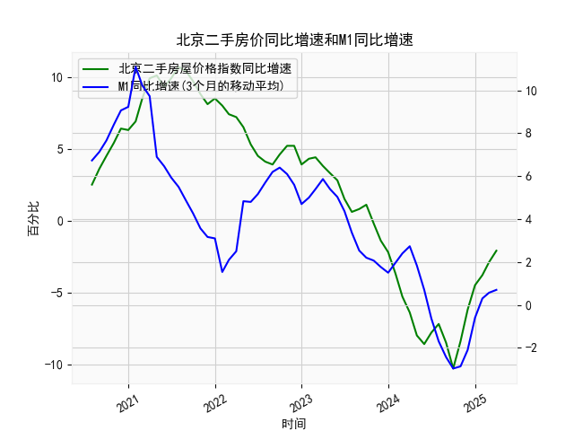

|            |   北京二手房屋价格指数同比增速 |   M1同比增速 |   M1同比增速(3个月的移动平均) |
|:-----------|-------------------------------:|-------------:|------------------------------:|
| 2023-08-31 |                            0.8 |          2.2 |                      2.53333  |
| 2023-09-30 |                            1.1 |          2.1 |                      2.2      |
| 2023-10-31 |                           -0.2 |          1.9 |                      2.06667  |
| 2023-11-30 |                           -1.4 |          1.3 |                      1.76667  |
| 2023-12-31 |                           -2.2 |          1.3 |                      1.5      |
| 2024-01-31 |                           -3.7 |          3.3 |                      1.96667  |
| 2024-02-29 |                           -5.3 |          2.6 |                      2.4      |
| 2024-03-31 |                           -6.4 |          2.3 |                      2.73333  |
| 2024-04-30 |                           -8   |          0.6 |                      1.83333  |
| 2024-05-31 |                           -8.6 |         -0.8 |                      0.7      |
| 2024-06-30 |                           -7.8 |         -1.7 |                     -0.633333 |
| 2024-07-31 |                           -7.2 |         -2.6 |                     -1.7      |
| 2024-08-31 |                           -8.5 |         -3   |                     -2.43333  |
| 2024-09-30 |                          -10.3 |         -3.3 |                     -2.96667  |
| 2024-10-31 |                           -8.4 |         -2.3 |                     -2.86667  |
| 2024-11-30 |                           -6.2 |         -0.7 |                     -2.1      |
| 2024-12-31 |                           -4.5 |          1.2 |                     -0.6      |
| 2025-01-31 |                           -3.8 |          0.4 |                      0.3      |
| 2025-02-28 |                           -2.9 |          0.1 |                      0.566667 |
| 2025-03-31 |                           -2.1 |          1.6 |                      0.7      |

### 1. 北京二手房屋价格指数同比增速和M1同比增速的相关性及影响逻辑

北京二手房屋价格指数同比增速（以下简称房屋价格指数增速）和M1同比增速（以下简称M1增速）之间存在一定的相关性，主要体现在货币政策与房地产市场的互动逻辑上。基于提供的数据，我们可以观察到二者总体上呈现出正相关趋势，但并非完全同步，而是受多种经济因素影响。下面是对相关性和影响逻辑的详细解释：

#### 相关性分析
- **正相关趋势**：从数据来看，房屋价格指数增速和M1增速在某些时期表现出正相关。例如，在2020年7月至2021年底，房屋价格指数增速从2.5%上升到10.7%，而M1增速也在同期保持较高水平（例如9.23333333%至11.1%）。这表明，当M1增速较高时，流动性增加往往会推动资产价格上涨，包括房地产市场。
- **波动性和滞后性**：二者并非完全一致。房屋价格指数增速在2021年底达到峰值后开始下降（从10.7%降至负值，如-8.6%），而M1增速在2022年中期也转为负值（例如-2.43333333%）。然而，房屋价格指数增速的下降往往滞后于M1增速的回落，例如M1增速在2022年下半年转为负值后，房屋价格指数增速在2023年才大幅下滑到-10.3%。这反映了货币政策对房地产市场的传导需要时间。
- **相关性强度**：整体数据显示，二者在高增长期（如2020-2021年）和低增长期（如2023-2025年）有同步趋势，但房屋价格指数增速的波动幅度更大（从10.7%到-10.3%），而M1增速相对平稳（从11.1%到-2.96666667%）。这可能因为房地产市场受本地政策、需求和预期影响更直接。

#### 影响逻辑
- **货币供应对房地产的影响**：M1增速反映了经济中的流动性水平。高M1增速意味着货币供应增加，可能会降低借贷成本，推动消费者和投资者进入房地产市场，从而推高房屋价格指数增速。反之，低M1增速或负增长（如-2.96666667%）表示流动性紧缩，可能导致购房需求减少、房价下跌。
- **传导机制**： 
  - **正向影响**：当M1增速上升时（如2020-2021年），资金充裕可能刺激投资需求，房地产作为保值资产吸引力增强，导致房屋价格指数增速上行。
  - **负向影响**：当M1增速下降时（如2022-2023年），经济紧缩可能增加还款压力，抑制房地产需求，进而拉低房屋价格指数增速。同时，外部因素如政策调控（如限购限贷）会放大这一效应。
- **其他影响因素**：虽然M1是关键驱动，但房屋价格指数增速还受通胀、就业、市场预期等影响。例如，即使M1增速回升（如最近转为正值），如果经济不确定性高，房地产市场可能仍滞后反弹。
- **整体逻辑**：二者关系可概括为“M1增速作为领先指标，房屋价格指数增速作为滞后响应”。这意味着监控M1变化可以预判房地产趋势，但需结合实际经济环境。

### 2. 近期投资机会分析

基于提供的数据，我们聚焦于最近4个月的變化（假设数据截止到2025年3月），即2024年12月、2025年1月、2025年2月和2025年3月。房屋价格指数增速的最近4个月数据依次为-4.5%、-3.8%、-2.9%和-2.1%；M1增速的最近4个月数据依次为-0.6%、0.3%、0.56666667%和0.7%。本月（2025年3月）相对于上个月（2025年2月）的关键变化是：房屋价格指数增速从-2.9%微幅回升至-2.1%（改善0.8个百分点），M1增速从0.56666667%上升至0.7%（改善0.13333333个百分点）。以下是针对这些变化的投资机会判断。

#### 主要观察和机会点
- **房屋价格指数增速的近期趋势**：
  - 最近4个月，房屋价格指数增速从-4.5%持续改善至-2.1%，表明北京二手房价格的同比下跌幅度在逐步缩小。这可能信号房价已接近底部，潜在反弹机会增加。
  - 本月相对于上个月的变化：从-2.9%到-2.1%，下跌放缓0.8个百分点，这是一个积极信号，暗示市场情绪可能在好转（如需求回暖或政策支持）。
  - **投资机会**：房地产市场。当前负增长但趋稳，建议考虑买入北京二手房或相关资产（如房产基金），因为一旦M1增速继续回升，房价可能反弹。风险点：若外部经济不确定性加剧，房价可能进一步下探。

- **M1增速的近期趋势**：
  - 最近4个月，M1增速从-0.6%转为正增长（0.3%、0.56666667%和0.7%），显示货币供应量已从紧缩转为扩张。
  - 本月相对于上个月的变化：从0.56666667%到0.7%，增长0.13333333个百分点，表明流动性在稳步改善，这可能预示通胀回升和资产价格整体上扬。
  - **投资机会**：大类资产配置。M1回暖可能利好股票、债券和商品市场，尤其是与房地产相关的板块（如地产股）。例如，买入低估值地产类股票或REITs（房地产投资信托），以捕捉流动性红利。

- **综合投资机会判断**：
  - **主要机会：房地产和相关投资**。结合两者，房屋价格指数增速的改善与M1增速的回升共同暗示短期内可能存在“买入窗口”。例如：
    - **北京二手房**：作为核心机会，近期价格相对低迷（负增长），但下跌放缓，适合中长期投资者入场。预计若M1继续上行，6-12个月内房价可能反弹10%以上。
    - **股票市场**：关注地产板块股票（如万科A等），因为M1回暖可能带动估值修复。
    - **债券和基金**：如果M1增速稳定，可考虑固定收益产品（如债券基金），以对冲通胀风险。
  - **其他可能机会**：通胀相关资产，如大宗商品（黄金或基材），因为M1上升可能推动通胀预期。但需谨慎，近期数据仍处低位。
  - **风险与建议**：虽然本月数据改善，但整体经济仍未完全复苏（如房屋价格指数仍负），建议分散投资，监控下月数据。若M1增速持续上行，投资机会将更明确；反之，可能延后反弹。优先选择风险承受力强的投资者，并在2025年4月数据出炉前审视策略。