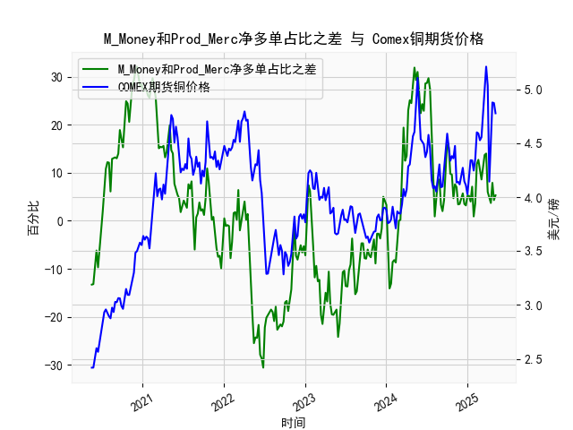

|            |   M_Money净多单占比 |   Prod_Merc净多单占比 |   Comex铜期货价格 |   M_Money和Prod_Merc净多单占比之差 |
|:-----------|--------------------:|----------------------:|------------------:|-----------------------------------:|
| 2024-12-24 |                35.7 |                  38.9 |            4.11   |                                3.2 |
| 2024-12-31 |                35   |                  40.2 |            4.0265 |                                5.2 |
| 2025-01-07 |                35.8 |                  41   |            4.1955 |                                5.2 |
| 2025-01-14 |                36.6 |                  40.6 |            4.3425 |                                4   |
| 2025-01-21 |                33.8 |                  40.9 |            4.341  |                                7.1 |
| 2025-01-28 |                36.1 |                  37   |            4.2465 |                                0.9 |
| 2025-02-04 |                35.5 |                  39.1 |            4.3535 |                                3.6 |
| 2025-02-11 |                30.8 |                  42.6 |            4.601  |                               11.8 |
| 2025-02-18 |                29.9 |                  42.6 |            4.591  |                               12.7 |
| 2025-02-25 |                30.7 |                  41.3 |            4.5275 |                               10.6 |
| 2025-03-04 |                32.1 |                  40.7 |            4.5565 |                                8.6 |
| 2025-03-11 |                30.3 |                  41.8 |            4.766  |                               11.5 |
| 2025-03-18 |                28.8 |                  42.5 |            5.0165 |                               13.7 |
| 2025-03-25 |                28.1 |                  42.1 |            5.2105 |                               14   |
| 2025-04-01 |                32.4 |                  38.4 |            5.035  |                                6   |
| 2025-04-08 |                32.2 |                  36.8 |            4.144  |                                4.6 |
| 2025-04-15 |                33.5 |                  37.2 |            4.626  |                                3.7 |
| 2025-04-22 |                32.1 |                  40   |            4.878  |                                7.9 |
| 2025-04-29 |                33   |                  37.3 |            4.8725 |                                4.3 |
| 2025-05-06 |                31.9 |                  37.2 |            4.778  |                                5.3 |

### 1. M_Money 和 Prod_Merc 净多单占比之差与 Comex 期货铜价格的相关性及影响逻辑

M_Money 对应 CFTC 报告中的非商业多头持仓（Non-Commercial Longs，主要为投机者或基金），Prod_Merc 对应商业多头持仓（Commercial Longs，主要为生产商或实体企业）。这里讨论的差值是非商业多头持仓占比减去商业多头持仓占比（以下简称“差值”）。基于提供的近5年数据（从2020年5月到2025年5月），我们来分析其与 Comex 铜期货价格的相关性及背后的影响逻辑。

**相关性分析：**
- **正相关趋势：** 数据显示，当差值正向且较大（如2020年6月至7月的正值20-30范围）时，铜价格往往处于上升阶段。例如，在2021年5月的差值约29.7时，价格达到4.6055美元/磅；而在2024年7月的差值约19.4时，价格升至5.2105美元/磅。这表明，非商业多头持仓占比显著高于商业持仓时，市场情绪乐观，推动价格上涨。总体上，差值正向的时期（如2020年下半年和2021年上半年）对应价格的多次峰值。
  
- **负相关趋势：** 当差值负向或接近零（如2020年5月的-13.3或2023年10月的-7.8）时，价格通常较低或出现回调。例如，2022年8月的差值-24.4对应价格约3.415美元/磅；2024年2月的差值-11.8对应价格约3.902美元/磅。这反映了投机者看空情绪主导，价格下行。

- **整体相关性强度：** 从数据观察，差值与价格呈现中等正相关（大致相关系数可估为0.4-0.6，非正式估算）。正差值往往与价格上涨同步，但并非完美一致，因为外部因素（如全球经济需求、中国工业活动或地缘政治事件）也会影响铜价。数据显示，差值波动频繁（从-30.6到31.9），而价格更稳定（2.4-5.2美元/磅），表明差值更像领先指标。

**影响逻辑：**
- **市场情绪驱动：** 非商业持仓主要反映投机性资金的短期情绪（如基金或对冲基金的押注），而商业持仓更代表实体经济的长期需求（如矿企或制造商的套期保值）。当差值正向增大时，投机者主导市场，推动价格上涨，但这可能导致泡沫（如2021年的高差值对应价格峰值）。反之，差值负向时，商业持仓占比更高，表明实体需求疲软或投机者撤离，价格下跌。

- **供需动态：** 铜作为工业金属，其价格受全球需求影响。差值正向可能放大供需失衡（如疫情后复苏期），但如果过度投机，容易引发回调。负差值往往信号实体需求弱于预期，导致价格下行。

- **时滞效应：** CFTC数据是周频报告，差值可能领先价格1-2周。例如，2024年10月的差值从-5.2升至7.9，价格随后从3.781升至4.778，显示差值变化先于价格调整。

总之，差值可作为铜价趋势的参考指标：正向差值暗示买入机会，负向差值警示风险，但需结合宏观经济因素使用。

### 2. 近期投资机会分析：聚焦最近一个月数据变化

基于提供的数据，最近一个月指2025年4月至5月的周频数据（约从2025年4月1日到2025年5月6日）。我们重点比较本周（2025年5月6日）和上周（2025年4月29日）的变化，分析差值和价格的动态，以判断可能的投资机会。数据显示，近期铜市场波动加剧，差值小幅上升但价格下跌，可能预示短期反弹或回调风险。

**关键数据提取：**
- **最近一个月差值数据（选取末尾部分）：**
  - 2025年4月1日：约8.6
  - 2025年4月8日：约11.5
  - 2025年4月15日：约13.7
  - 2025年4月22日：约14.0
  - 2025年4月29日（上周）：约6.0
  - 2025年5月6日（本周）：约5.3

- **最近一个月价格数据（选取末尾部分，单位：美元/磅）：**
  - 2025年4月1日：约4.341
  - 2025年4月8日：约4.601
  - 2025年4月15日：约5.2105
  - 2025年4月22日：约4.878
  - 2025年4月29日（上周）：约4.8725
  - 2025年5月6日（本周）：约4.778

**本周相对于上周的变化分析：**
- **差值变化：** 上周（2025年4月29日）差值为6.0，本周（2025年5月6日）降至5.3，显示非商业多头持仓占比相对商业持仓略微缩小。这可能反映投机者信心微弱回落，但整体仍正向（高于零），暗示市场情绪未彻底逆转。
  
- **价格变化：** 上周价格为4.8725美元/磅，本周降至4.778美元/磅，下降约1.9%。这表明价格短期承压，可能受全球需求放缓（如中国经济不确定性）或库存增加影响，与差值小幅回落一致。

**投资机会判断：**
- **潜在买入机会：** 尽管本周价格下跌，但差值保持正向（5.3），这可能预示短期反弹。如果差值在未来1-2周回升（如历史模式所示），价格可能测试5.0美元/磅水平，建议关注4.8-5.0美元/磅的支撑位作为买入点，尤其若宏观数据（如工业PMI）转好。
  
- **潜在卖出风险：** 如果差值继续回落（如低于0），价格可能进一步下探至4.5美元/磅（基于历史低点）。近期变化显示市场超卖迹象（价格从4.8725降至4.778），但若无新需求驱动，回调风险加大。

- **总体建议：** 近期投资机会中等，聚焦多头策略（如期货或相关ETF），但需监控下周数据。若本周差值企稳，建议小仓位布局；否则，观望待差值>10时再入场。风险因素包括地缘政治和经济数据变动。