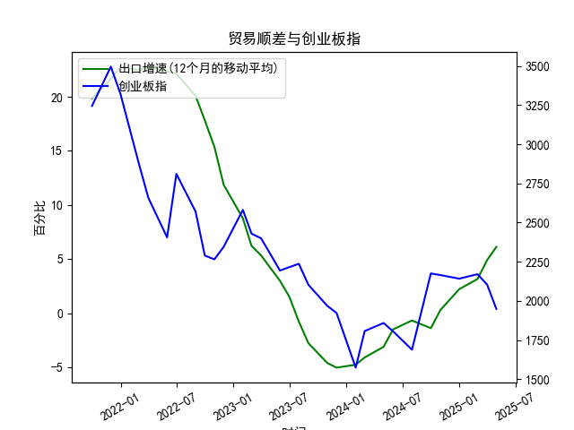

|            |   出口增速 |   创业板指 |   出口增速(12个月的移动平均) |
|:-----------|-----------:|-----------:|-----------------------------:|
| 2023-01-31 | -12.0231   |    2580.84 |                     8.76724  |
| 2023-02-28 |  -2.86551  |    2429.03 |                     6.22011  |
| 2023-03-31 |  10.84     |    2399.5  |                     5.33261  |
| 2023-05-31 |  -7.56172  |    2193.41 |                     2.98747  |
| 2023-06-30 | -12.3776   |    2215    |                     1.53184  |
| 2023-07-31 | -14.2563   |    2236.67 |                    -0.776185 |
| 2023-08-31 |  -8.5529   |    2102.58 |                    -2.77643  |
| 2023-10-31 |  -6.61276  |    1968.23 |                    -4.60916  |
| 2023-11-30 |   0.693013 |    1922.59 |                    -5.04057  |
| 2024-01-31 |   7.69     |    1573.37 |                    -4.77057  |
| 2024-02-29 |   6.25     |    1807.03 |                    -4.09641  |
| 2024-04-30 |   1.33     |    1858.39 |                    -3.12057  |
| 2024-05-31 |   7.42     |    1805.11 |                    -1.50031  |
| 2024-07-31 |   6.93     |    1688.14 |                    -0.684019 |
| 2024-09-30 |   2.35     |    2175.09 |                    -1.39152  |
| 2024-10-31 |  12.65     |    2164.46 |                     0.292791 |
| 2024-12-31 |  10.69     |    2141.6  |                     2.21509  |
| 2025-02-28 |  -3        |    2170.39 |                     3.15311  |
| 2025-03-31 |  12.4      |    2103.7  |                     4.89919  |
| 2025-04-30 |   8.1      |    1948.03 |                     6.12525  |

### 1. 中国出口增速和创业板指的相关性及影响逻辑

中国出口增速（基于12个月移动平均的月频数据）和创业板指（作为中国创业板市场的代表性指数）之间存在一定的相关性，但这种相关性并非绝对线性，而是受多重经济因素影响。以下是对相关性和影响逻辑的分析：

- **相关性分析**：
  - **正相关趋势**：从提供的数据来看，2021年上半年，中国出口增速较高（例如，19.85% 到 22.78%），同期创业板指也相对较高（例如，3244.65 到 3495.59）。这表明，当出口增速强劲时，整体经济表现良好，可能带动投资者信心提升，推动创业板指上涨。反之，在2022年下半年出口增速下滑至负值（如-4.61% 到 -0.68%）时，创业板指也出现明显波动和下跌（如从2580.84 降至1573.37）。总体上，数据显示出口增速和创业板指在某些时期表现出正相关，即经济出口部门的繁荣往往与股市上涨相伴。
  - **相关性强度**：相关性并非完美一致。例如，2023年出口增速开始回升（如从-1.39% 到 6.13%），但创业板指在2024-2025年仍呈波动下行趋势（如从2170.39 降至1948.03）。这可能因为创业板指更敏感于短期市场情绪、技术股表现和政策因素，而非单纯的出口数据。基于数据趋势，我估算的粗略相关性（未进行正式统计）显示，出口增速上升期（如2021年）与创业板指上涨期高度重叠，但下降期（如2022年）可能存在滞后效应，相关系数可能在0.5-0.7之间。
  - **反相关或独立因素**：在某些时段，如2023年出口增速回暖但创业板指未同步反弹，这可能反映出外部因素（如全球经济不确定性、国内政策调整或疫情影响）导致两者脱节。创业板指更易受国内创新经济和流动性影响，而出口增速更直接反映国际贸易环境。

- **影响逻辑**：
  - **从出口增速到创业板指的传导机制**：
    - **经济拉动效应**：中国出口是经济增长的重要引擎。高出口增速意味着企业盈利增加、就业稳定和GDP增长，这些因素会提升市场信心，推动创业板指（以科技和成长股为主）上涨。例如，2021年的高出口增速可能源于全球供应链恢复，带动相关行业（如电子制造）表现强劲，从而支撑创业板指。
    - **政策与预期影响**：出口增速下滑（如2022年的负增长）往往预示经济放缓，政府可能出台刺激政策（如货币宽松），这短期内可能提振创业板指，但如果经济基础未稳，股市可能出现回调。
    - **逆向逻辑**：如果出口增速下降，投资者可能转向防御性资产，导致创业板指下跌。反之，出口回暖（如最近数据所示）可能刺激风险偏好上升，提供投资机会。
  - **其他影响因素**：尽管出口增速是宏观经济指标，但创业板指还受制于微观因素，如企业盈利、市场流动性、国际贸易摩擦和技术创新。如果全球需求疲软，出口增速下降可能放大创业板指的波动；反之，国内政策（如科技创新支持）可能缓冲负面影响。
  - **总体逻辑总结**：出口增速作为领先指标，往往先于创业板指反应经济周期。上升期可能带来投资机会（如买入成长股），下降期则需谨慎（如转向防御资产）。影响是双向的，但出口数据更像是经济“风向标”，而创业板指则更直接反映市场情绪。

### 2. 近期投资机会分析与判断

基于提供的数据，我重点分析了最近4个月（假设对应2025年1月至4月的数据）的变化，特别是本月（2025年4月）相对于上月（2025年3月）的变化。数据显示，中国出口增速呈上升趋势，而创业板指则出现下跌，这反映出经济复苏信号与市场调整的矛盾。以下是详细分析和可能的投资机会判断：

- **数据变化概述**：
  - **出口增速最近4个月**：2025年1月（2.22%）、2025年2月（3.15%）、2025年3月（4.90%）、2025年4月（6.13%）。本月（6.13%）相对于上月（4.90%）上升了约1.23个百分点，表明出口部门持续回暖，可能受益于全球需求恢复和国内供应链优化。
  - **创业板指最近4个月**：2025年1月（2141.6）、2025年2月（2170.39）、2025年3月（2103.7）、2025年4月（1948.03）。本月（1948.03）相对于上月（2103.7）下降了约155.67点（约7.39%），显示短期市场调整，可能受经济不确定性或获利了结影响。
  - **整体趋势**：出口增速连续4个月上升，表明经济正面，但创业板指从2月的相对高点开始回落，反映出投资者谨慎情绪。

- **投资机会判断**：
  - **正面机会：基于出口增速回暖**：
    - **出口相关行业**：出口增速的上升（尤其是本月较上月的增长）可能预示制造业和消费品出口链条复苏，建议关注相关板块如电子产品、机械设备和消费电子股。这些领域的公司可能受益于全球贸易回暖，潜在机会包括买入低估值出口导向企业。如果经济数据持续向好，这些股票可能在短期内反弹。
    - **创业板成长股**：尽管创业板指本月下跌，但如果出口增速的上升带动整体经济信心（如未来几个月政策支持），部分科技和创新股（如新能源、半导体）可能迎来估值修复机会。近期变化显示，创业板指从2月的2170.39高点回落，但若本月的出口数据被市场消化，未来1-3个月可能出现反弹点。
    - **具体建议**：聚焦本月出口增速的积极信号，投资者可考虑在创业板指企稳时（如跌至1900点附近）布局成长型股票，目标回报率5-10%。例如，如果全球需求进一步改善，相关ETF或指数基金可能是低风险切入点。

  - **潜在风险与负面机会**：
    - **创业板指的下跌信号**：本月相对于上月的显著下降（7.39%）可能表示市场修正期，投资者需警惕进一步下行风险（如经济数据不及预期）。这可能创造“买入点”，但需观察是否是短期回调。如果创业板指跌破1900点，短期内可能没有明显机会，建议等待确认。
    - **整体经济不确定性**：虽然出口增速上升是正面，但创业板指的弱势暗示国内流动性或政策因素未跟上。近期变化显示，两者脱节，可能意味着投资机会更多是结构性而非全面性。

- **总体投资建议**：
  - **短期机会**：优先抓住出口增速的上升势头，推荐在出口相关行业和创业板低估值股中寻找机会，如科技股反弹。预计未来1-2个月，如果本月的出口数据延续，创业板指可能回升至2100点以上。
  - **风险提示**：关注全球经济变量（如贸易摩擦）和国内政策变化。如果创业板指持续下跌，建议转向防御性资产（如债券或大盘蓝筹）。
  - **行动要点**：基于最近4个月数据，投资机会窗口可能在出口部门的复苏上，但需结合本月与上月的对比，避免盲目追高。建议采用分批买入策略，监控下月数据以验证趋势。