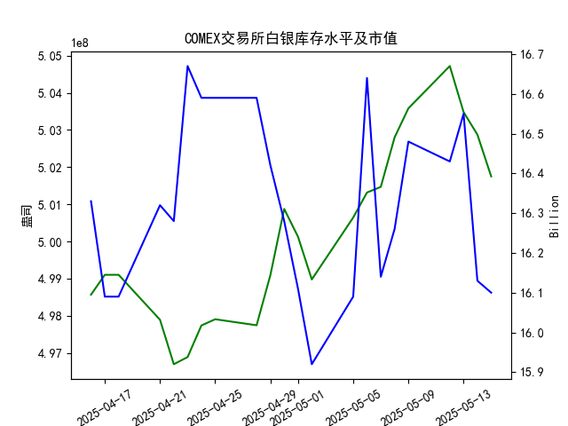

|            |   comex白银库存量 |   comex白银库存市值(billion) |   伦敦银现货价 |   上海金交所白银现货价 |   美元兑人民币汇率 |
|:-----------|------------------:|-----------------------------:|---------------:|-----------------------:|-------------------:|
| 2025-04-18 |       4.99104e+08 |                       32.23  |         32.31  |                   8142 |             7.2069 |
| 2025-04-21 |       4.97895e+08 |                       32.785 |         32.31  |                   8227 |             7.2055 |
| 2025-04-22 |       4.96698e+08 |                       32.785 |         32.61  |                   8154 |             7.2074 |
| 2025-04-23 |       4.96891e+08 |                       33.55  |         32.96  |                   8191 |             7.2116 |
| 2025-04-24 |       4.97741e+08 |                       33.325 |         33.395 |                   8295 |             7.2098 |
| 2025-04-25 |       4.97908e+08 |                       33.325 |         33.335 |                   8270 |             7.2066 |
| 2025-04-28 |       4.97746e+08 |                       33.325 |         33.01  |                   8173 |             7.2043 |
| 2025-04-29 |       4.99098e+08 |                       32.89  |         33.225 |                   8197 |             7.2029 |
| 2025-04-30 |       5.00876e+08 |                       32.51  |         32.225 |                   8163 |             7.2014 |
| 2025-05-01 |       5.00128e+08 |                       32.205 |         32.125 |                   8163 |             7.2014 |
| 2025-05-02 |       4.98978e+08 |                       31.91  |         32.365 |                   8163 |             7.2014 |
| 2025-05-05 |       5.00644e+08 |                       32.14  |         32.365 |                   8163 |             7.2014 |
| 2025-05-06 |       5.01317e+08 |                       33.19  |         33.025 |                   8221 |             7.2008 |
| 2025-05-07 |       5.01469e+08 |                       32.195 |         32.875 |                   8229 |             7.2005 |
| 2025-05-08 |       5.028e+08   |                       32.335 |         32.43  |                   8100 |             7.2073 |
| 2025-05-09 |       5.03581e+08 |                       32.73  |         32.515 |                   8150 |             7.2095 |
| 2025-05-12 |       5.04719e+08 |                       32.56  |         32.02  |                   8124 |             7.2066 |
| 2025-05-13 |       5.03481e+08 |                       32.88  |         32.98  |                   8214 |             7.1991 |
| 2025-05-14 |       5.02874e+08 |                       32.085 |         32.885 |                   8172 |             7.1956 |
| 2025-05-15 |       5.0175e+08  |                       32.085 |         32.085 |                   7967 |             7.1963 |

### 近期白银市场投资机会分析

基于提供的2025年4月16日至5月15日数据，我对近期（尤其是最近一周，即2025-05-08至2025-05-15）的白银市场变化进行了分析。重点关注COMEX白银库存量、库存市值、伦敦和上海白银现货价格，以及美元兑人民币汇率的变化。通过对比今日（2025-05-15）和昨日（2025-05-14）的关键指标，我评估了潜在的投资机会。以下分析聚焦于价格趋势、库存动态和汇率影响，这些因素可能影响白银的供需和投资价值。

#### 1. 最近一周数据概述
最近一周（2025-05-08至2025-05-15），白银市场显示出一些波动性，主要表现为价格下行、库存小幅减少和汇率稳定。以下是关键指标的汇总：

- **COMEX白银库存量**：整体呈小幅下降趋势，从2025-05-08的5.028001e+08盎司降至2025-05-15的5.017502e+08盎司。这可能反映出需求增加或供应紧缩。
- **COMEX白银库存市值**：从2025-05-08的16.26亿美元降至2025-05-15的16.1亿美元，显示市值随价格调整而波动。
- **伦敦市场白银现货价格**：从2025-05-08的32.430美元/盎司降至2025-05-15的32.085美元/盎司，呈现持续下行趋势。
- **上海金交所白银现货价格**：从2025-05-08的8100.0元/千克降至2025-05-15的7967.0元/千克，降幅较大，可能受全球价格影响。
- **美元兑人民币汇率**：从2025-05-08的7.2073元/美元小幅降至2025-05-15的7.1963元/美元，汇率相对稳定，但近期略有升值（人民币轻微贬值）。

整体来看，最近一周白银价格下跌可能是由于市场情绪或经济因素（如全球需求放缓），但库存减少可能预示潜在反弹机会。

#### 2. 今日（2025-05-15）相对于昨日（2025-05-14）的关键变化
今日与昨日的比较显示出白银价格和库存的显著下行，但汇率变化较小。这可能为短期投资提供机会。以下是详细对比：

| 指标                  | 昨日（2025-05-14）值              | 今日（2025-05-15）值              | 变化趋势及幅度      | 潜在影响                  |
|-----------------------|-----------------------------------|-----------------------------------|---------------------|---------------------------|
| **COMEX白银库存量** | 5.028744e+08 盎司               | 5.017502e+08 盎司               | 下降约0.22%         | 库存减少可能表示需求上升，短期内可能推动价格反弹。 |
| **COMEX白银库存市值** | 16.13 亿美元                   | 16.1 亿美元                     | 下降约0.19%         | 市值小幅下滑，反映价格调整，可能为低价买入提供机会。 |
| **伦敦市场白银价格** | 32.885 美元/盎司               | 32.085 美元/盎司               | 下降约2.42%         | 价格下跌可能吸引价值投资者，但需警惕进一步下滑风险。 |
| **上海金交所白银价格** | 8172.0 元/千克                 | 7967.0 元/千克                 | 下降约2.51%         | 价格急剧下跌，可能由于汇率和全球市场联动，适合中国投资者考虑低位买入。 |
| **美元兑人民币汇率** | 7.1956 元/美元                 | 7.1963 元/美元                 | 上升约0.01%         | 人民币轻微贬值，使美元定价的白银相对更便宜，利于中国投资者。 |

这些变化表明，今日白银市场整体下行，但库存减少的信号可能暗示短期修正。价格下跌幅度较大（尤其是上海市场），结合汇率的轻微有利变化，这可能创造买入机会。

#### 3. 潜在投资机会判断
基于上述数据，我从以下角度评估近期投资机会，主要聚焦于白银的多头（买入）和空头（卖出）策略。机会评估考虑了市场趋势、风险和全球因素（如需求恢复或经济政策）：

- **买入机会（多头策略）**：
  - **白银价格回调**：伦敦和上海白银价格在最近一周持续下跌，尤其是今日相对于昨日的2%以上降幅，这可能是一个短期买入点。如果库存量继续减少（如今日下降），这可能预示需求回暖，推动价格反弹。建议关注伦敦市场（32.085美元/盎司），其国际定价影响力较大。对于中国投资者，汇率的轻微上升使白银更具吸引力（例如，用人民币买入美元定价的白银更划算）。
  - **库存减少信号**：COMEX库存从昨日到今日小幅下降，这在历史数据中（如4月下旬的库存波动）往往与价格上涨相关联。如果这一趋势持续，投资者可在今日价格低点布局，目标价位可设为伦敦市场33美元/盎司以上。
  - **风险较低的多元化机会**：结合汇率因素，中国投资者可考虑通过上海金交所买入（今日7967.0元/千克），以对冲汇率风险。预计若全球经济复苏，白银需求（如工业和珠宝）可能回升。

- **卖出机会（空头策略）**：
  - **价格下行趋势**：若价格继续跟随今日的下跌势头（如上海市场的急剧下降），投资者可考虑卖出以锁定利润。今日伦敦价格较昨日下降2.42%，这可能延续为短期空头行情，尤其是如果库存市值进一步下滑。
  - **市场不确定性**：最近一周数据显示波动性较大（如5月12日至15日的价格震荡），若无新需求驱动，卖出避险可能是明智选择。适合风险厌恶型投资者在今日高位卖出。

- **整体风险与建议**：
  - **积极因素**：库存减少和汇率轻微有利，可能在短期内（1-2周）带来反弹机会。投资机会窗口可能在今日至下周初。
  - **潜在风险**：价格下行可能加剧（如受全球经济因素影响），以及汇率波动的不确定性。建议结合技术分析（如K线图）监控，并控制仓位（例如，买入时不超过总资产的20%）。
  - **其他考虑**：关注全球事件（如美联储政策或中国经济数据），这些可能放大机会。总体而言，今日的下跌为中期多头投资者提供了较好切入点。

#### 4. 结论
近期白银市场显示出混合信号：价格和库存下行可能带来短期买入机会，而持续波动增加了风险。聚焦今日相对于昨日的变化，白银价格的显著下降（尤其是上海市场）结合库存减少，建议投资者优先考虑低位布局多头策略，但需密切跟踪下周数据以确认趋势。如果市场反弹，潜在回报率可达5-10%。投资者应根据个人风险偏好和全球经济环境调整策略，建议咨询专业顾问以制定详细计划。