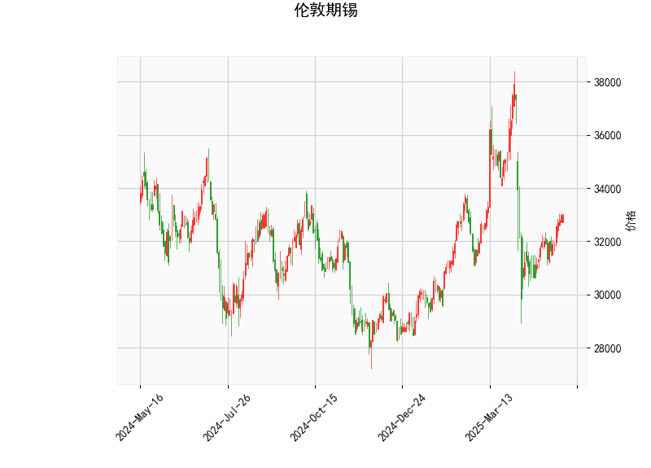

# 伦敦期锡技术分析结果分析

## 总体概述
伦敦期锡的当前价格为32974.0，基于提供的指标，我们可以看到市场呈现出中性偏向上的态势。RSI显示价格动能稳定，MACD直方图正值暗示潜在的看涨信号，而Bollinger Bands表明价格处于中轨附近，波动率适中。K线形态的"CDLSHORTLINE"（短线模式）可能表示短期波动或反转机会。整体而言，这反映出市场可能在盘整后寻求方向，但需警惕潜在的逆转风险。

## 详细指标分析
- **RSI (相对强弱指数)**: 当前值为56.41，这是一个中性水平（RSI高于50表示牛市倾向，但低于70未达超买）。这表明近期买方动能稍占上风，但未出现过度买入的迹象。投资者可视为市场健康状态，如果RSI继续上升，可能预示进一步上行；反之，若跌破50，可能转为观望或卖出信号。
  
- **MACD (移动平均收敛散度)**: MACD线为12.88（正值），信号线为-231.48（负值），直方图为244.36（正值）。这是一个有趣的组合：直方图正值通常表示多头强势，暗示短期看涨。然而，信号线处于负值可能反映出潜在的修正压力。总体上，这可能意味着MACD线即将交叉向上，形成买入机会，但需确认趋势是否持续。如果直方图继续扩大，价格可能向上测试Bollinger Bands的上轨。

- **Bollinger Bands (布林带)**: 
  - 上轨（Upper Band）: 36985.89
  - 中轨（Middle Band）: 33005.85
  - 下轨（Lower Band）: 29025.82
  当前价格（32974.0）紧邻中轨，这表示价格处于相对均衡状态，波动率中等。如果价格向上突破上轨（约36986），可能触发强势上涨；反之，若跌破下轨（约29026），则可能进入超卖区。目前的紧凑带宽暗示市场可能即将出现波动加剧。

- **K线形态**: "CDLSHORTLINE" 可能指短期K线模式，如锤头线或类似反转形态。这通常表示价格可能在短期内出现反弹或修正，尤其在盘整后。结合其他指标，如果这是一种看涨短线信号（如底部锤头），则可能支持买入；但需结合市场新闻（如全球锡需求或供应变化）验证其可靠性。

## 近期投资或套利机会和策略判断
基于以上分析，伦敦期锡市场可能存在短期投资机会，但需谨慎考虑全球经济因素（如工业需求、供应链中断或宏观经济数据）。以下是针对可能的投资和套利机会的分析与策略建议：

### 潜在投资机会
- **看涨机会**: MACD直方图正值和RSI中性水平暗示短期上行潜力。如果价格维持在中轨以上（约33006），投资者可考虑买入，目标指向上轨（约36986）。例如，当前价格接近中轨，结合"CDLSHORTLINE"的可能反转信号，这可能是一个进入点的起点。
  
- **风险及时机**: 市场若出现突破（如RSI升至70以上或MACD线交叉向上），可视为确认信号。但如果全球锡价受外部因素（如中国经济数据或金属库存变化）影响，可能导致回调。因此，适合短期交易者（1-5天内），但需设置止损（如跌破中轨10%）以控制风险。

### 套利策略建议
- **跨商品套利**: 伦敦期锡与铜、锌等金属高度相关。如果锡价相对其他金属（如LME铜）出现低估（当前锡价在历史中轨附近），可考虑多头锡/空头铜的配对套利策略。例如，利用锡的潜在上行与铜的波动性差异，通过期货合约锁定价差。预计如果锡需求（如电子行业）回暖，这种机会可能在近期显现。

- **波动率套利**: Bollinger Bands显示带宽较窄，暗示即将的波动扩大。可采用期权策略，如买入锡价看涨期权（Call Option）并卖出看跌期权（Put Option），以捕捉价格向上轨移动的波动。当前中轨位置适合均值回归策略：如果价格偏离中轨（如向上），可通过短期多头头寸获利。

- **风险管理策略**: 任何机会都需结合止损和头寸控制。例如，将头寸规模限制在总资金的5%以内，并监控全球事件（如美联储利率决策或中国工业产出数据）。如果RSI超过70或MACD直方图转为负值，建议及时退出。

### 总体策略建议
- **对于保守投资者**: 优先观察，等待更明确信号（如MACD金叉）。可从小额头寸入手，结合基本面分析（如锡矿供应报告）。
- **对于积极交易者**: 短期买入策略，目标上轨，但准备好在下轨附近止损。结合套利，可探索多市场（如LME与上海期货交易所）机会。
- **注意事项**: 技术分析并非万能，需结合宏观环境（如通胀或地缘政治风险）。建议使用模拟交易平台测试策略，以降低实际风险。

通过这些分析，伦敦期锡短期内可能提供温和的投资机会，但市场的不确定性较高，投资者应保持谨慎。