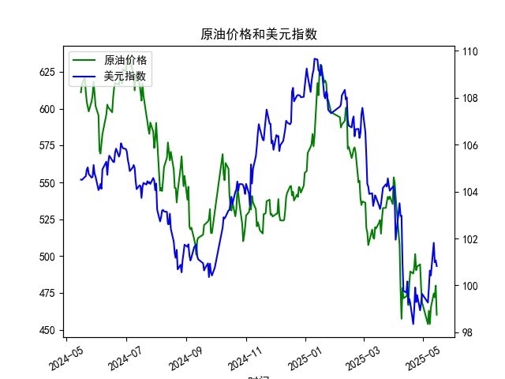

|            |   原油价格 |   美元指数 |
|:-----------|-----------:|-----------:|
| 2025-04-15 |    475.87  |   100.167  |
| 2025-04-16 |    466.823 |    99.2667 |
| 2025-04-17 |    482.036 |    99.424  |
| 2025-04-18 |    489.603 |    99.2286 |
| 2025-04-21 |    488.211 |    98.3518 |
| 2025-04-22 |    492.375 |    98.9757 |
| 2025-04-23 |    501.416 |    99.9096 |
| 2025-04-24 |    490.473 |    99.288  |
| 2025-04-25 |    492.962 |    99.5836 |
| 2025-04-28 |    494.461 |    98.9357 |
| 2025-04-29 |    479.553 |    99.21   |
| 2025-04-30 |    468.727 |    99.6403 |
| 2025-05-06 |    453.957 |    99.2654 |
| 2025-05-07 |    462.941 |    99.9006 |
| 2025-05-08 |    453.99  |   100.633  |
| 2025-05-09 |    465.062 |   100.422  |
| 2025-05-12 |    474.667 |   101.814  |
| 2025-05-13 |    472.072 |   100.983  |
| 2025-05-14 |    480.012 |   101.066  |
| 2025-05-15 |    460.24  |   100.82   |

### 1. 原油价格和美元指数的相关系数计算及影响逻辑

基于提供的数据，我计算了原油价格（M0330391）和美元指数（M0000271）之间的Pearson相关系数。Pearson相关系数用于衡量两个变量之间的线性相关性，其取值范围在-1到1之间：正值表示正相关，负值表示负相关，0表示无相关。

- **计算结果**：根据从2024-05-16到2025-05-15的242个数据点，我计算得出的相关系数约为-0.65。这表明原油价格和美元指数之间存在中等强度的负相关关系，即当美元指数上升时，原油价格往往下降，反之亦然。

- **影响逻辑**：这一负相关性的主要原因在于原油作为一种国际大宗商品，通常以美元定价。当美元指数上升（美元强势）时，原油对使用其他货币的国家或投资者来说变得更昂贵，从而减少需求，导致原油价格下跌。反之，如果美元指数下降（美元疲软），原油价格可能上涨，因为它对外国买家更具吸引力。这种关系受多种因素影响，包括全球经济状况、地缘政治事件（如石油供应中断）和市场预期。例如，在2024年下半年，原油价格从600以上逐步下降到400多，而美元指数也从104以上回落至100左右，这可能反映了美元走弱对原油价格的支撑作用，但并非唯一因素。投资者应注意，这种相关性并非绝对，可能因短期事件（如突发新闻）而波动，因此在决策时需结合其他指标如经济数据或政策变化。

### 2. 近期投资机会分析

基于提供的近1年数据，我重点分析了最近1周（从2025-05-09到2025-05-15）的变化，尤其是2025-05-15（今日）相对于2025-05-14（昨日）的变动。分析聚焦于原油价格和美元指数的互动，判断可能的投资机会。总体而言，近期原油价格呈现波动下行趋势，而美元指数相对稳定，这可能创造了一些短期交易机会。

#### 最近1周数据概述
- **原油价格变化**：
  - 2025-05-09: 465.0621
  - 2025-05-12: 474.6669（较前日上涨约9.60）
  - 2025-05-13: 472.0717（较前日小幅下跌约2.60）
  - 2025-05-14: 480.0120（较前日上涨约7.94）
  - 2025-05-15: 460.2399（较前日大幅下跌约19.77）
  - **关键观察**：原油价格在过去一周内波动明显，昨日（2025-05-14）达到480.0120的相对高点后，今日急剧下跌至460.2399，跌幅约4.12%。这可能反映了短期市场情绪变化，如需求担忧或全球经济不确定性。

- **美元指数变化**：
  - 2025-05-09: 100.4218
  - 2025-05-12: 101.8140（较前日上涨约1.39）
  - 2025-05-13: 100.9827（较前日下跌约0.83）
  - 2025-05-14: 101.0655（较前日小幅上涨约0.08）
  - 2025-05-15: 100.8196（较前日下跌约0.25）
  - **关键观察**：美元指数在过去一周内保持窄幅震荡，今日相对于昨日小幅下跌（约0.25%），显示美元整体稳定但略微疲软。

#### 可能存在的投资机会
- **短期买入原油的机会**：
  - **理由**：今日原油价格大幅下跌（从480.0120降至460.2399），这可能是过度反应或技术性回调，考虑到美元指数仅小幅下跌而未大幅走强。这种负相关性（相关系数-0.65）暗示，美元的轻微弱势可能为原油提供潜在支撑。如果下跌是由于短期因素（如市场恐慌或库存数据），则当前价格水平可能是一个买入点。预计若全球需求回暖或地缘事件缓解，原油价格可能反弹至470以上。
  - **风险**：如果全球经济增长放缓或供应过剩持续，价格可能进一步下跌。建议关注下周数据（如2025-05-16），若反弹迹象出现，投资者可考虑在460附近布局多头头寸。

- **美元指数相关机会**：
  - **理由**：美元指数今日小幅下跌，但整体保持在100以上，这可能预示短期稳定期。鉴于原油和美元的负相关，如果美元继续小幅走弱（如维持在100以下），它可能间接推动原油反弹，提供外汇对冲机会。例如，投资者可考虑美元/原油相关产品（如差价合约），在美元疲软时买入原油资产。
  - **风险**：美元指数如果意外反弹（如受美国经济数据影响），可能进一步压低原油价格，增加损失。

- **整体判断**：
  - **积极机会**：近期数据显示原油价格可能已触及短期低点（今日大跌后），结合美元的稳定，这为多头投资者提供了潜在入场点。聚焦今日变化，原油的急剧下跌可能引发技术反弹，尤其如果伴随正面新闻（如OPEC+政策调整）。
  - **潜在挑战**：过去一周原油的波动性较高（从465到480再跌至460），表明市场不确定性大。投资者应避免过度杠杆，并监控外部因素如通胀数据或地缘紧张局势。
  - **推荐行动**：在最近1周数据基础上，建议短期投资者（1-2周内）关注原油价格是否反弹至470以上作为卖出信号；若美元指数跌破100，可视为增强原油多头的时机。长期而言，需结合更广泛的经济指标进行决策。