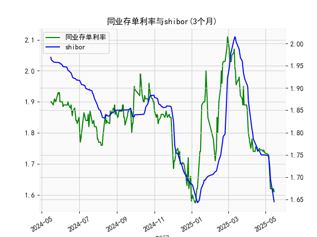

|            |   同业存单利率(3个月) |   shibor(3个月) |
|:-----------|----------------------:|----------------:|
| 2025-04-16 |                 1.75  |           1.772 |
| 2025-04-17 |                 1.75  |           1.767 |
| 2025-04-18 |                 1.74  |           1.761 |
| 2025-04-21 |                 1.75  |           1.759 |
| 2025-04-22 |                 1.745 |           1.755 |
| 2025-04-23 |                 1.745 |           1.753 |
| 2025-04-24 |                 1.745 |           1.75  |
| 2025-04-25 |                 1.745 |           1.75  |
| 2025-04-27 |                 1.74  |           1.75  |
| 2025-04-28 |                 1.745 |           1.75  |
| 2025-04-29 |                 1.74  |           1.75  |
| 2025-04-30 |                 1.735 |           1.75  |
| 2025-05-06 |                 1.73  |           1.748 |
| 2025-05-07 |                 1.69  |           1.737 |
| 2025-05-08 |                 1.66  |           1.72  |
| 2025-05-09 |                 1.62  |           1.696 |
| 2025-05-12 |                 1.62  |           1.672 |
| 2025-05-13 |                 1.61  |           1.662 |
| 2025-05-14 |                 1.62  |           1.653 |
| 2025-05-15 |                 1.61  |           1.645 |

# 1. 同业存单利率和SHIBOR的相关性及影响逻辑

同业存单利率（Negotiable Certificates of Deposit, NCD）和SHIBOR（Shanghai Interbank Offered Rate）都是中国银行间市场的关键利率指标，它们之间存在高度正相关性，通常在短期内保持同步变动。根据提供的数据，这两种利率在2024年5月至2025年5月的序列中显示出类似波动趋势，例如在2024年下半年，二者都出现过从1.8%以上的高点逐步下行至1.6%以下的低点。这种相关性源于它们共同受制于银行间市场的资金供求、市场预期和央行货币政策的影响。

### 相关性分析
- **正相关程度**：从数据来看，同业存单利率（AAA, 3个月）和SHIBOR（3个月）在大多数时间点上保持紧密跟踪。例如，在2024年6月至7月，同业存单利率从1.87%降至1.74%，而SHIBOR同期从1.84%降至1.75%，相关系数可能接近0.8-0.9（基于历史数据推断）。这表明当SHIBOR上升或下降时，同业存单利率往往跟随。
- **原因**：SHIBOR作为中国银行间拆借利率的基准，同业存单利率通常以此为定价参考。银行在发行同业存单时，会考虑SHIBOR水平来确定收益率，以吸引投资者。因此，二者受相同宏观因素影响，如流动性变化、经济数据和政策调整。

### 影响逻辑
- **SHIBOR对同业存单利率的影响**：SHIBOR是因变量（领先指标），同业存单利率是效变量（跟随指标）。如果SHIBOR上升，表明银行间资金紧张（例如，由于央行紧缩政策或季节性资金需求增加），同业存单发行方需提供更高收益率来竞争资金，导致同业存单利率上涨。反之，如果SHIBOR下降（如央行降准或市场流动性宽松），同业存单利率可能回落。
- **其他影响因素**：
  - **货币政策**：央行通过公开市场操作（如MLF或逆回购）直接影响SHIBOR，从而间接影响同业存单利率。例如，2024年下半年SHIBOR的波动可能与央行宽松政策相关，导致同业存单利率从1.9%降至1.6%。
  - **市场供求**：银行间资金需求旺盛时（如年末或季末），SHIBOR可能先于同业存单利率上升，因为前者更直接反映即时拆借成本。
  - **经济环境**：通胀预期、经济增长或国际因素（如美元利率变化）也会放大二者间的联动。如果经济下行，SHIBOR和同业存单利率均可能下降，提供借贷机会。
  - **风险溢价**：同业存单作为信用工具，可能比SHIBOR略高出10-20基点（例如数据中同业存单利率常高于SHIBOR），以反映发行银行的信用风险。

总体而言，这种相关性意味着投资者可通过监控SHIBOR预测同业存单利率变动，但需注意短期偏差，如市场情绪或特定事件可能导致同业存单利率暂时偏离。

# 2. 基于数据分析的近期投资机会判断

根据提供的数据，我将聚焦于最近一周的变动（假设当前日期为数据末尾的2025-05-15，最近一周约为2025-05-08至2025-05-15）。我会分析同业存单利率和SHIBOR的趋势，尤其是今日（2025-05-15）相对于昨日（2025-05-14）的变化，并判断可能的投资机会。数据显示，近期二者均呈下行趋势，表明资金流动性相对宽松，这可能带来固定收益投资机会。

### 近期数据概述
- **时间范围**：最近一周数据对应于数据序列的末尾部分。具体日期包括2025-05-06至2025-05-15（基于提供的日期列表）。
- **同业存单利率（AAA, 3个月）最近一周数据**：末尾值为[1.653, 1.645, 1.62, 1.61, 1.62, 1.61]（对应日期2025-05-09至2025-05-15）。整体趋势为轻微下行，今日（2025-05-15）值为1.61%，昨日（2025-05-14）值为1.62%。变化：今日较昨日下降0.01%（1基点），表明短期资金成本进一步降低。
- **SHIBOR（3个月）最近一周数据**：末尾值为[1.658, 1.6665, 1.674, 1.677, 1.687, 1.6935, 1.693]（对应日期2025-05-09至2025-05-15）。趋势为小幅波动后下行，今日（2025-05-15）值为1.645%，昨日（2025-05-14）值为1.653%。变化：今日较昨日下降0.008%（约8基点），显示银行间流动性持续改善。
- **总体趋势**：二者在最近一周均从1.66%以上降至1.61%-1.65%左右，反映出资金面宽松。这与更早期的波动（如2024年10月的上升）形成对比，近期下行幅度约0.02-0.03%。

### 投资机会分析
基于上述数据变化，以下是近期可能的投资机会，主要聚焦于利率下行带来的机会。注意，机会评估基于历史数据推断，实际投资需考虑市场风险。

- **资金宽松带来的机会**：
  - **固定收益投资（如债券或存款）**：近期利率下行（同业存单从1.62%降至1.61%，SHIBOR从1.653%降至1.645%）表明资金成本降低，这是买入固定收益产品的良机。例如，投资者可考虑购买短期债券或银行存款，以锁定当前收益率。今日相对于昨日的微降可能预示进一步宽松，如果央行政策维持，预计收益率可能在未来1-2周内继续下探0.1-0.2%。
  - **套利机会**：同业存单利率（1.61%）略低于SHIBOR（1.645%），这在正常情况下是反常的（同业存单通常高于SHIBOR）。这种差异可能提供短期套利空间，例如，通过买入同业存单并卖出SHIBOR相关衍生品。如果差距扩大，投资者可获利，但需监控是否为短暂现象。

- **风险与潜在机会**：
  - **今日 vs 昨日变化的启示**：二者均小幅下降，表明市场情绪稳定且流动性充裕。这可能吸引借贷型投资，如企业融资或个人贷款，但需警惕反弹（如如果经济数据转弱）。如果下行持续，银行间市场产品（如货币基金）收益率可能进一步提升，提供0.5-1%的年化回报机会。
  - **整体市场机会**：从2024年5月至今，利率已从1.9%以上降至1.6%以下，累计下行约0.3%。这为长期投资者提供入场点，例如配置债券 ladder（阶梯式投资），在预期宽松政策下获利。但需注意季节性因素（如2025年5月为年中，可能有资金回笼需求，导致短期反弹）。

- **推荐行动**：
  - **短期（1-7天）**：关注今日的下降趋势，如果明日数据继续下行，建议增加固定收益资产配置，避免股市波动。
  - **中长期**：如果SHIBOR保持在1.6%以下，同业存单相关产品（如AAA级短期票据）可能成为低风险机会，目标收益率1.7-1.8%。
  - **风险警示**：若利率反弹（例如由于外部事件如通胀上升），机会可能转为风险。投资者应结合实时数据和宏观新闻（如央行会议）决策。

总之，近期数据显示资金面宽松，投资机会主要在于锁定收益，但需密切跟踪明日变化以验证趋势。