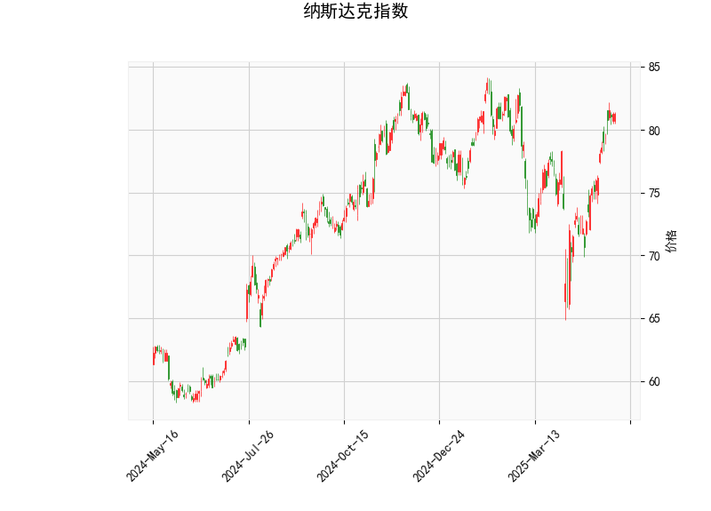

# 纳斯达克指数技术分析结果分析

## 概述
纳斯达克指数的当前价格为81.28，基于提供的指标显示出整体看涨的信号，但也存在潜在的风险。以下是对各技术指标的详细分析，这些指标包括RSI、MACD、布林带和K线形态。总体而言，指数处于强势区域，但RSI的超买状态可能预示短期回调。

## 指标详细分析
- **RSI (相对强弱指数，67.24)**:  
  RSI当前值为67.24，处于中性偏上区域（通常50以上表示看涨）。然而，它已接近70的超买阈值，这暗示市场可能过度买入，短期内存在回调或修正的风险。如果RSI继续上升至70以上，可能会增加卖出压力；反之，如果回落至50以下，则可能标志着新的买入机会。

- **MACD (移动平均收敛散度，1.92；信号线1.26；直方图0.66)**:  
  MACD线（1.92）高于信号线（1.26），且直方图值为正（0.66），这表明多头动量强劲，短期内可能继续上涨。这种金叉形态（MACD线上穿信号线）通常被视为买入信号，支持看涨趋势。然而，如果直方图开始缩小或转为负值，则可能预示动量减弱和潜在反转。

- **布林带（上轨83.11，中轨75.80，下轨68.49）**:  
  当前价格（81.28）位于中轨（75.80）和上轨（83.11）之间，更接近上轨，这反映出价格处于强势区间。布林带收窄或价格接近上轨通常表示波动性增加，如果价格突破上轨，可能引发进一步上涨；反之，如果回落至中轨附近，则可能进入盘整或回调阶段。这暗示当前市场有上行潜力，但也需警惕突破失败的风险。

- **K线形态（CDLSHORTLINE）**:  
  CDLSHORTLINE可能指短线蜡烛形态（如短实体蜡烛），这通常表示价格波动较小、市场犹豫或潜在反转信号。在强势趋势中，这种形态可能预示短期修正或盘整，而不是立即反转。结合其他指标，它可能强化了RSI的超买警告，建议投资者密切关注后续K线以确认方向。

## 总体市场解读
从这些指标来看，纳斯达克指数显示出短期看涨趋势（MACD和布林带支持），但RSI的超买状态和K线形态的犹豫信号增加了不确定性。市场可能在近期继续向上测试上轨阻力（如83.11附近），但如果外部因素（如经济数据或地缘事件）触发卖压，回调风险将上升。整体而言，这是一个强势但需谨慎的局面。

# 近期投资或套利机会和策略判断

## 潜在投资机会
基于当前技术分析，纳斯达克指数可能存在以下投资机会：
- **看涨机会**: 指数的MACD金叉和接近布林上轨表明短期上行潜力。如果价格突破83.11水平，投资者可考虑买入相关ETF（如QQQ）或指数基金，目标指向85-87区域。RSI虽接近超买，但若无明显负面催化剂，上涨动能可能持续。
- **回调买入机会**: 如果RSI回落至60以下或价格回测中轨（75.80附近），这可能是一个低风险买入点，尤其适合中长线投资者。通过均线（如50日或200日移动平均）确认支撑位，能进一步增强这一策略。
- **套利机会**: 在指数层面，套利可能涉及衍生品，如期权或期货。当前价差（例如，纳斯达克期货与现货的价差）可能提供统计套利机会。如果MACD直方图缩小，投资者可通过卖出看涨期权（收取溢价）或构建价差交易（如牛市价差）来获利。同时，关注相关资产（如科技股ETF与指数的相对表现）可能发现配对交易机会，例如如果某些科技股滞后于指数，可在指数多头时做空这些股票。

## 推荐策略
- **短期交易策略**:  
  - **多头策略**: 在价格维持在上轨以下时买入，设置止盈（如84.00）和止损（如79.00），以捕捉短期反弹。结合MACD信号，入场时机可选在直方图扩大时。
  - **风险控制**: 鉴于RSI超买，采用仓位控制（如不超过总仓位的20%）和动态止损，避免回调放大损失。
  
- **中长期投资策略**:  
  - **趋势跟踪**: 如果大环境（如美联储政策）支持科技股，持有指数相关资产等待突破。建议结合基本面分析（如企业财报），以避免纯技术策略的局限。
  - **套利策略**: 利用期权市场构建中性策略，例如铁蝶式期权（iron butterfly），在波动率较低时获利。该策略适合经验丰富的投资者，利用当前布林带收窄的低波动环境。

- **潜在风险与注意事项**:  
  尽管机会存在，但RSI超买和K线形态的信号提醒了回调可能性。外部因素如通胀数据、美联储加息或全球事件可能触发下行。投资者应优先考虑风险/回报比，并使用模拟交易测试策略。最终，建议结合宏观经济数据和个人风险偏好制定决策。