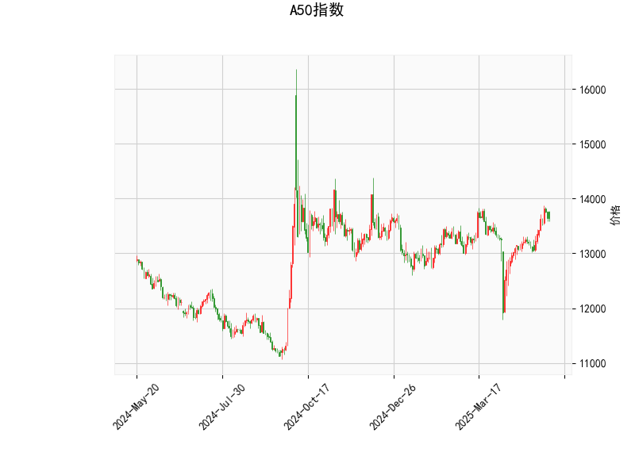

### A50指数的技术分析结果分析

#### 1. 对技术指标的详细分析
基于提供的A50指数技术分析数据，我们可以从多个角度解读当前的市场状况。以下是对关键指标的逐一分析：

- **当前价格（Current Price）**：A50指数当前价格为13638.0。这是一个中性位置，表明指数处于相对稳定的区间，并未出现极端高点或低点。
  
- **RSI（Relative Strength Index，相对强弱指数）**：RSI值为60.49。这表明指数处于中性偏强区域（RSI在50以上表示强势，但低于70表示未超买）。这暗示短期内市场可能继续保持上行势头，但需警惕若RSI升至70以上，可能出现超买风险，导致回调。

- **MACD（Moving Average Convergence Divergence，移动平均收敛散度）**：
  - MACD线：146.81
  - MACD信号线：92.74
  - MACD柱状图（Hist）：54.06
  - MACD线高于信号线，且柱状图为正值，这是一个典型的看涨信号。表示短期动量强劲，价格可能继续上涨。然而，如果MACD柱状图开始收窄或转为负值，则可能预示趋势逆转。

- **布林带（Bollinger Bands）**：
  - 上轨（Upper Band）：13908.77
  - 中轨（Middle Band）：13262.67
  - 下轨（Lower Band）：12616.57
  - 当前价格（13638.0）位于中轨和上轨之间，距离中轨略微偏上。这显示价格处于一个相对稳定的波动区间内，潜在的上行空间有限（需突破上轨13908.77才能确认强势）。如果价格跌破中轨，可能进入修正阶段；反之，向上突破可视为买入机会。

- **K线形态**：检测到“CDLMATCHINGLOW”模式（Matching Low）。这是一个看涨的K线形态，通常出现在价格底部，暗示潜在的反转信号。例如，它可能表示市场已触及短期低点，并可能开始反弹。这与MACD的看涨信号相呼应，增强了短期乐观预期。

总体而言，A50指数的技术指标显示当前处于一个温和看涨态势。RSI和MACD支持上行潜力，布林带表明价格在关键区间内波动，而K线形态提供底部反转的确认。但整体风险仍存，如果外部因素（如经济数据或地缘事件）影响，市场可能快速逆转。

#### 2. 近期可能存在的投资或套利机会和策略分析
基于上述技术分析，我们可以进一步评估A50指数的潜在投资机会。当前指标偏向看涨，但市场波动性较高，因此策略应注重风险管理。以下是针对近期（短期内1-3个月）的判断和建议：

##### 投资机会
- **看涨机会**：指标整体偏多头，尤其是MACD的正直方图和CDLMATCHINGLOW形态，暗示A50指数可能在短期内继续上涨。如果价格突破布林带上轨（13908.77），这将是一个强有力的买入信号，潜在目标可设在14000-14200区间。RSI未超买（低于70）进一步支持这一机会，适合多头投资者。
  
- **潜在风险**：如果全球市场情绪转弱或经济数据疲软，价格可能回落至中轨（13262.67）以下，甚至测试下轨（12616.57）。RSI若升至70以上，将增加回调风险，因此需密切监控。

##### 套利机会
- **跨市场套利**：A50指数常与恒生指数或A股市场相关联。如果A50与这些指数之间出现价差（如A50相对 undervalued），可考虑跨市场套利策略。例如，利用A50期货与现货指数的差异进行套利，但需注意交易成本和流动性。
  
- **波动率套利**：布林带的窄幅波动（当前价在中轨附近）可能预示短期波动率增加。投资者可通过期权策略（如卖出看涨期权或买入跨式期权）来捕捉波动率变化。如果CDLMATCHINGLOW形态确认反弹，波动率上升可带来套利收益。

##### 投资策略建议
- **多头策略（适合乐观投资者）**：
  - **买入点**：当下或当价格接近中轨（13262.67）时买入，目标设在上轨以上（13908.77）。结合MACD信号，待柱状图进一步扩大时入场。
  - **止损设置**：若价格跌破下轨（12616.57），立即止损，以控制损失。
  - **持有期**：短期（1-2周），观察RSI是否保持在60以下。

- **中性或观望策略（适合谨慎投资者）**：
  - **等待确认**：若K线形态持续显示看涨信号（如后续出现更多底部反转模式），再考虑入场。否则，保持观望，避免盲目操作。
  - **结合基本面**：监控中国经济数据（如GDP、CPI）和全球事件（如美联储政策），以验证技术信号。

- **风险管理策略**：
  - **头寸控制**：分配不超过总资金的20-30%用于A50相关投资。
  - **多样化**：结合其他资产（如债券或黄金）进行对冲，降低单一市场风险。
  - **退出计划**：若RSI超过70或MACD柱状图转为负值，及时减仓。

总之，近期A50指数的投资机会主要基于其看涨技术信号，但套利策略需依赖市场间价差和波动率。投资者应结合个人风险偏好，并持续跟踪最新数据进行调整。技术分析仅为参考，实际决策需考虑 broader 市场环境。