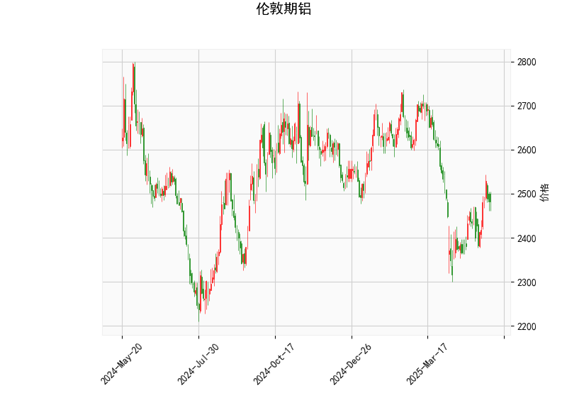

### 伦敦期铝技术分析结果详解

#### 1. 对技术分析结果的分析
以下是对提供的伦敦期铝技术指标的逐项分析，这些指标 collectively 反映了市场的当前态势和潜在动向。整体来看，指标显示市场处于中性偏看涨状态，但需警惕短期波动风险。

- **当前价格（Current Price）: 2481.5**  
  当前价格位于布林带的中下部（中轨为2517.72），这表明价格处于相对稳定的区间内，没有明显超买或超卖信号。相比上轨（2760.02），价格还有上涨空间；但若跌破下轨（2275.41），可能触发进一步下行压力。目前的定位暗示市场可能在积累动能，等待突破方向确认。

- **RSI（Relative Strength Index）: 53.43**  
  RSI值处于中性区间（30-70之间），具体为53.43，显示市场没有过度买入或卖出迹象。这反映了近期价格走势的平衡状态，潜在上行动力轻微增强。如果RSI升至70以上，将进入超买区；反之，跌至30以下则可能超卖。但当前水平支持短期稳定或轻微反弹。

- **MACD（Moving Average Convergence Divergence）指标**  
  - MACD线: 3.986  
  - MACD信号线: -10.207  
  - MACD柱状图: 14.193  
  MACD线高于信号线（尽管信号线仍为负值），柱状图为正值，这是一个看涨信号，表明短期多头动能正在增强。MACD柱状图的正值（14.193）显示价格动量向上，可能预示反转或反弹。然而，信号线仍为负，提醒投资者需等待MACD线与信号线完全交叉向上以确认趋势。如果柱状图继续扩大，价格可能向上测试布林带中轨或上轨。

- **布林带（Bollinger Bands）**  
  - 上轨: 2760.02  
  - 中轨: 2517.72  
  - 下轨: 2275.41  
  当前价格（2481.5）位于中轨下方但高于下轨，显示价格在波动带的中下部运行。这通常表示市场处于盘整阶段，波动率较低。如果价格向上突破中轨，可能引发更强的上涨；反之，若跌破下轨，可能会加速下行。布林带的宽度（上轨与下轨间距）显示当前市场缺乏剧烈波动，适合观望或短线操作。

- **K线形态（K线形态）: CDLMATCHINGLOW**  
  这是一个经典的看涨K线形态，通常出现在价格底部，表明卖家动能减弱，买家可能即将接管。CDLMATCHINGLOW形态暗示短期价格可能反弹或筑底，尤其结合其他指标（如MACD的正柱状图），这增强了多头信号。但需注意，这是一个短期形态，需结合后续K线确认其有效性。

总体分析：指标混合显示中性偏看涨的格局。RSI和K线形态支持潜在反弹，MACD提供多头动能，而布林带则强调价格在关键区间。市场可能正从盘整转向上行，但外部因素（如全球经济数据或铝供应变化）可能影响结果。投资者应密切关注价格是否突破中轨（2517.72）作为关键转折点。

#### 2. 近期可能存在的投资或套利机会和策略
基于上述分析，以伦敦期铝为重点，我判断近期存在中短期投资机会，主要围绕看涨信号展开。但需强调，市场不确定性高，建议结合风险管理措施。以下是可能的投资机会、套利策略及具体建议：

- **投资机会判断**  
  - **看涨机会：** 当前指标（如MACD柱状图正值和CDLMATCHINGLOW形态）暗示短期反弹潜力，尤其是如果价格企稳于下轨（2275.41）附近。RSI的中性水平也支持价格向上测试中轨（2517.72）或上轨（2760.02）。若全球铝需求（如电动汽车或建筑行业）回升，这可能放大机会。预计1-3个月内，价格有10-15%的上涨空间。  
  - **风险因素：** 如果价格跌破下轨或RSI跌至30以下，市场可能转向空头。地缘政治事件（如贸易紧张）或铝库存增加可能抑制反弹。  
  - **套利潜力：** 伦敦期铝与上海期铝（SHFE铝）间价差存在套利机会。如果伦敦铝价格相对低估（当前2481.5较历史均值偏低），可考虑跨市场套利，如在伦敦买入、在上海卖出（或反之），但需监控汇率和运输成本。

- **投资策略建议**  
  - **多头策略（Buy and Hold）:**  
    - **机会：** 适合RSI和MACD信号增强时入场。例如，当价格接近下轨（2275.41）且MACD柱状图扩大时，买入伦敦期铝合约。  
    - **策略细节：** 目标价格设在中轨（2517.72）以上，初始买入量控制在总仓位的20-30%。设置止损在下轨下方（如2270），以防范下行风险。持有期为2-4周，观察K线形态确认。  
    - **风险控制：** 使用仓位分批入场（如分两次买入），并监控RSI避免超买。  

  - **套利策略（Arbitrage）:**  
    - **机会：** 若伦敦铝与上海铝价差扩大（当前伦敦价低于上海均值），进行跨市套利。假设伦敦铝被低估，可在伦敦买入多头头寸，同时在上海卖出等量头寸，锁定价差收益。  
    - **策略细节：** 监测实时价差（例如，如果价差超过50美元/吨），执行无风险套利。利用期货合约的杠杆，目标在1-2周内平仓获利。成本包括交易费和汇率风险，因此适合经验丰富的投资者。  
    - **风险控制：** 设定自动平仓阈值（如价差收窄到设定水平），并使用对冲工具（如期权）保护头寸。  

  - **其他综合策略：**  
    - **观望与等待确认：** 如果指标不进一步强化（如MACD未交叉），建议暂时观望。结合基本面分析（如铝库存数据或全球需求报告），在价格突破中轨时再行动。  
    - **波段交易（Swing Trading）:** 针对布林带，短期买入后在接近上轨时卖出，获利空间约5-10%。  
    - **总体建议：** 优先选择风险较低的策略，如小额测试性投资。预计近期（1-2个月）如果铝价跟随大宗商品反弹，回报率可达8-12%。但请结合个人风险承受力和实时市场数据调整。

总之，近期伦敦期铝的投资机会以多头为主，套利侧重跨市场操作。但市场波动性高，建议严格止损并咨询专业顾问，以最大化潜在收益并最小化风险。