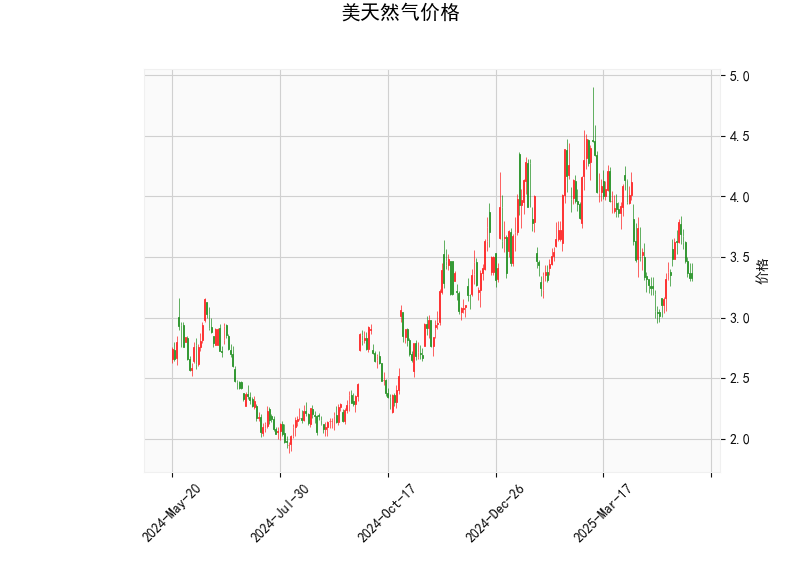

# 美天然气价格的技术分析结果分析

## 1. 对技术分析结果的详细分析
以下是对美天然气价格当前技术指标的分析，基于提供的指标数据：当前价为3.325美元。整体来看，这些指标显示市场可能处于盘整阶段，但存在潜在的看涨信号，暗示短期内可能出现反弹或反转。

- **RSI (相对强弱指数)**: 当前值为42.94。这是一个中性水平，RSI通常在0-100范围内运行，高于70表示超买（可能即将回调），低于30表示超卖（可能即将反弹）。42.94的数值略微偏向超卖区域，表明市场近期动力不足，但尚未达到极端超卖状态。这可能反映出价格在短期内缺乏强势上涨动力，投资者需关注是否会跌破30水平引发反弹。

- **MACD (移动平均收敛散度)**: MACD线为-0.044，信号线为-0.055，柱状图（MACD Hist）为0.011。正值柱状图表明MACD线已从信号线之上穿越，这是一个潜在的看涨信号，暗示短期多头动力可能增强。然而，MACD整体仍处于负值，意味着熊市趋势尚未完全逆转。这可能表示市场正从下行趋势中恢复，但需要进一步确认以避免假突破。

- **布林带指标**: 上轨为4.532，中轨为3.735，下轨为2.938。当前价格3.325位于中轨（3.735）和下轨（2.938）之间，接近中轨下方。这显示价格处于布林带的中间区域，暗示市场可能在窄幅波动。如果价格继续向中轨逼近或突破，可能预示反弹；反之，如果跌破下轨（2.938），则可能进一步下探。布林带的收窄通常表示波动率降低，潜在的突破机会正在酝酿。

- **K线形态**: 检测到"CDLMATCHINGLOW"模式，这是一个经典的看涨反转信号。它通常表示两个连续的低点大致相同，暗示市场可能已触及短期底部，并可能迎来向上反弹。这种形态在技术分析中常被视为买盘信号，但需结合其他指标确认，以避免市场噪音干扰。

总体而言，这些指标显示美天然气价格可能处于底部区域，RSI和MACD的信号略微偏向看涨，结合K线形态的潜在反转，短期市场可能从盘整转向上行。但需警惕外部因素如地缘政治或供需变化，可能放大波动性。

## 2. 近期可能存在的投资或套利机会和策略
基于上述分析，美天然气市场短期内可能存在看涨机会，但风险较高。以下是对潜在投资或套利机会的判断，以及相应的策略建议。注意，天然气市场受全球能源动态影响，建议结合基本面分析（如天气、库存数据）使用这些策略。

### 潜在投资机会
- **看涨反弹机会**: 当前技术指标（如MACD的正柱状图和CDLMATCHINGLOW形态）暗示价格可能从当前水平反弹，目标可能指向布林带中轨（3.735）或上轨（4.532）。如果RSI回升至50以上，这将加强多头信号。短期内，投资者可关注价格突破3.500作为买入点。
- **套利机会**: 天然气期货和期权市场常有价格差异（如现货 vs. 期货），可通过跨期套利（如买入近期合约、卖出远期合约）或跨市场套利（如美天然气 vs. 欧洲天然气）捕捉。如果市场波动率上升，期权策略（如买入看涨期权）可能提供低成本杠杆。
- **风险因素**: 市场波动性高，价格易受季节性需求（如冬季取暖）或供应中断影响。如果RSI跌破30或价格跌破下轨（2.938），可能出现进一步下行风险，需谨慎。

### 推荐投资策略
- **多头策略（适合看涨者）**: 
  - **买入现货或期货**: 在当前价位（3.325）附近买入天然气期货，目标设在中轨（3.735）或上轨（4.532）。设置止损在下轨以下（例如2.900），以控制损失。如果RSI升至50以上，可加仓。
  - **期权策略**: 买入短期看涨期权（如到期日1-3个月），成本较低。如果价格反弹，潜在回报高，但需注意时间衰减风险。
  
- **波动率套利策略（适合中性者）**:
  - **跨式期权套利**: 如果预期价格将大幅波动（如基于布林带收窄），可同时买入看涨和看跌期权，捕捉大行情。当前MACD信号暗示潜在突破，这适合在3.300-3.500区间操作。
  - **期货跨期套利**: 买入近期天然气期货合约（假设价格将反弹），同时卖出远期合约（如6个月后），利用价差缩小获利。需监控库存报告以确认机会。

- **风险管理建议**:
  - **资金分配**: 仅使用总资金的10-20%参与，避免高杠杆。
  - **监控与退出**: 每日检查RSI和MACD变化；若价格跌破3.000，立即止损退出。
  - **整体建议**: 短期策略优先于长期，结合经济新闻（如OPEC动态或美国库存数据）调整。天然气市场不确定性强，保守投资者宜观望或使用模拟交易测试。

总之，近期投资机会主要围绕潜在反弹展开，但需谨慎评估市场风险。建议结合实时数据和专业咨询制定计划。