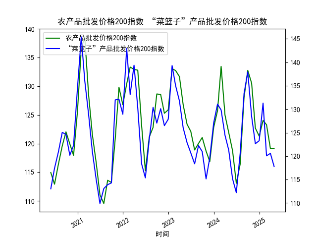

|            |   MSCI新兴市场指数 |   LME铜现货结算价 |
|:-----------|-------------------:|------------------:|
| 2025-04-22 |            1073.79 |            9293.5 |
| 2025-04-23 |            1096.05 |            9416.5 |
| 2025-04-24 |            1092.98 |            9410.5 |
| 2025-04-25 |            1097.1  |            9364   |
| 2025-04-28 |            1102.57 |            9365.5 |
| 2025-04-29 |            1105.99 |            9487.5 |
| 2025-04-30 |            1112.84 |            9204   |
| 2025-05-01 |            1111.97 |            9195   |
| 2025-05-02 |            1133.27 |            9376   |
| 2025-05-06 |            1137.42 |            9500   |
| 2025-05-07 |            1137.41 |            9486   |
| 2025-05-08 |            1133.58 |            9413   |
| 2025-05-09 |            1138.4  |            9485.5 |
| 2025-05-12 |            1161.85 |            9590   |
| 2025-05-13 |            1156.82 |            9534   |
| 2025-05-14 |            1173.65 |            9649.5 |
| 2025-05-15 |            1173.53 |            9537.5 |
| 2025-05-16 |            1172.38 |            9534   |

### 1. MSCI新兴市场指数和铜价的相关性及影响逻辑

MSCI新兴市场指数（MSCI Emerging Markets Index）是全球主要新兴市场股票的代表性指标，涵盖了如中国、印度、巴西等国家的主要公司股票表现。它反映了新兴经济体的整体增长趋势和投资者信心。铜价（LME铜现货结算价）则代表了铜这种大宗商品的价格，铜被广泛用于建筑、电子和基础设施领域，常被视为全球经济活动的领先指标。

**相关性分析：**  
- **正相关性为主：** 历史数据显示，MSCI新兴市场指数和铜价通常呈现正相关关系。这是因为新兴市场经济体（如中国）是铜的主要消费国，当这些经济体增长强劲时，企业投资和基础设施需求增加，推动铜需求上涨，从而拉高铜价。同时，新兴市场股市上涨往往反映出投资者对经济增长的乐观预期，这可能进一步强化铜价的上涨趋势。反之，如果新兴市场面临经济放缓或地缘政治风险，铜价也可能随之下跌。  
- **相关性强度：** 在经济繁荣期（如全球复苏周期），相关性更强；而在供给主导期（如矿产供应中断），相关性可能减弱。根据提供的数据，MSCI指数从4月22日的1073.79上涨至5月16日的1172.38（约9.2%的涨幅），而铜价从9293.5上涨至9534.（约2.6%的涨幅），这显示了近期正相关的迹象，但铜价涨幅较小，可能受短期供给因素影响。

**影响逻辑：**  
- **需求驱动：** 新兴市场经济增长（如制造业和基建投资）会增加铜需求，导致铜价上涨；反之，铜价上涨可能反映全球需求复苏，提升新兴市场企业盈利预期，从而推高MSCI指数。  
- **经济周期因素：** 铜作为周期性商品，其价格往往领先于经济周期。新兴市场对大宗商品敏感，如果铜价上涨预示通胀或工业复苏，MSCI指数可能跟进上涨；但如果铜价因供给短缺暴涨，可能会引发通胀担忧，抑制股市。  
- **外部影响：** 全球货币政策、地缘政治（如贸易战）和能源价格波动也会间接影响两者。例如，美国加息可能抑制新兴市场资金流入，导致MSCI指数下跌，同时压低铜需求。  
- **短期 vs. 长期：** 短期内，市场情绪和新闻事件（如疫情或政策变动）可能导致相关性波动；长期来看，铜价更像新兴市场增长的“晴雨表”，因为新兴经济体依赖出口和工业化。

总体而言，这种相关性并非绝对，而是受全球经济动态影响。投资者可利用此关系进行跨资产配置，例如在MSCI指数上涨时增持铜相关资产。

### 2. 根据数据分析判断近期投资机会

基于提供的数据，我分析了MSCI新兴市场指数和铜价的近期变化（从2025-04-22到2025-05-16，共18个交易日），重点聚焦于最近1周（约2025-05-09到2025-05-16）的趋势，尤其是今日（2025-05-16）相对于昨日（2025-05-15）的变化。以下是关键观察和可能的投资机会。

**整体数据趋势概述：**  
- **MSCI新兴市场指数：** 从4月22日的1073.79上涨至5月16日的1172.38，整体呈现上升趋势（约9.2%的涨幅），表明新兴市场股市近期强势，可能受益于全球经济复苏和投资者信心提升。  
- **铜价：** 从4月22日的9293.5上涨至5月16日的9534.，涨幅约2.6%，但波动较大，显示需求稳固但受短期因素（如库存或供给）制约。  
- **最近1周变化（2025-05-09到2025-05-16）：**  
  - MSCI指数：从5月9日的1133.58上涨至5月15日的1173.53（峰值），然后微降至5月16日的1172.38（较昨日下跌约0.09%）。这显示短期回调，可能由于获利了结或市场不确定性。  
  - 铜价：从5月9日的9413.上涨至5月15日的9537.5，然后微降至5月16日的9534.（较昨日下跌约0.04%）。铜价的涨幅放缓，暗示需求边际减弱。  
  - **今日 vs. 昨日关键变化：** 两者均出现轻微下跌（MSCI下跌0.09%，铜价下跌0.04%），这可能是短期修正，而非趋势逆转。整体来看，最近1周MSCI指数强势上涨（从1133.58到1173.53），铜价也小幅上行，反映出正相关性。

**可能存在的投资机会：**  
- **买入机会（多头策略）：**  
  - **MSCI新兴市场指数相关资产：** 近期MSCI指数持续上涨，但今日小幅回调（从1173.53降至1172.38）可能是一个“买点”。如果全球经济复苏预期持续（如新兴市场基建需求增加），指数可能反弹至1180以上。建议关注相关ETF或基金，如买入新兴市场股票基金，目标收益5-10%。风险：若地缘政治事件升级，可能导致进一步回调。  
  - **铜价相关资产：** 铜价虽小幅下跌，但整体趋势向上，且与MSCI正相关。如果今日回调是暂时的，铜价可能在短期内反弹至9600以上。投资机会包括：  
    - **买入铜期货或ETF**：如LME铜合约，预期在需求回暖（如中国制造业复苏）下，价格可能回升2-5%。  
    - **相关行业股票**：投资铜矿或加工企业股票（如在新兴市场上市的公司），利用铜价潜在反弹获利。  

- **卖出或套利机会（空头或对冲策略）：**  
  - **短期修正风险：** 今日MSCI和铜价均下跌，暗示短期过热。如果回调加剧（MSCI跌破1160），可考虑短期做空MSCI相关产品，或用铜价作为对冲工具（如卖出铜期货）。潜在收益：1-3%的短期利润，但需警惕快速反弹。  
  - **跨资产套利：** 由于两者正相关，若MSCI回调而铜价相对稳定，可在MSCI指数下跌时买入铜资产，实现套利（例如，MSCI跌0.1%时，铜价可能跟跌，提供买卖差价机会）。

**投资建议和风险提示：**  
- **时机判断：** 聚焦今日小幅下跌，短期内（1-2周）可能迎来反弹，尤其如果全球数据（如PMI指数）显示经济向好。优先考虑多头策略，基于正相关性。  
- **风险因素：** 包括全球通胀压力、货币政策紧缩（如美联储加息）和地缘事件，这些可能放大回调。建议结合止损机制（例如，MSCI跌破1170时卖出）。  
- **总体展望：** 近期数据显示新兴市场和铜价仍有上行潜力，投资机会大于风险，但需监控今日回调是否延续。建议小额测试性投资，结合更多实时数据验证。