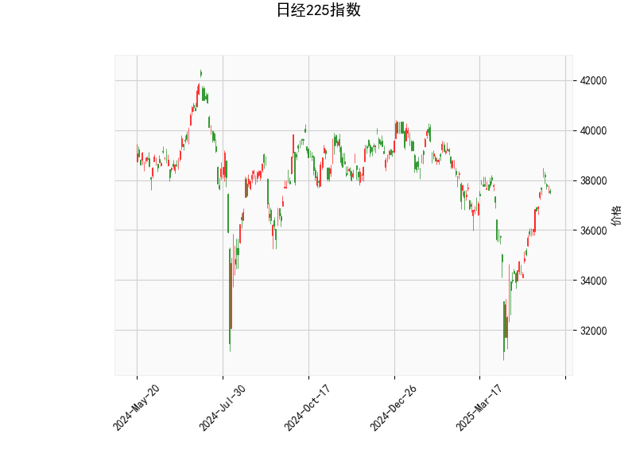

### 日经225指数的技术分析结果分析

#### 1. 对技术分析结果的详细解读
基于提供的日经225指数数据，我们可以从多个技术指标入手，对当前市场状况进行评估。以下是对各指标的分析：

- **当前价格（37498.63）**：日经225指数当前位于约37498.63点。这是一个相对较高的水平，相比于20日移动平均线（Bollinger Bands的中轨为36287.44），价格处于中线上方，表明短期内市场可能维持上行趋势。然而，它尚未触及上轨（39693.31），这意味着指数仍有上行空间，但也可能面临回调风险。

- **RSI（相对强弱指数，59.61）**：RSI值处于59.61，位于中性偏强区域（RSI > 50 表示强势，但 < 70 表示未超买）。这暗示市场当前有较强的买入势头，但尚未进入超买状态（超买通常定义为RSI > 70）。如果RSI继续上升，可能预示短期上行潜力；反之，如果回落至50以下，则需警惕卖出压力。

- **MACD指标**：
  - MACD线（640.37）：高于信号线（427.60），这是一种看涨信号，表明短期移动平均线已超越长期移动平均线，显示出市场动量正在增强。
  - MACD信号线（427.60）和柱状图（212.77）：柱状图为正值且不断扩大，强化了多头趋势的确认。总体而言，MACD的正向背离（MACD线高于信号线）建议投资者关注潜在的买入机会，但需注意如果柱状图开始缩小，可能预示趋势逆转。

- **Bollinger Bands（布林带）**：
  - 上轨（39693.31）、中轨（36287.44）和下轨（32881.56）：当前价格位于中轨和上轨之间，显示价格波动处于正常范围内。价格接近上轨但未突破，表明市场可能在积累动能。如果价格突破上轨，可能会触发进一步上涨；反之，如果回落至中轨以下，则可能出现修正。布林带的宽度相对适中，暗示当前市场波动性不高。

- **K线形态**：提供的K线形态为空（[]），意味着近期未出现明显的经典K线模式（如吞没形态或锤头线）。这可能表示市场缺乏强烈的短期反转信号，投资者应更多依赖其他指标进行判断。

总体而言，日经225指数的技术面显示出中性偏强的态势。RSI和MACD的组合暗示上行趋势持续，但Bollinger Bands的定位提醒我们潜在的波动风险。如果这些指标保持当前状态，市场可能处于牛市初期或巩固阶段；然而，外部因素（如全球经济数据或地缘政治事件）可能放大波动。

#### 2. 判断近期可能存在的投资或套利机会和策略
基于上述分析，日经225指数短期内可能存在上行机会，但也伴随回调风险。以下是针对可能的投资和套利策略的判断和建议：

- **潜在投资机会**：
  - **上行趋势机会**：当前RSI和MACD均显示看涨信号，结合价格位于Bollinger Bands中轨上方，短期内（例如未来1-2周）可能出现进一步上涨。如果全球股市情绪乐观（如美联储降息预期），日经225有望测试上轨（39693.31）附近。建议多头投资者考虑在当前水平附近买入指数基金或ETF（如Nikkei 225 ETF）。
  - **回调买入机会**：如果价格回落至中轨（约36287.44）附近，RSI可能降至50以下，这将是一个低风险买入点。MACD柱状图若保持正值，将强化这一机会。

- **潜在套利策略**：
  - **趋势跟踪策略**：利用MACD作为主要信号，当MACD线持续高于信号线时，执行多头头寸（例如，通过日经225期货或期权合约）。例如，可以在MACD柱状图扩大时买入期货头寸，目标设在上轨附近（39693.31）。为管理风险，设置止损在下轨（32881.56）下方5%的位置，以防范突发下跌。
  - **均值回归策略**：价格接近Bollinger Bands上轨时，可能出现短期超买回调。通过卖出看涨期权或构建价差套利（如买入看跌期权、卖出看涨期权），投资者可以在回调中获利。预计回调幅度为5-10%，这可作为套利空间。
  - **跨市场套利**：日经225与全球指数（如美国S&P 500）相关性较高。如果日经225相对S&P 500被低估（基于MACD对比），可考虑指数间套利，例如通过买入日经期货并卖出S&P 500期货来捕捉相对价值机会。但需注意汇率风险（日元波动）。

- **风险与注意事项**：
  - **下行风险**：RSI若快速升至70以上，可能引发超买回调；MACD若反转为负值，将信号卖出压力。全球经济不确定性（如通胀数据）可能导致日经225急跌。
  - **策略建议**：采用组合策略，例如70%资金用于趋势跟踪，30%用于均值回归。同时，控制仓位（不超过总资金的50%）并使用技术止损（如Bollinger Bands下轨）。长期投资者可关注日本经济复苏主题，但短期投机者需密切监控RSI和MACD的变化。
  - **整体判断**：近期投资机会大于风险，但需谨慎。适合经验丰富的投资者，初学者应以小额测试为主。

通过这些分析，日经225指数显示出积极信号，但市场波动性不可忽视。投资者应结合基本面（如日本企业盈利）进行决策，以优化风险回报比。