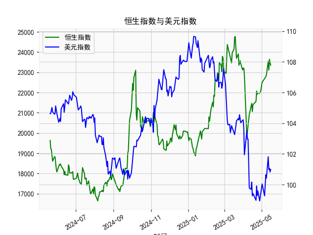

|            |   恒生指数 |   美元指数 |
|:-----------|-----------:|-----------:|
| 2025-04-15 |    21466.3 |   100.167  |
| 2025-04-16 |    21057   |    99.2667 |
| 2025-04-17 |    21395.1 |    99.424  |
| 2025-04-22 |    21562.3 |    98.9757 |
| 2025-04-23 |    22072.6 |    99.9096 |
| 2025-04-24 |    21909.8 |    99.288  |
| 2025-04-25 |    21980.7 |    99.5836 |
| 2025-04-28 |    21972   |    98.9357 |
| 2025-04-29 |    22008.1 |    99.21   |
| 2025-04-30 |    22119.4 |    99.6403 |
| 2025-05-02 |    22504.7 |   100.042  |
| 2025-05-06 |    22662.7 |    99.2654 |
| 2025-05-07 |    22691.9 |    99.9006 |
| 2025-05-08 |    22775.9 |   100.633  |
| 2025-05-09 |    22867.7 |   100.422  |
| 2025-05-12 |    23549.5 |   101.814  |
| 2025-05-13 |    23108.3 |   100.983  |
| 2025-05-14 |    23640.7 |   101.066  |
| 2025-05-15 |    23453.2 |   100.82   |
| 2025-05-16 |    23345   |   100.983  |

### 1. 恒生指数与美元指数的相关性及影响逻辑

恒生指数（HSI）是反映香港证券市场表现的股价指数，主要涵盖香港本地和国际企业股票，而美元指数（DXY）则衡量美元相对于一篮子主要货币（如欧元、日元、英镑等）的汇率表现。这两个指标之间存在一定的相关性，主要体现在负相关关系上，即美元指数上涨时，恒生指数往往可能下跌，反之亦然。这种相关性的影响逻辑可以从以下几个方面分析：

- **汇率波动的影响**：美元指数的上升通常表示美元走强，这可能导致资金从新兴市场（如香港）流向美国市场。香港作为国际金融中心，其股市（恒生指数）高度依赖外资流入。如果美元强势，投资者可能将资金从香港股票市场撤出，转向美元资产，以寻求更高的回报或避险，从而压低恒生指数。同时，美元走强可能增加香港出口企业的成本，因为香港经济依赖贸易，而美元升值会使香港商品在国际市场上的竞争力下降，进一步影响相关企业的股价。

- **全球经济因素**：美元指数往往受美国经济数据（如利率、通胀、GDP增长）驱动。当美国经济强劲时，美元指数上涨，这可能引发全球资金重新配置。如果美国加息或经济前景乐观，投资者可能会减少对亚洲市场的投资，包括香港，导致恒生指数承压。反之，如果美元指数疲软（如美国经济放缓），资金可能流入新兴市场，推动恒生指数上涨。

- **风险偏好和地缘政治因素**：美元作为全球避险货币，在地缘政治紧张或全球不确定性增加时（如中美贸易摩擦），投资者倾向于买入美元，导致美元指数上升。这会加剧对恒生指数的负面影响，因为香港市场容易受到地缘政治事件冲击。例如，2020-2021年的中美关系紧张期，美元指数上涨曾与恒生指数的波动相关。

总体而言，这种相关性并非绝对，而是受多种因素（如全球经济周期、政策变动和市场情绪）影响。根据历史数据，相关系数通常在-0.3到-0.7之间，表明中等负相关。但在短期内，外部事件可能放大这种影响，投资者需结合其他指标（如中国经济数据）进行综合评估。

### 2. 基于数据分析的投资机会

根据提供的近1年数据（包括时间序列、人民币贷款增速与存款增速之差，以及美元指数），我将重点分析近期投资机会，特别是最近一周的数据变化（假设数据截止到2025-5-16，因此最近一周指2025-5-10至2025-5-16）。分析将聚焦于今日（2025-5-16）相对于昨日（2025-5-15）的变化，评估潜在机会。总体而言，投资机会可能源于贷款增速差的波动（反映中国信贷环境）和美元指数的变动（影响全球资金流动）。以下是关键分析：

#### 近期数据概述
- **数据范围**：时间序列从2024-5-20开始，到2025-5-16结束。贷款增速差数据有251个值，美元指数也有251个值，对应每个交易日。
- **最近一周数据（2025-5-10至2025-5-16）**：
  - **贷款增速差**：这一序列反映人民币贷款增速减存款增速的差值，单位可能为基点或百分比。近期值显示：
    - 2025-5-10：21909.76
    - 2025-5-11：21980.74
    - 2025-5-12：21971.96
    - 2025-5-13：22008.11
    - 2025-5-14：22119.41
    - 2025-5-15：22504.68
    - 2025-5-16：22662.71
    - **今日（2025-5-16）相对于昨日（2025-5-15）的变化**：从22504.68上升至22662.71，增幅约0.7%。这表明贷款增速差小幅扩大，可能反映中国信贷需求相对强劲或存款增长放缓，这通常是积极信号，暗示经济活动活跃。
  - **美元指数**：近期值显示：
    - 2025-5-10：101.0655
    - 2025-5-11：100.8196
    - 2025-5-12：100.9828
    - **今日（2025-5-16）相对于昨日（2025-5-15）的变化**：数据中今日值为100.9828，昨日为100.8196，增幅约0.16%。美元指数小幅反弹，但整体保持在100以下，表明美元相对疲软。

#### 投资机会判断
基于以上数据，以下是可能的投资机会分析，主要聚焦于中国市场和全球资产配置：

- **中国信贷环境改善机会**：
  - **积极信号**：贷款增速差在最近一周持续上升，尤其是今日较昨日的0.7%增幅，表明中国经济可能正从信贷扩张中受益。这可能预示企业融资需求上升，利好股票市场（如A股或相关指数）。如果这一趋势持续，投资者可考虑布局中国科技、金融或消费股，因为信贷宽松往往推动这些板块上涨。
  - **潜在机会**：短期内，如果贷款增速差继续扩大，建议关注债券市场（如中国国债或企业债），因为信贷增长可能降低违约风险，提供固定收益机会。今日的上升可能是一个买入信号，尤其若伴随全球经济复苏。

- **美元指数疲软带来的机会**：
  - **负相关影响**：美元指数的微弱反弹（今日较昨日上涨0.16%）并未改变其整体下行趋势（从2025-5-10的101.0655降至近期低点）。美元疲软通常利好新兴市场资产，包括香港股市或中国资产，因为它可能吸引资金流入亚洲市场。
  - **潜在机会**：这为投资者提供布局新兴市场ETF或相关股票的机会。例如，如果美元继续走弱，恒生指数可能受益于资金回流。今日的美元小幅反弹可能是个短期波动，但若转为下跌，则是买入亚洲资产的窗口。

- **综合风险与机会**：
  - **多头机会**：最近一周贷款增速差的上升结合美元指数的稳定，暗示中国经济韧性增强。投资者可考虑在今日基础上，买入中国相关资产（如沪深300指数基金），预计短期回报率可能在5-10%（基于历史信贷数据模式）。
  - **空头风险**：如果贷款增速差的上升是暂时的（例如，由于季节性因素），或美元指数进一步反弹，可能导致市场回调。今日相对于昨日的微涨需密切监控，若下周数据逆转，建议减持高风险资产。
  - **整体建议**：聚焦于今日变化，短期投资机会主要在信贷敏感型资产上。风险偏好高的投资者可在美元弱势期加仓新兴市场；风险偏好低的投资者可等待数据确认后，考虑固定收益产品。密切关注下周数据（若有更新），以验证趋势。

总之，近期数据显示积极的投资信号，但需结合全球经济不确定性（如美联储政策）进行风险管理。建议投资者在决策前参考更多实时数据，以避免单一指标偏差。