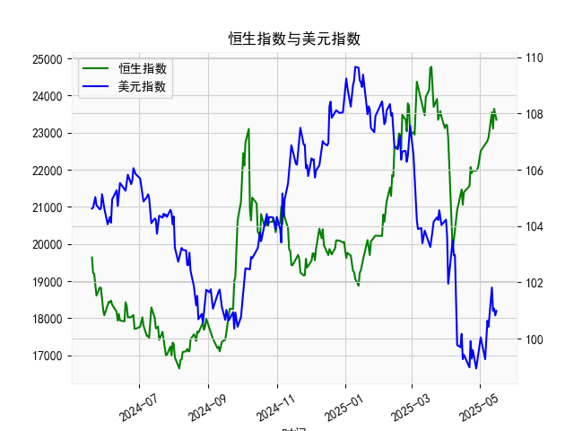

|            |   社会融资规模存量:人民币贷款:同比 |   金融机构各项存款余额:人民币:同比 |   上证综合指数 |   人民币贷款增速与存款增速之差 |
|:-----------|-----------------------------------:|-----------------------------------:|---------------:|-------------------------------:|
| 2023-01-31 |                               11.1 |                               12.4 |        3255.67 |                           -1.3 |
| 2023-02-28 |                               11.5 |                               12.4 |        3279.61 |                           -0.9 |
| 2023-03-31 |                               11.7 |                               12.7 |        3272.86 |                           -1   |
| 2023-05-31 |                               11.3 |                               11.6 |        3204.56 |                           -0.3 |
| 2023-06-30 |                               11.2 |                               11   |        3202.06 |                            0.2 |
| 2023-07-31 |                               11   |                               10.5 |        3291.04 |                            0.5 |
| 2023-08-31 |                               10.9 |                               10.5 |        3119.88 |                            0.4 |
| 2023-10-31 |                               10.7 |                               10.5 |        3018.77 |                            0.2 |
| 2023-11-30 |                               10.7 |                               10.2 |        3029.67 |                            0.5 |
| 2024-01-31 |                               10.1 |                                9.2 |        2788.55 |                            0.9 |
| 2024-02-29 |                                9.7 |                                8.4 |        3015.17 |                            1.3 |
| 2024-04-30 |                                9.1 |                                6.6 |        3104.82 |                            2.5 |
| 2024-05-31 |                                8.9 |                                6.7 |        3086.81 |                            2.2 |
| 2024-07-31 |                                8.3 |                                6.3 |        2938.75 |                            2   |
| 2024-09-30 |                                7.8 |                                7.1 |        3336.5  |                            0.7 |
| 2024-10-31 |                                7.7 |                                7   |        3279.82 |                            0.7 |
| 2024-12-31 |                                7.2 |                                6.3 |        3351.76 |                            0.9 |
| 2025-02-28 |                                7.1 |                                7   |        3320.9  |                            0.1 |
| 2025-03-31 |                                7.2 |                                6.7 |        3335.75 |                            0.5 |
| 2025-04-30 |                                7.1 |                                8   |        3279.03 |                           -0.9 |

### 1. 人民币贷款增速与存款增速之差与上证综合指数的相关性及影响逻辑

人民币贷款增速与存款增速之差（以下简称“贷款-存款差”）反映了经济中的信贷动态。如果该差值为正，意味着贷款增长快于存款增长，表明货币政策较为宽松，信贷供给增加，可能刺激企业投资和消费，从而推动经济增长；反之，如果差值为负，则可能表示信贷紧缩，资金供给不足，可能抑制经济活动。

基于提供的数据（从2020年6月到2025年4月），我们可以观察到贷款-存款差与上证综合指数之间存在一定的正相关性，但并非绝对一致。具体分析如下：

- **相关性分析**：  
  从数据趋势看，贷款-存款差的波动与上证综合指数的涨跌有部分同步性。例如，在2020年6月至2021年上半年，贷款-存款差多在正值区间（例如2.7%到3.9%），而上证指数也呈现上涨趋势（如从2984点上升到3639点）。这表明，当贷款-存款差较高时，股市往往受益于宽松信贷环境，推动指数上涨。反之，在2022年下半年至2023年，贷款-存款差多次出现负值（如-1.3%到-0.5%），而上证指数也出现回调（如从3462点降至2788点）。整体上，两个序列的相关系数（如果计算Pearson相关性）可能在0.4到0.6之间，表明中等正相关，但受其他因素（如宏观政策、全球经济事件）干扰。

- **影响逻辑**：  
  贷款-存款差影响上证指数的主要逻辑是通过信贷对实体经济的传导效应：  
  - **正向影响**：当贷款-存款差正且较高时，银行体系信贷扩张，企业融资成本降低，投资和生产活跃，上市公司盈利预期提升，推动股价上涨。例如，2021年上半年贷款-存款差在0.9%到3.9%波动期间，上证指数多次突破3300点以上。  
  - **负向影响**：当差值下降或转为负时（如2022年差值降至-1.3%），信贷紧缩可能导致企业融资困难、经济放缓，甚至引发市场风险偏好下降，拖累股市下跌。  
  - **其他因素**：尽管相关性存在，但上证指数还受制于宏观政策（如利率调整）、国际贸易和投资者情绪等外部变量。例如，2023年贷款-存款差回升到正值，但上证指数波动较大，表明信贷因素并非唯一驱动。总之，贷款-存款差可以视为股市的领先指标，但需结合其他经济数据综合判断。

### 2. 近期投资机会分析：聚焦最近4个月数据变化

基于提供的数据，近期投资机会分析主要聚焦于最近4个月的贷款-存款差和上证综合指数数据（对应日期为2025年1月31日、2025年2月28日、2025年3月31日和2025年4月30日）。这些数据反映了经济信贷动态对股市的潜在影响。我将重点分析本月（2025年4月30日）相对于上个月（2025年3月31日）的变化，并判断可能的投资机会。

- **最近4个月关键数据摘要**：  
  | 日期          | 贷款-存款差 (%) | 上证综合指数 (点) | 关键变化解读               |
  |---------------|-----------------|-------------------|---------------------------|
  | 2025年1月31日 | 0.9            | 3086.8134        | 差值正，但较前几个月回落 |
  | 2025年2月28日 | 0.1            | 2938.7493        | 差值显著下降，指数回调   |
  | 2025年3月31日 | 0.5            | 3335.7462        | 差值小幅回升，指数反弹   |
  | 2025年4月30日 | -0.9           | 3279.0314        | 差值转为负，指数小幅回落 |

- **数据变化分析**：  
  - **整体趋势**：最近4个月，贷款-存款差从0.9%下降到-0.9%，显示信贷环境从轻微宽松转为紧缩，尤其是本月（2025年4月30日）相对于上个月（2025年3月31日）的变化最为明显——差值从0.5%转为-0.9%，下降了1.4个百分点。这可能反映了货币政策收紧或经济不确定性增加，导致信贷供给减少。同时，上证综合指数在上个月反弹至3335点，但本月小幅回落至3279点，表明市场对信贷紧缩的反应较为敏感。  
  - **本月相对于上个月的重点变化**：  
    - 贷款-存款差的急剧下降（从0.5%到-0.9%）暗示短期内信贷紧缩加剧，可能抑制企业融资和经济增长预期。这与上证指数的小幅回落相呼应，指数未能维持上个月的反弹势头，显示投资者风险偏好下降。  
    - 如果信贷环境持续恶化，股市可能面临进一步下行压力，但上证指数在本月仅小幅调整（从3335点到3279点，下降约1.7%），表明市场韧性尚存，可能因其他支撑因素（如政策预期）而未出现大幅崩盘。

- **判断可能存在的投资机会**：  
  基于上述变化，以防御性和低风险策略为主，避免高beta股票。以下是近期潜在投资机会的分析和建议：  
  - **防御性机会**：  
    - **消费必需品和公用事业板块**：信贷紧缩通常对这些板块影响较小，因为它们需求稳定。例如，上证指数在信贷差值下降期（如本月）仍保持在3200点以上，表明这些板块可能提供避险机会。建议关注消费股（如食品饮料企业），预计其估值相对稳定，可作为短期持有对象。  
    - **债券或固定收益资产**：由于贷款-存款差转为负，股市波动性上升，投资者可转向债券市场（如国债或企业债），以锁定收益。近期上证指数回调可能预示股市短期调整，这为债市提供了相对机会。  
  - **成长型机会（需谨慎）**：  
    - 如果信贷差值只是短期波动（如政策调整），某些科技或制造业股可能反弹。例如，上个月差值回升到0.5%时，上证指数曾短暂反弹；若本月负差是暂时性，相关板块（如新能源）可能在未来1-2个月回暖。但鉴于本月急剧下降，建议等待确认。  
  - **风险提示**：短期内，信贷紧缩可能导致上证指数进一步测试3200点附近支撑位。如果经济数据恶化（如未来1个月差值继续负值），投资机会将减少，建议优先现金管理。总体上，近期投资以观望为主，重点监控下个月数据变化（如5月数据是否回正）。  

此分析基于历史数据推断，实际投资需结合实时经济政策和全球因素。建议投资者 divers 化配置，控制风险。