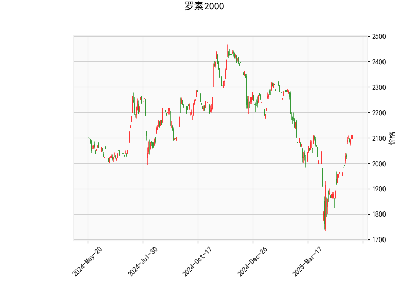

### 1. 对罗素2000指数的技术分析结果的分析

罗素2000指数（Russell 2000）是代表美国小型股市场的关键指标，以其当前技术指标为基础，我们可以从多个角度评估其市场态势。以下是对各项指标的详细解读：

- **当前价格（Current Price）**：指数当前价格为2113.2542。这表明指数处于相对较高的水平，相比历史均值（如Bollinger Bands的中轨）有所偏上，暗示短期内可能存在上行压力或潜在回调风险。

- **RSI（Relative Strength Index，相对强弱指数）**：RSI值为66.1474。这是一个接近超买区域的水平（通常RSI超过70被视为超买）。这意味着指数的上涨动能强劲，但也可能预示着短期内出现修正或回调，因为市场可能被过度推高，投资者需警惕潜在的卖出压力。

- **MACD（Moving Average Convergence Divergence，移动平均收敛散度）**：MACD线值为38.3308，信号线为18.6899，柱状图（MACD Hist）为19.6409。MACD线高于信号线，且柱状图为正值，这显示出强烈的看涨信号，表明短期内多头动能占优，价格可能继续上行。然而，MACD值的快速上升也可能表示动量已过热，需注意可能的反转。

- **Bollinger Bands（布林带）**：上轨为2199.7659，中轨为2006.1656，下轨为1812.5653。目前价格2113.2542位于中轨与上轨之间，接近上轨。这反映出价格波动在正常范围内，但靠近上边界可能暗示短期超买状况，增加了回落至中轨（均值回归）的可能性。如果价格突破上轨，可能进一步确认上行趋势；反之，跌破中轨则可能触发回调。

- **K线形态（Candlestick Patterns）**：检测到的形态包括CDLBELTHOLD、CDLCLOSINGMARUBOZU、CDLGAPSIDESIDEWHITE、CDLLONGLINE和CDLMARUBOZU。这些形态整体上显示强势上涨特征：
  - **CDLBELTHOLD**：表示价格在高位维持强势，暗示多头控制。
  - **CDLCLOSINGMARUBOZU**：接近实体蜡烛，显示强劲的单向趋势，通常为看涨。
  - **CDLGAPSIDESIDEWHITE**：带有价格间隙的白实体蜡烛，表明强势上涨并可能有进一步上行。
  - **CDLLONGLINE**：长线蜡烛，反映强烈动量，可能为突破信号。
  - **CDLMARUBOZU**：实体蜡烛无明显影子，强调趋势的连续性。

总体而言，罗素2000指数的技术指标显示出强势上涨态势（MACD和K线形态支持多头），但RSI接近超买和价格靠近Bollinger上轨的警告信号，表明市场可能面临短期回调风险。这反映了当前小盘股市场的乐观情绪，但也需警惕外部因素（如经济数据或地缘事件）可能引发的波动。

### 2. 近期可能存在的投资或套利机会和策略

基于上述分析，罗素2000指数短期内显示出上涨潜力，但也存在回调风险。以下是针对近期可能的投资机会和套利策略的判断和建议。请注意，市场充满不确定性，任何策略均应结合个人风险承受能力和实时数据进行调整。

#### **可能的投资机会**
- **看涨机会**：指标如MACD和K线形态显示多头主导，如果市场继续维持强势（如无重大负面新闻），指数可能进一步向上测试Bollinger上轨（2199.7659）或更高。这适合于中小型股投资者，尤其在美国经济复苏或通胀预期稳定的背景下。
  - **潜在风险**：RSI超买和价格接近上轨可能导致修正，投资者需关注支撑位（如中轨2006.1656）。
  
- **回调机会**：如果RSI进一步升高或价格回落至中轨附近，这可能提供低吸入场点，尤其对价值型投资者来说。小盘股在回调后往往有反弹潜力。

#### **套利策略建议**
套利策略旨在利用市场 inefficiencies，如价格波动或指标背离。以下是基于当前指标的具体策略：
- **动量交易策略（Momentum Trading）**：
  - **买入并持有**：在MACD看涨和K线强势的支撑下，考虑买入Russell 2000相关ETF（如iShares Russell 2000 ETF, IWM）。目标位可设在上轨以上（如2200附近），止损位设在中轨下方（如2000附近）。这适合短期多头投资者，但需监控RSI，若超过70则考虑减仓。
  - **预期回报**：如果趋势延续，潜在收益10-15%（基于历史波动），但若回调，损失可能达5-10%。

- **均值回归策略（Mean Reversion）**：
  - **卖出或做空**：价格接近Bollinger上轨，RSI超买，暗示短期回落可能性。投资者可通过卖出IWM或做空期货（如E-mini Russell 2000 futures）获利。等待价格回落至中轨（2006.1656）附近再平仓，或结合K线形态（如出现反转信号）作为退出点。
  - **预期回报**：回调至中轨可能带来5-8%的套利空间，但需设置止损在上轨以上以防上破。
  - **风险管理**：此策略适合经验丰富的交易者，因为如果多头趋势加强，损失可能放大。

- **期权套利策略（Options Arbitrage）**：
  - **卖出看涨期权**：鉴于RSI和Bollinger带显示超买，投资者可卖出IWM的短期看涨期权（例如，strike price在2200附近，期限1-2个月）。如果价格回落，期权到期无效，投资者可获期权溢价收益。
  - **买入看跌期权保护**：作为对冲，结合买入策略时购买看跌期权（如strike price在2100附近），以防范RSI突破70后的回调。潜在收益：通过期权溢价实现2-5%的无风险收入（假设波动率适中）。
  - **适用场景**：适合波动率较高的市场环境，如美联储政策会议前后。

#### **总体风险与建议**
- **风险因素**：全球经济不确定性（如通胀、美联储加息或地缘冲突）可能放大回调。RSI和Bollinger带的信号虽强，但K线形态的强势需结合成交量确认。
- **策略执行建议**：优先使用风险管理工具，如设置止损位（例如，中轨2006.1656作为关键支撑），并结合基本面分析（如就业数据）。对于初学者，建议从模拟交易开始，并咨询专业顾问。
- **时机判断**：如果MACD柱状图继续扩大，看涨机会优先；若RSI超过70，则转向防御性策略。

通过这些分析和策略，投资者可以更全面地把握罗素2000指数的潜在机会，但请始终记住，技术分析并非绝对预测，需与实际市场动态相结合。