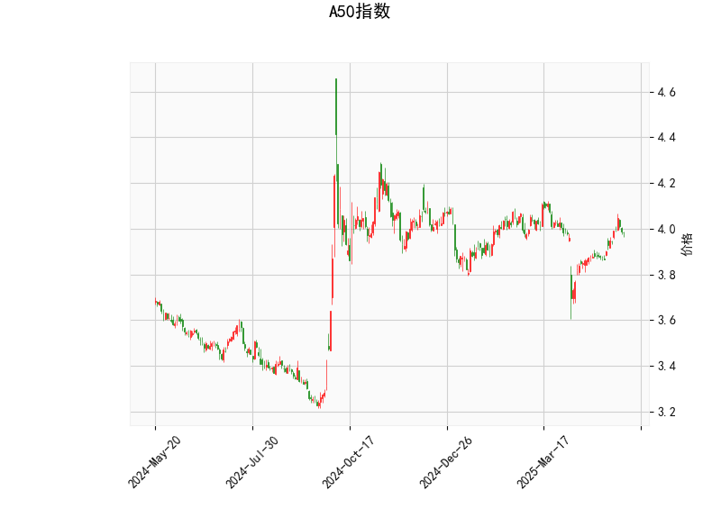

# A50指数技术分析

## 1. 对技术分析结果的详细分析

以下是对A50指数当前技术分析结果的逐项解读，这些指标综合反映了市场的短期趋势、动量和潜在波动性。当前价格为3.983，整体市场显示出中性偏向，但存在一些看涨信号。

- **当前价格（3.983）**：价格位于布林带中间带（3.9573）附近，略高于中线。这表明指数处于相对稳定的区间内，没有明显突破上带（4.1459）或下探下带（3.7687）。这种位置通常代表市场处于盘整阶段，短期内可能维持横盘或等待突破信号。

- **RSI（相对强弱指数，57.74）**：RSI值处于中性区域（50-70之间），表示指数的买入和卖出力量基本平衡。没有出现超买（RSI>70）或超卖（RSI<30）的迹象，暗示市场缺乏强烈趋势。目前的RSI水平显示短期内可能继续震荡，但若RSI向上突破60以上，可能预示着潜在的牛市动能。

- **MACD（移动平均收敛散度）**：
  - MACD线（0.02335）高于信号线（0.00955），且MACD直方图（0.01380）为正值。这是一个轻微的看涨信号，表明短期内多头力量可能占优，价格可能向上移动。然而，直方图值较小，表明这一信号并不强烈，可能只是短期反弹。如果MACD线与信号线继续扩大差距，将增强看涨确认。
  
- **布林带（Bollinger Bands）**：
  - 上带（4.1459）、中带（3.9573）和下带（3.7687）显示了价格的波动范围。当前价格接近中带，处于布林带的中间位置，这反映市场处于窄幅震荡。布林带收缩（上带与下带的距离较窄）可能预示未来波动性增加；如果价格向上突破上带，将是强烈的买进信号；反之，向下触及下带则可能触发卖出。

- **K线形态**：检测到的形态包括CDLDOJI、CDLHIGHWAVE、CDLLONGLEGGEDDOJI和CDLSPINNINGTOP。这些形态多为犹豫型K线，表明市场参与者处于不确定状态：
  - CDLDOJI和CDLLONGLEGGEDDOJI：代表价格在高低点之间波动大，但收盘接近开盘，显示买卖力量均衡，可能预示反转或持续盘整。
  - CDLHIGHWAVE：表示高波动性十字星，暗示市场缺乏方向性，投资者需警惕潜在的突发行情。
  - CDLSPINNINGTOP：纺锤顶形态，显示买卖双方拉锯，常见于顶部或底部确认前的犹豫期。
  
总体而言，技术指标显示A50指数短期内处于中性偏看涨的状态。RSI和MACD提供了一些正面信号，但K线形态的犹豫性提醒投资者需谨慎，市场可能在等待更明确的突破。

## 2. 近期可能存在的投资或套利机会和策略判断

基于上述分析，A50指数的近期走势可能以震荡为主，但MACD的看涨信号为潜在机会提供了基础。以下是针对投资和套利的判断和策略建议，旨在帮助投资者在不确定性中抓住机会，同时控制风险。

### 可能存在的投资机会
- **看涨机会**：MACD指标显示多头信号，且价格接近布林带上带，如果RSI继续上升（突破60-70区间），短期内可能出现向上突破。这为多头投资者提供买入点，尤其在全球市场情绪转暖或中国经济数据向好的背景下。
- **套利机会**：A50指数作为期货或ETF产品，可能存在跨品种或跨期套利空间。例如，如果A50期货价格与现货指数间出现偏差（当前价3.983低于上带），投资者可考虑无风险套利，如在期货市场低位买入并对冲现货风险。但需注意，K线形态的犹豫性可能导致波动加大，增加套利难度。
- **风险机会**：如果市场转为空头（例如RSI回落至50以下），则可能出现卖出或做空机会，但当前指标不支持这一可能性。

### 投资策略建议
- **买入策略**：在MACD直方图扩大且RSI向上突破60时，考虑在3.983附近或布林带中带以上买入A50相关产品（如ETF或期货）。设置止损位在下带（3.7687）附近，以防范突发下行风险。目标位可设在上带（4.1459）以上，预期10-15%的涨幅。
- **卖出或观望策略**：鉴于K线形态显示不确定性，建议短期内优先观望。如果价格回落至中带以下，或RSI跌破50，则可考虑卖出或做空以锁定利润。同时，结合基本面因素（如经济数据或政策变动）确认信号，避免单纯依赖技术面。
- **套利策略**：针对A50指数的期货市场，可采用跨期套利策略，例如买入近期合约（若现价偏低）并卖出远期合约，利用时间价值的差异获利。风险控制措施包括：限制仓位不超过总资金的20%，并实时监控MACD和布林带以调整头寸。如果市场波动加剧，优先退出套利头寸。
- **整体风险管理**：技术指标虽有看涨迹象，但K线犹豫性高，建议采用组合策略，如分散投资于相关资产（例如A股或大宗商品），并设置动态止盈止损。短期内，市场可能维持震荡，投资者应关注全球经济事件（如美联储政策）作为外部催化剂。

总之，近期A50指数的投资机会以轻仓试探为主，套利需依赖专业工具和数据。投资者应结合个人风险偏好和市场动态进行决策，避免过度交易。