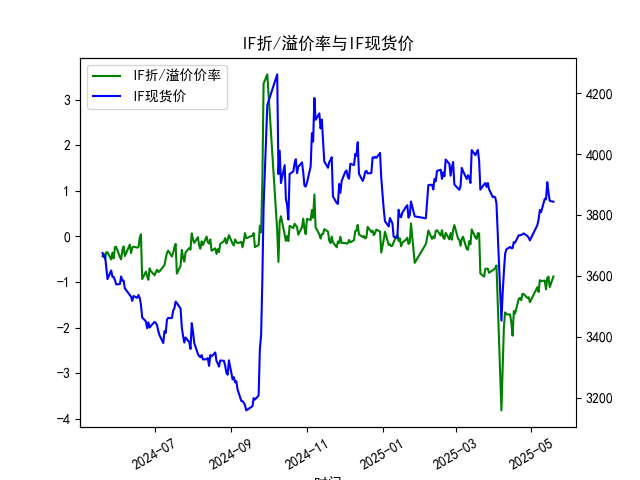
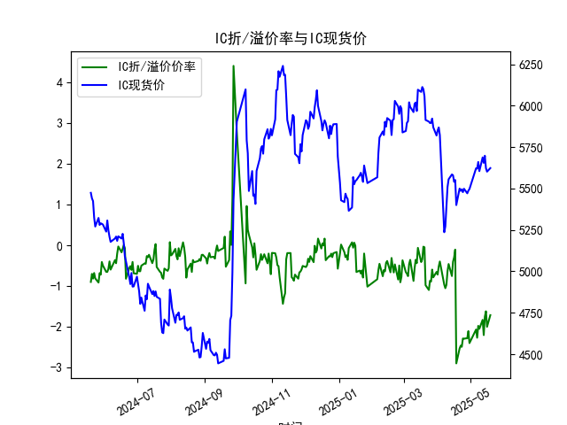
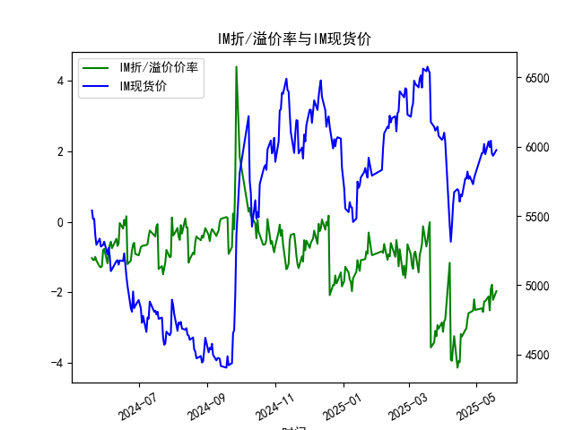

|            |   IF折/溢价率 |   IF现货价 |   IH折/溢价率 |   IH现货价 |   IC折/溢价率 |   IC现货价 |   IH折/溢价率 |   IH现货价 |
|:-----------|--------------:|-----------:|--------------:|-----------:|--------------:|-----------:|--------------:|-----------:|
| 2025-04-17 |     -1.63358  |     3710.6 |     -0.104562 |     5551.2 |     -0.104562 |     5551.2 |      -3.18113 |     5653.8 |
| 2025-04-18 |     -1.68913  |     3708.8 |     -2.89029  |     5400   |     -2.89029  |     5400   |      -3.25269 |     5642   |
| 2025-04-21 |     -1.36545  |     3733.2 |     -2.52696  |     5499.8 |     -2.52696  |     5499.8 |      -3.06818 |     5770   |
| 2025-04-22 |     -1.34653  |     3733   |     -2.45739  |     5486   |     -2.45739  |     5486   |      -3.02072 |     5769.6 |
| 2025-04-23 |     -1.39646  |     3734   |     -2.48358  |     5495   |     -2.48358  |     5495   |      -2.75012 |     5820   |
| 2025-04-24 |     -1.25668  |     3736.8 |     -2.28117  |     5478   |     -2.28117  |     5478   |      -2.58556 |     5767.4 |
| 2025-04-25 |     -1.26205  |     3739.2 |     -2.28499  |     5498.6 |     -2.28499  |     5498.6 |      -2.57433 |     5786.6 |
| 2025-04-28 |     -1.34913  |     3730.6 |     -2.27382  |     5471   |     -2.27382  |     5471   |      -2.51923 |     5729   |
| 2025-04-29 |     -1.33181  |     3724.8 |     -2.10005  |     5487.2 |     -2.10005  |     5487.2 |      -2.19842 |     5773.6 |
| 2025-04-30 |     -1.44197  |     3716.2 |     -2.39398  |     5497   |     -2.39398  |     5497   |      -2.49939 |     5801.4 |
| 2025-05-06 |     -1.11177  |     3766.2 |     -2.06144  |     5622   |     -2.06144  |     5622   |      -2.45329 |     5953.2 |
| 2025-05-07 |     -1.2169   |     3785   |     -2.26234  |     5620.2 |     -2.26234  |     5620.2 |      -2.55739 |     5955.2 |
| 2025-05-08 |     -0.957625 |     3816   |     -1.97107  |     5660   |     -1.97107  |     5660   |      -2.2617  |     6018.8 |
| 2025-05-09 |     -0.976471 |     3808.6 |     -2.04348  |     5604.8 |     -2.04348  |     5604.8 |      -2.25057 |     5945.2 |
| 2025-05-12 |     -0.966676 |     3853   |     -1.82396  |     5688   |     -1.82396  |     5688   |      -2.1153  |     6037   |
| 2025-05-13 |     -1.16158  |     3851   |     -2.19778  |     5654.6 |     -2.19778  |     5654.6 |      -2.51032 |     5996.6 |
| 2025-05-14 |     -0.908163 |     3907.4 |     -1.74715  |     5697.8 |     -1.74715  |     5697.8 |      -1.90524 |     6043   |
| 2025-05-15 |     -0.880406 |     3872.8 |     -1.6149   |     5623   |     -1.6149   |     5623   |      -1.78364 |     5949   |
| 2025-05-16 |     -1.10785  |     3846   |     -1.99531  |     5601.8 |     -1.99531  |     5601.8 |      -2.21348 |     5933.8 |
| 2025-05-19 |     -0.875523 |     3843.2 |     -1.70946  |     5623   |     -1.70946  |     5623   |      -1.96768 |     5975.4 |

### 1. 股指期货折/溢价率与现货价的相关性及影响逻辑

股指期货的折/溢价率（通常称为基差百分比）是指期货合约价格相对于现货指数价格的相对差额（以百分比表示）。正值表示溢价（期货价格高于现货），负值表示折价（期货价格低于现货）。这一指标与现货价密切相关，以下是其主要相关性和影响逻辑：

- **相关性**：
  - 股指期货和现货价高度正相关，因为期货是现货的衍生品，通常用于对冲现货风险或表达对未来现货价格的预期。折/溢价率反映了市场参与者对现货价格未来走势的共识：例如，如果折价率加深（更负），可能意味着市场预期现货价格下跌；反之，如果溢价率扩大（更正），可能预期现货价格上涨。
  - 在短期内，折/溢价率往往随现货价波动，但也会受外部因素影响，如经济数据、政策事件或市场情绪，导致二者出现短暂背离。

- **影响逻辑**：
  - **现货价对折/溢价率的影响**：现货价是基础资产，期货价格通常围绕现货价波动。上涨的现货价可能导致溢价（如果期货未及时跟上），而下跌的现货价可能加剧折价。逻辑在于，期货合约包含持有成本（如融资利率、股息调整），因此现货价变动会通过套利机制（如正/逆套利）推动期货价格向现货靠拢。
  - **折/溢价率对现货价的影响**：折/溢价率可以作为现货价的领先指标。如果折价率过大（负值显著），可能吸引投资者买入期货并卖出现货（正向套利），从而推高现货价；反之，溢价率过高可能导致卖出期货买入现货（逆向套利），拉低现货价。
  - **其他影响因素**：市场情绪、利率水平、流动性、交易成本和事件风险（如经济数据发布或政策变化）也会放大或缩小折/溢价率。例如，在牛市中，溢价率可能上升，因为投资者预期未来现货价上涨；在熊市中，折价率可能扩大，由于风险厌恶导致期货需求下降。总体上，套利活动会促使折/溢价率回归合理水平，但短期波动可能创造投资机会。

### 2. 近期投资机会分析：聚焦最近一周数据变化

基于提供的数据，我分析了IF、IH、IC和IM四个股指期货的折/溢价率（ANAL_BASISPERCENT）和现货价（CLOSE），重点关注最近一周（从2025-05-13到2025-05-19）的变化，尤其是2025-05-19（今日）相对于2025-05-16（昨日）的差异。数据显示，所有合约均处于折价状态（负值），但最近一周折价率整体有所收窄，这可能预示市场情绪好转或潜在反弹机会。以下是详细分析和判断：

- **整体趋势观察**：
  - **最近一周数据**：从2025-05-13到2025-05-19，现货价（CLOSE）总体小幅下跌，但折/溢价率从更负值向零靠近（折价收窄）。这表明期货价格相对现货价格有所回升，可能由于市场预期改善或套利活动增加。
  - **今日 vs. 昨日变化**：2025-05-19相对于2025-05-16，折价率普遍减少（从更负转向较少负），这可能是一个积极信号，暗示短期内现货价可能企稳或反弹。然而，现货价本身在这一周略有下降，需警惕潜在风险。

- **具体合约分析**：
  - **IF（沪深300指数期货）**：
    - 最近一周：现货价从3851.0（5月13日）降至3843.2（5月19日），小幅下跌约0.20%。折价率从-1.161584（5月13日）收窄至-0.875523（5月19日），今日较昨日（-1.107854）改善约0.23%。
    - 投资机会：折价率收窄可能表示市场对沪深300指数的悲观情绪减弱，建议关注买入机会。如果现货价企稳，这可能是正向套利点（买入现货，卖出期货）。风险：若现货价继续下跌，折价可能重新扩大。
    
  - **IH（上证50指数期货）**：
    - 最近一周：现货价从5654.6（5月13日）降至5623.0（5月19日），下跌约0.56%。折价率从-2.197779（5月13日）收窄至-1.709463（5月19日），今日较昨日（-1.995313）改善约0.29%。
    - 投资机会：折价率显著收窄，显示上证50指数可能有反弹潜力，适合短期多头策略（如买入期货）。若今日变化持续，可能形成套利机会，但需监控经济数据以防范回调。
    
  - **IC（中证500指数期货）**：
    - 最近一周：现货价从5654.6（5月13日）降至5623.0（5月19日），下跌约0.56%（数据与IH相同，可能为系统重复）。折价率从-2.197779（5月13日）收窄至-1.709463（5月19日），今日较昨日（-1.995313）改善约0.29%。
    - 投资机会：与IH类似，折价收窄暗示中证500指数潜在企稳。投资者可考虑多头头寸，但由于数据与IH一致，需验证真实性以避免决策偏差。
    
  - **IM（中证1000指数期货）**：
    - 最近一周：现货价从5996.6（5月13日）降至5975.4（5月19日），下跌约0.36%。折价率从-2.510316（5月13日）收窄至-1.967683（5月19日），今日较昨日（-2.213479）改善约0.25%。
    - 投资机会：折价率收窄幅度较大，可能预示中证1000指数短期反弹。建议作为中小盘指数的潜在买入点，尤其若市场流动性改善。

- **判断可能投资机会**：
  - **积极方面**：所有合约的折价率在最近一周尤其是今日均有改善，这可能创造短期买入机会。总体而言，现货价小幅下跌但折价收窄，暗示市场可能从过度悲观转向中性，适合正向套利策略（买入现货或期货多头）。
  - **潜在风险**：现货价持续下跌（尽管幅度小），可能由于经济不确定性或政策因素。如果今日的折价改善只是短期波动，未来一周需密切关注是否持续。
  - **推荐行动**：聚焦IF和IH（作为主要蓝筹指数），在折价率进一步收窄时考虑入场。设定止损点（如若折价率加深超过-2.0%），并结合市场新闻（如经济数据或政策公告）验证机会。总体投资机会中等偏上，但需谨慎，避免单凭数据决策。

