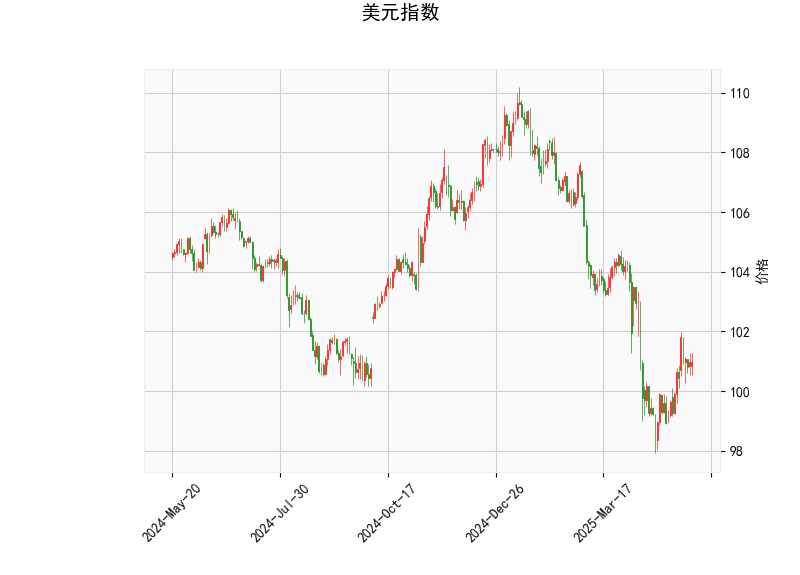

### 1. 美元指数的技术分析结果解读

基于提供的美元指数技术指标数据，以当前价位100.98为核心，我们可以对整体市场态势进行评估。以下是对关键指标的详细分析：

- **当前价格（Current Price）**：美元指数当前报100.98，位于布林带的中轨（102.30）附近，略低于中轨。这表明价格处于中性区域，没有明显突破上行或下行趋势，市场可能在等待新催化剂。

- **RSI（Relative Strength Index）**：RSI值为50.85，处于中性水平（通常50以上表示强势，50以下表示弱势）。这个数值暗示美元指数短期内没有过度买入或卖出的信号，市场力量相对均衡，潜在波动可能较小。

- **MACD（Moving Average Convergence Divergence）**：MACD线为-0.20，信号线为-0.52，MACD直方图（Hist）为0.32（正值）。虽然MACD线和信号线均处于负值（显示短期弱势），但直方图转为正值，表明动量可能正在从弱势向中性或轻微强势转变。这是一个潜在的看涨信号，但力度有限，需要进一步确认。

- **布林带（Bollinger Bands）**：上轨为107.07，中轨为102.30，下轨为97.53。当前价位100.98位于中轨下方，但未接近下轨，这反映出价格在中性波动区间。布林带收窄可能预示着短期内缺乏方向性突破，市场不确定性较高。

- **K线形态**：形态为“纺锤线”（Spinning Top），这是一种显示市场犹豫的K线模式，表明多空力量均衡。纺锤线通常出现在趋势转折点，暗示美元指数短期内可能维持震荡或等待新消息驱动。

总体而言，美元指数当前处于中性偏弱态势。RSI和布林带显示市场缺乏强烈方向，而MACD的正直方图提供了一丝看涨潜力，但纺锤线形态强调了不确定性。短期内，美元指数可能继续在100-103区间震荡，如果外部因素（如美国经济数据或全球风险事件）出现，可能会触发突破（如向上测试上轨或向下测试下轨）。

### 2. 近期A股和港股的投资或套利机会及策略分析

美元指数的中性偏弱表现可能对A股和港股带来积极影响，因为强势美元通常会增加新兴市场资金外流压力，而美元走弱则可能吸引外资流入中国市场。A股（中国大陆股市）和港股（香港股市）作为新兴市场代表，容易受全球美元动态影响。以下是基于当前美元指数分析的判断和建议：

#### 投资机会判断
- **对A股的影响**：美元指数若继续在中性偏弱区间震荡，将利好A股，尤其是出口导向型和消费类股票。中国经济正处于复苏阶段，弱美元环境可能推动人民币相对升值，提振投资者信心。当前A股估值相对合理（如上证指数PE约为12-15倍），科技、消费和新能源板块可能迎来机会。例如，如果MACD继续转强，美元弱势可能刺激A股反弹。
  
- **对港股的影响**：港股更国际化，受全球资金流动敏感。弱美元可能吸引外资通过香港市场进入中国资产，H股（如腾讯、阿里等）估值较低（平均PE约15倍），且流动性较好。港股当前处于相对低位，如果美元指数未能向上突破，港股可能迎来技术性反弹，尤其在蓝筹股和科技股领域。

- **潜在套利机会**： 
  - **A-H股价差套利**：A股和H股（同一家公司在大陆和香港上市）的价差可能扩大为机会。例如，如果美元弱势导致H股相对A股更具吸引力，投资者可通过买入H股并卖出A股进行套利。目前，A-H股溢价率（A股相对H股的溢价）约为20-30%，若美元指数下行，此溢价可能收窄，提供短期套利空间。
  - **跨境投资机会**：弱美元可能强化人民币资产吸引力，投资者可关注QDII或沪港通机制下的跨境投资，如买入港股通股票（例如恒生科技指数成分股），并结合A股多头策略。

#### 投资策略建议
- **短期策略**：
  - **多头布局**：在美元指数RSI维持中性且MACD直方图正转的情况下，建议买入A股蓝筹ETF（如沪深300ETF）或港股科技股（如买入腾讯控股或阿里巴巴）。目标收益可设为5-10%，止损位控制在5%以内。
  - **套利操作**：利用A-H股价差，选择估值差异大的个股（如银行股），买入低估H股并卖出高估A股。预计套利周期为1-3个月，关注汇率波动以管理风险。
  
- **中长期策略**：
  - **分散投资**：结合弱美元预期，构建A股和港股组合，例如50%配置A股消费股、30%配置港股科技股、20%现金储备。利用布林带中轨作为参考，待美元指数接近下轨时加仓。
  - **风险管理**：密切监控美元指数突破信号（如若MACD转负，美元强势复苏可能打压A股港股）。建议使用期权或期货对冲汇率风险，并控制仓位在50%以内。

总体风险提示：虽然弱美元为A股和港股提供机会，但需警惕全球经济不确定性（如地缘政治或美联储政策变化）。投资者应结合基本面（如中国经济数据）进行决策，优先选择流动性强的标的以便灵活应对市场波动。