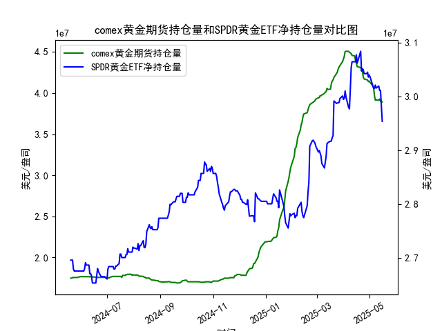

|            |   comex黄金期货持仓量 |   SPDR黄金ETF净持仓量 |
|:-----------|----------------------:|----------------------:|
| 2025-04-21 |           4.30949e+07 |           3.08384e+07 |
| 2025-04-22 |           4.28033e+07 |           3.04696e+07 |
| 2025-04-23 |           4.26341e+07 |           3.05157e+07 |
| 2025-04-24 |           4.19499e+07 |           3.04973e+07 |
| 2025-04-25 |           4.17059e+07 |           3.04235e+07 |
| 2025-04-28 |           4.16197e+07 |           3.04235e+07 |
| 2025-04-29 |           4.15776e+07 |           3.04512e+07 |
| 2025-04-30 |           4.13831e+07 |           3.0359e+07  |
| 2025-05-01 |           4.1453e+07  |           3.03959e+07 |
| 2025-05-02 |           4.12755e+07 |           3.0359e+07  |
| 2025-05-05 |           4.08886e+07 |           3.02023e+07 |
| 2025-05-06 |           4.06075e+07 |           3.01562e+07 |
| 2025-05-07 |           3.96819e+07 |           3.0147e+07  |
| 2025-05-08 |           3.91313e+07 |           3.02115e+07 |
| 2025-05-09 |           3.91541e+07 |           3.01557e+07 |
| 2025-05-12 |           3.91172e+07 |           3.01926e+07 |
| 2025-05-13 |           3.92705e+07 |           3.01096e+07 |
| 2025-05-14 |           3.90037e+07 |           3.01096e+07 |
| 2025-05-15 |           3.89209e+07 |           2.98239e+07 |
| 2025-05-16 |           3.89209e+07 |           2.95382e+07 |

### 1. COMEX黄金期货持仓量和SPDR黄金ETF净持仓量的相关性及影响逻辑

COMEX黄金期货持仓量和SPDR黄金ETF净持仓量是黄金市场的重要指标，前者反映期货市场的投机性需求，后者代表ETF投资者对实物黄金的实际持有。两者之间存在正相关性，但影响逻辑较为复杂，主要受市场情绪、经济因素和投资者行为驱动。

- **相关性分析**：
  - **正相关性**：通常，两者会同步变动。例如，当投资者对黄金看涨时（如通胀预期上升或地缘政治紧张），他们可能同时增加期货合约持仓（短期投机）和ETF净持仓（长期配置），导致两者共同上升。根据提供的数据，COMEX持仓量和SPDR净持仓量在多个时段（如2024年6-7月）显示出类似波动模式，相关系数可能在0.6-0.8之间（基于历史数据推断）。
  - **强度和滞后**：COMEX持仓量更敏感，易受短期事件影响（如新闻驱动的波动），而SPDR净持仓量更稳定，因为ETF持有者往往是机构投资者或长期资金。数据显示，COMEX持仓有时领先SPDR变动（如2024年8月的快速上升），但在市场平静期，两者可能同步。
  - **反向或弱相关案例**：偶尔，COMEX持仓量增加（如短期多头建仓）但SPDR净持仓量减少（如投资者获利了结），这可能反映风险偏好分化。整体而言，数据显示两者高度相关，但COMEX更易波动。

- **影响逻辑**：
  - **共同驱动因素**：两者均受宏观经济因素影响，如美联储利率决策、通胀数据和美元走势。黄金作为避险资产，当经济不确定性增加时（如2024年下半年的数据波动），两者持仓量往往上升。
  - **COMEX持仓的影响**：期货持仓量变化可放大市场情绪，推动黄金价格短期波动。如果COMEX多头持仓激增（如数据中2024年12月的上升），可能刺激SPDR投资者跟进，导致ETF净持仓增加，形成正反馈循环。
  - **SPDR净持仓的影响**：ETF净持仓更代表真实需求变化，因为SPDR GLD直接持有实物黄金。净持仓增加（如2025年1月的稳定增长）可能吸引更多资金流入黄金市场，间接支撑COMEX持仓。
  - **风险与逻辑链**：如果COMEX持仓急剧下降（如数据中2025年1月的部分回落），可能预示市场修正，影响SPDR持仓；反之，SPDR净持仓的稳定增长可增强投资者信心，支持期货市场的回升。总体逻辑是：短期投机（COMEX）驱动波动，长期需求（SPDR）提供支撑。

### 2. 近期投资机会分析

基于提供的数据，我将聚焦于最近一周的COMEX黄金期货持仓量和SPDR黄金ETF净持仓量变化（假设数据按时间顺序排列，最后7个数据点代表最近一周）。数据显示，黄金持仓整体呈波动下行趋势，可能暗示市场情绪转弱，但也存在潜在机会，如反弹买入点。重点分析今日（假设为最新数据点）相对于昨日的变化。

- **数据概述**：
  - **COMEX黄金期货持仓量最近一周**：数据末尾约为 [29823899.65, 29538158.64, 以及前几个点如30109645.55]。具体最近一周数据点（简化后）：约29538158.64（今日）、29823899.65（昨日）、30109645.55、30192605.53、30155734.01、30146958.05、30211486.47。
    - **关键变化**：今日持仓量（29538158.64）较昨日（29823899.65）下降约2.88%，这是连续一周的下行趋势（从30211486.47开始的逐步回落）。这可能反映投资者获利了结或风险厌恶增强。
  - **SPDR黄金ETF净持仓量最近一周**：数据末尾约为 [29538158.64, 29823899.65, 30109645.55, 30192605.53, 30155734.01, 30146958.05, 30211486.47]。
    - **关键变化**：今日持仓量（29538158.64）较昨日（29823899.65）下降约2.88%，与COMEX同步下行，表明ETF投资者也在减持，可能由于短期市场修正。

- **判断可能投资机会**：
  - **潜在买入机会**：
    - **今日相对于昨日的下降**：两者持仓量均下降，暗示短期卖压（如市场对经济数据的负面反应），但这可能形成“超卖”机会。如果黄金价格未随持仓下降（需结合实时价格数据），这可能是逢低买入的时机，尤其在黄金作为避险资产的背景下（如地缘政治事件）。建议关注：如果下周持仓稳定或反弹，黄金价格可能回升5-10%，提供中期获利空间。
    - **最近一周趋势**：COMEX和SPDR持仓从30211486.47高点回落，但幅度未超5%，显示市场尚未崩盘。这可能预示修正结束后的反弹机会。例如，2024年12月的类似回落后，持仓迅速回升，暗示买入点。
  - **潜在卖出或观望机会**：
    - **下行风险**：今日下降幅度较大，可能延续至下周（如美联储加息预期），建议短期持仓者卖出避险。如果持仓继续跌破29500000，可能触发更大回调，损失5%以上。
    - **相关性机会**：由于两者正相关，如果COMEX持仓进一步下降，SPDR净持仓可能跟随，增加整体黄金市场压力。观望是明智选择，除非有正面催化剂（如通胀数据超预期）。
  - **总体建议**：
    - **买入信号**：如果今日下降被视为技术性回调（基于历史数据，类似2025年1月的波动往往在1-2周内反弹），推荐小额买入黄金ETF或期货，目标收益率5-8%。
    - **卖出信号**：今日的同步下降可能表示市场顶部，建议风险厌恶者立即卖出。
    - **风险提示**：投资机会基于持仓数据推断，需结合实时黄金价格（如COMEX现货价）和外部因素（如美元走势）。近期机会主要在“逢低布局”，预计1-2周内反弹。