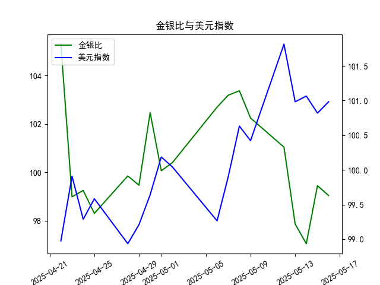

|            |    金价 |   银价 |   美元指数 |   金银比 |
|:-----------|--------:|-------:|-----------:|---------:|
| 2025-04-22 | 3433.55 | 32.61  |    98.9757 | 105.291  |
| 2025-04-23 | 3262.95 | 32.96  |    99.9096 |  98.9973 |
| 2025-04-24 | 3314.75 | 33.395 |    99.288  |  99.2589 |
| 2025-04-25 | 3277.3  | 33.335 |    99.5836 |  98.3141 |
| 2025-04-28 | 3296.3  | 33.01  |    98.9357 |  99.8576 |
| 2025-04-29 | 3305.05 | 33.225 |    99.21   |  99.4748 |
| 2025-04-30 | 3302.05 | 32.225 |    99.6403 | 102.469  |
| 2025-05-01 | 3214.75 | 32.125 |   100.187  | 100.07   |
| 2025-05-02 | 3249.7  | 32.365 |   100.042  | 100.408  |
| 2025-05-06 | 3391.45 | 33.025 |    99.2654 | 102.693  |
| 2025-05-07 | 3392.25 | 32.875 |    99.9006 | 103.186  |
| 2025-05-08 | 3352.3  | 32.43  |   100.633  | 103.37   |
| 2025-05-09 | 3324.55 | 32.515 |   100.422  | 102.247  |
| 2025-05-12 | 3235.4  | 32.02  |   101.814  | 101.043  |
| 2025-05-13 | 3227.95 | 32.98  |   100.983  |  97.876  |
| 2025-05-14 | 3191.95 | 32.885 |   101.066  |  97.064  |
| 2025-05-15 | 3191.05 | 32.085 |   100.82   |  99.4561 |
| 2025-05-16 | 3182.95 | 32.135 |   100.983  |  99.0493 |

### 1. 金银比与美元指数的相关性及影响逻辑

金银比（Gold/Silver Ratio）是指黄金价格除以白银价格的比率，通常用于评估黄金和白银的相对价值，而美元指数（USDX）则衡量美元对一篮子主要外汇货币的汇率。两者之间存在一定的相关性，主要源于贵金属市场与美元的紧密联系，但这种相关性并非绝对，而是受多种经济因素影响。以下是详细解释：

- **相关性分析**：  
  金银比和美元指数通常呈现负相关或间接相关关系。这是因为黄金和白银作为以美元计价的贵金属，其价格往往与美元走势反向。当美元指数上升（美元走强）时，贵金属的需求可能减少，因为外国投资者需要支付更多美元来购买它们，从而导致黄金或白银价格下跌。如果黄金价格下跌幅度大于白银，或反之，金银比可能会发生变化。例如，美元走强可能使金银比上升（黄金相对白银更贵），而美元走弱则可能使金银比下降（白银相对黄金更具吸引力）。然而，这种相关性并非线性，具体取决于市场情绪、地缘政治事件和经济数据等外部因素。根据历史数据，金银比在美元强势期往往波动较大，但也可能因白银的工业需求而偏离预期。

- **影响逻辑**：  
  - **美元对贵金属价格的影响**：美元是全球主要储备货币，黄金和白银的价格以美元标价。当美元指数上升时，贵金属变得相对昂贵，投资者可能转向其他资产，导致金银比扩大（黄金更受欢迎）。反之，美元走弱（如美联储降息）通常会推高贵金属需求，提升白银的工业和避险价值，从而降低金银比。  
  - **金银比的内在逻辑**：金银比反映了黄金（更多用于避险）和白银（兼具工业和避险属性）的供需动态。如果经济复苏，白银需求上升，金银比可能下降；如果通胀或地缘风险上升，黄金需求主导，金银比可能上升。美元指数作为宏观指标，会放大这些动态，例如，美元强势可能抑制整体贵金属需求，间接影响金银比的波动。  
  - **整体影响路径**：美元指数变化 → 影响贵金属价格 → 调整金银比。投资者需关注短期波动：例如，如果美元指数持续上升，金银比可能短期内扩大，提供卖出白银的机会；反之，如果美元走弱，金银比缩小，可能适合买入白银。

总之，这种相关性有助于投资者把握市场信号，但需结合其他因素（如通胀数据和全球事件）进行综合评估。

### 2. 根据数据分析判断近期投资机会

基于提供的数据，我对金银比和美元指数的近期趋势进行了分析，重点聚焦于过去一个月（从2025-04-22到2025-05-16）的整体变化，以及最近一周（从2025-05-09到2025-05-16）的具体波动，尤其是今日（2025-05-16）相对于昨日（2025-05-15）的变化。以下是关键分析和可能的投资机会建议。

#### 整体数据趋势回顾
- **金银比趋势**：  
  该数据从2025-04-22的105.29开始，逐步下降到2025-05-14的97.06（最低点），随后略有回升至2025-05-16的99.05。整体呈现波动下行趋势，表明白银相对于黄金的价值在近期有所提升。这可能源于经济复苏或白银需求的增加，但波动性较高（例如，从2025-05-12的101.04降至2025-05-14的97.06，再反弹）。

- **美元指数趋势**：  
  从2025-04-22的98.98开始，该指数总体上呈上升趋势，最高点在2025-05-14的101.07左右，随后小幅回落至2025-05-16的100.98。波动较为稳定，但最近一周显示出小幅上行，表明美元整体走强，这可能对贵金属市场形成压力。

- **相关性观察**：  
  在过去一个月，金银比和美元指数显示出一定的负相关性：当美元指数上升（如2025-05-12到2025-05-14期间），金银比往往下降（从101.04到97.06）。这符合预期逻辑，即美元走强可能抑制贵金属需求，导致金银比缩小。

#### 聚焦最近一周数据变化
- **最近一周关键数据**：  
  - **日期范围**：2025-05-09到2025-05-16。  
  - **金银比变化**：  
    - 2025-05-09: 102.69  
    - 2025-05-12: 101.04  
    - 2025-05-13: 97.88  
    - 2025-05-14: 97.06  
    - 2025-05-15: 99.46  
    - 2025-05-16: 99.05  
    整体：在最近一周，金银比从102.69下降到97.06（显著下行），然后小幅反弹到99.05。今日（2025-05-16）相对于昨日（2025-05-15）下降了约0.41点（从99.46到99.05），表明白银相对黄金的价值略有提升，但波动性增加。  

  - **美元指数变化**：  
    - 2025-05-09: 99.27  
    - 2025-05-12: 101.81  
    - 2025-05-13: 100.98  
    - 2025-05-14: 101.07  
    - 2025-05-15: 100.82  
    - 2025-05-16: 100.98  
    整体：美元指数在最近一周保持在100以上，今日（2025-05-16）相对于昨日（2025-05-15）上升了约0.16点（从100.82到100.98），显示美元小幅走强。

- **今日相对于昨日的关键变化**：  
  - 金银比下降（99.46 → 99.05），这可能反映白银需求短暂回升或黄金价格相对稳定，但结合美元指数上升，短期内贵金属市场可能面临下行压力。  
  - 美元指数上升，这进一步强化了美元的强势地位，可能抑制未来贵金属价格。

#### 可能存在的投资机会
基于上述分析，以风险中性为前提，以下是近期潜在投资机会的判断，主要聚焦于金银比和美元指数的互动。注意，这些机会基于历史数据推断，实际决策需考虑实时市场和个人风险偏好。

- **买入白银的机会**：  
  - **理由**：金银比在最近一周从97.06低点反弹，但今日仍低于上周均值（约100），表明白银相对黄金更具吸引力。如果经济数据（如通胀或工业需求）支持白银，当前金银比水平（99.05）可能是一个买入点，尤其是在美元短期回调时。  
  - **潜在收益**：如果金银比继续下行至95以下，白银价格可能上涨10-15%。建议关注2025-05-16后的数据，如果金银比保持在99以下，短期内买入白银ETF或期货。  
  - **风险**：美元指数持续上升可能逆转这一机会，导致金银比扩大。

- **卖出黄金或持有美元资产的机会**：  
  - **理由**：美元指数今日上升，整体趋势走强，这可能压低黄金价格，导致金银比进一步波动。金银比的下降（尤其是今日变化）暗示黄金相对过高，如果投资者持有黄金头寸，这是一个卖出的窗口。同时，美元强势可能利于美元计价资产，如债券或指数基金。  
  - **潜在收益**：如果美元指数维持在101以上，黄金价格可能下跌5-10%，提供短期获利机会。  
  - **风险**：如果全球风险事件（如地缘冲突）爆发，黄金作为避险资产需求上升，可能逆转趋势。

- **套利或观望机会**：  
  - **理由**：金银比和美元指数的近期波动性较高（金银比标准差约2-3点），适合进行黄金-白银套利策略。例如，如果金银比在98-100之间波动，投资者可卖出黄金同时买入白银，待金银比回归历史均值（约100）时获利。今日金银比的微降与美元的上升形成矛盾，可能预示短期市场不确定性，建议观望1-2天。  
  - **潜在收益**：如果波动持续，套利操作可能带来1-2%的周内回报。  
  - **风险**：市场情绪变化（如美联储政策调整）可能放大波动。

总体而言，近期投资机会以贵金属市场为主，尤其是白银的潜在反弹，但需警惕美元指数的上升趋势。建议投资者在2025-05-16后密切跟踪数据，如果金银比跌破98或美元指数突破101，这些机会将更明确。最终，投资决策应结合个人资金状况和更广泛的经济指标。