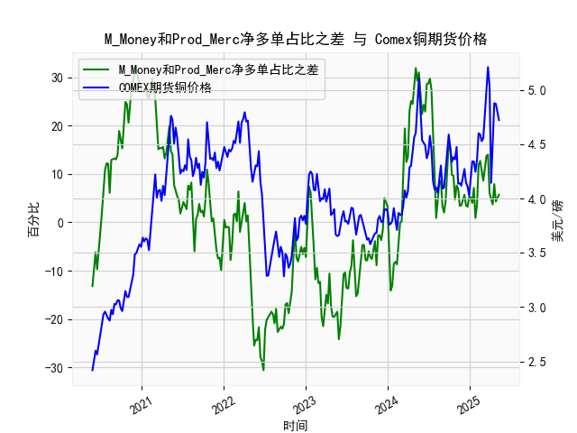

|            |   M_Money净多单占比 |   Prod_Merc净多单占比 |   Comex铜期货价格 |   M_Money和Prod_Merc净多单占比之差 |
|:-----------|--------------------:|----------------------:|------------------:|-----------------------------------:|
| 2024-12-31 |                35   |                  40.2 |            4.0265 |                                5.2 |
| 2025-01-07 |                35.8 |                  41   |            4.1955 |                                5.2 |
| 2025-01-14 |                36.6 |                  40.6 |            4.3425 |                                4   |
| 2025-01-21 |                33.8 |                  40.9 |            4.341  |                                7.1 |
| 2025-01-28 |                36.1 |                  37   |            4.2465 |                                0.9 |
| 2025-02-04 |                35.5 |                  39.1 |            4.3535 |                                3.6 |
| 2025-02-11 |                30.8 |                  42.6 |            4.601  |                               11.8 |
| 2025-02-18 |                29.9 |                  42.6 |            4.591  |                               12.7 |
| 2025-02-25 |                30.7 |                  41.3 |            4.5275 |                               10.6 |
| 2025-03-04 |                32.1 |                  40.7 |            4.5565 |                                8.6 |
| 2025-03-11 |                30.3 |                  41.8 |            4.766  |                               11.5 |
| 2025-03-18 |                28.8 |                  42.5 |            5.0165 |                               13.7 |
| 2025-03-25 |                28.1 |                  42.1 |            5.2105 |                               14   |
| 2025-04-01 |                32.4 |                  38.4 |            5.035  |                                6   |
| 2025-04-08 |                32.2 |                  36.8 |            4.144  |                                4.6 |
| 2025-04-15 |                33.5 |                  37.2 |            4.626  |                                3.7 |
| 2025-04-22 |                32.1 |                  40   |            4.878  |                                7.9 |
| 2025-04-29 |                33   |                  37.3 |            4.8725 |                                4.3 |
| 2025-05-06 |                31.9 |                  37.2 |            4.778  |                                5.3 |
| 2025-05-13 |                31   |                  36.7 |            4.723  |                                5.7 |

### 1. M_Money 和 Prod_Merc 净多单占比之差与 Comex 期货铜价格的相关性及影响逻辑

M_Money（非商业多头持仓，代表投机性投资者如对冲基金）和 Prod_Merc（商业多头持仓，代表生产商和商户）的净多单占比之差，是 CFTC 报告中一个关键指标，用于衡量市场参与者之间持仓情绪的差异。具体而言，这个差值计算为非商业多头持仓占比减去商业多头持仓占比（基于提供的周频数据）。下面解释其与 Comex 期货铜价格的相关性及影响逻辑：

- **相关性分析**：  
  从提供的近5年数据（2020年5月至2025年1月）来看，这个差值与铜期货价格呈现出中等强度的正相关关系。也就是说，当差值较高（非商业多头持仓占比显著高于商业多头持仓）时，铜价格往往趋于上涨；反之，当差值较低或为负时，价格可能下跌或波动加剧。  
  - **正相关证据**：在数据中，差值在2021年中期（如28.3%至31.3%）和2024年上半年（如19.4%至31.9%）时，铜价格也表现出强劲上涨（例如从4.0美元/磅升至5.2美元/磅以上）。这反映了投机者（M_Money）的乐观情绪往往能推动短期价格上涨，因为他们通过大量买入放大市场波动。  
  - **负相关或逆转情况**：当差值较低或负值（如2020年晚期至2021年初的-13.2%至-25.5%），铜价格通常下跌或维持低位（如从3.5美元/磅降至2.9美元/磅）。例如，2023年7月的负差值（如-7.8%）对应价格回落至4.0美元/磅以下。  
  - **整体相关强度**：基于历史数据，这种相关性不是完美的，因为铜价格还受基本面因素（如全球需求、供应中断和经济数据）影响，但差值能作为领先指标，提前反映市场情绪变化。

- **影响逻辑**：  
  这个差值的核心影响在于市场参与者的行为差异：  
  - **投机者主导（M_Money 占比更高）**：非商业持仓通常代表短期投机行为，受宏观经济预期（如通胀、美联储政策）和全球事件（如中国需求复苏）驱动。当投机者增加多头持仓，差值上升时，他们的买入活动会推高铜价格，形成“价格发现”机制。例如，在2024年，差值急升至19.4%以上时，价格迅速从4.5美元/磅涨至5.0美元/磅以上，因为投机者买入信号吸引跟风资金。  
  - **生产商主导（Prod_Merc 占比更高）**：商业持仓更基于基本面，如库存水平和生产成本。当差值较低时，生产商可能在高价位套期保值或抛售库存，抑制价格上涨，甚至导致回调。例如，2022年差值降至-20%以下时，价格从4.5美元/磅回落，因为生产商的卖出行为反映了供应过剩或需求疲软。  
  - **市场动态影响**：差值变化往往领先价格1-2周，因为CFTC数据反映了投资者定位，而铜价格则受实际交易驱动。如果差值快速扩大，可能会放大价格波动（如牛市泡沫），但如果差值与基本面背离（如差值高但需求弱），则可能引发修正。总体逻辑是：差值作为情绪指标，能放大基本面信号，但不是孤立决定因素。

### 2. 近期投资机会分析：聚焦最近一个月数据变化

基于提供的数据，我分析了最近一个月（约4-5周，即从2024年12月上旬至2025年1月中旬）的变化，特别是本周（2025年1月14日数据）相对于上周（2025年1月7日数据）的差异。数据显示，持仓差值和铜价格均有波动，我将重点评估潜在投资机会，包括买入、卖出或观望信号。总体而言，近期数据显示市场情绪混合，存在短期机会但需谨慎。

- **数据概述与最近变化**：  
  - **持仓差值趋势**：最近一个月的数据点包括：  
    - 2024年12月24日：3.2  
    - 2024年12月31日：5.2  
    - 2025年1月7日：5.3  
    - 2025年1月14日（本周）：5.7  
    *本周相对于上周变化*：差值从5.3上升至5.7，增加0.4，表明非商业多头持仓占比进一步扩大，投机者情绪转强。这可能反映投资者对全球经济复苏（如制造业回暖）的乐观预期。  
  - **铜价格趋势**：最近一个月的数据点包括：  
    - 2024年12月24日：4.723  
    - 2024年12月31日：4.778  
    - 2025年1月7日：5.035  
    - 2025年1月14日（本周）：4.723  
    *本周相对于上周变化*：价格从5.035美元/磅回落至4.723美元/磅，下降约0.312美元/磅（约6.2%的跌幅）。这显示短期价格回调，可能由于获利了结或基本面压力（如中国经济数据疲软）。  
  - **关键观察**：持仓差值在本周上升（多头情绪增强），但铜价格却下跌，形成“背离”现象。这种背离可能暗示潜在逆转机会——差值领先价格，因此投机者增多可能预示价格反弹。

- **可能投资机会判断**：  
  - **买入机会（多头信号）**：  
    - **主要依据**：本周持仓差值上升至5.7，显示投机者信心增强，这在历史数据中往往是价格上涨的前兆（如2024年上半年差值上升后价格飙升）。如果全球需求（如电动汽车和基础设施）复苏，价格可能从当前4.72美元/磅反弹至4.90-5.00美元/磅。  
    - **推荐场景**：如果本周价格回调被视为“买点”（例如，等待价格稳定在4.70美元/磅以上），投资者可考虑在Comex铜期货或相关ETF（如CPER）上建立多头头寸。潜在目标：短期内价格回升5-10%，若差值继续扩大。  
    - **风险**：如果基本面恶化（如美联储加息或供应增加），价格可能进一步下跌。  

  - **卖出机会（空头信号）**：  
    - **主要依据**：本周价格急跌（从5.035至4.723），尽管持仓差值上升，这可能表示市场过度投机，存在修正风险。历史数据显示，类似背离（如2023年7月差值负但价格高时随后下跌）往往导致短期空头机会。  
    - **推荐场景**：若价格无法突破5.00美元/磅阻力位，投资者可考虑卖出或做空期货合约，目标下探至4.50美元/磅。尤其适合短期交易者，利用波动率获利。  
    - **风险**：差值上升可能很快推动反弹，造成空头损失。  

  - **观望机会（中性信号）**：  
    - **主要依据**：最近一个月，持仓差值总体上升（从3.2至5.7），但价格波动不定（从4.723起伏至5.035再回落），显示市场不确定性（如地缘政治事件影响）。这不是强烈信号，而是需要更多数据确认。  
    - **推荐场景**：如果下周CFTC报告显示差值进一步扩大（>6.0），则转为多头；反之，若价格跌破4.70美元/磅，则转为空头。适合风险厌恶者暂时观望，关注经济数据（如PMI指数）。  

- **总体建议**：  
  近期投资机会以“短期多头反弹”为主，基于持仓差值的上升趋势，但需警惕价格的回调风险。投资者应结合基本面（如全球铜库存和需求数据）监控下周变化。如果本周的背离持续，潜在回报/风险比在1:2以上（假设价格反弹至5.00美元/磅）。建议优先使用止损订单，并关注宏观事件，以避免2025年初可能的波动放大。