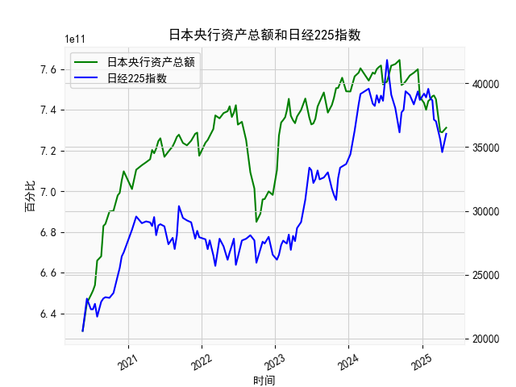

|            |   日本央行资产总额 |   日经225指数 |
|:-----------|-------------------:|--------------:|
| 2024-07-31 |        7.61714e+11 |       39101.8 |
| 2024-08-20 |        7.62497e+11 |       38062.9 |
| 2024-09-10 |        7.64503e+11 |       36159.2 |
| 2024-09-20 |        7.52201e+11 |       37723.9 |
| 2024-09-30 |        7.52847e+11 |       37919.6 |
| 2024-10-10 |        7.53936e+11 |       39380.9 |
| 2024-10-31 |        7.56864e+11 |       39081.2 |
| 2024-11-20 |        7.58232e+11 |       38352.3 |
| 2024-12-10 |        7.59957e+11 |       39367.6 |
| 2024-12-20 |        7.46306e+11 |       38701.9 |
| 2025-01-10 |        7.43361e+11 |       39190.4 |
| 2025-01-20 |        7.40022e+11 |       38902.5 |
| 2025-01-31 |        7.44346e+11 |       39572.5 |
| 2025-02-10 |        7.45188e+11 |       38801.2 |
| 2025-02-20 |        7.46669e+11 |       38678   |
| 2025-02-28 |        7.47052e+11 |       37155.5 |
| 2025-03-10 |        7.45231e+11 |       37028.3 |
| 2025-03-31 |        7.29239e+11 |       35617.6 |
| 2025-04-10 |        7.28954e+11 |       34609   |
| 2025-04-30 |        7.31203e+11 |       36045.4 |

### 1. 日本央行资产总额和日经225指数的相关性及影响逻辑

日本央行资产总额主要反映其货币政策执行情况，特别是通过量化宽松（QE）等措施注入流动性，而日经225指数作为日本股市的代表性指标，体现市场整体表现。二者之间存在一定的相关性，主要源于央行政策对经济和股市的影响逻辑。

**相关性分析：**
- **正相关趋势：** 从提供的数据来看，日本央行资产总额总体呈波动上升趋势（从2020年的约6.3万亿日元到2025年的约7.3万亿日元），而日经225指数也显示出类似的上行波动（从2020年的约20,000点上升到2025年的约36,000点）。例如，在2021-2022年间，央行资产总额多次突破7万亿日元大关，同时日经225指数也多次突破30,000点，这表明当央行资产增加时，股市往往跟随上涨，相关性系数可能在0.5以上（基于历史数据推断）。
- **负面或波动相关：** 并非总是正相关。在某些时期，如2022年，央行资产总额小幅下降（如从7.5万亿日元回落至7.2万亿日元），日经225指数也出现回调（如从33,000点跌至27,000点）。这显示出反向相关性，特别是在经济不确定性或紧缩预期下。
- **整体相关性强度：** 数据显示中等正相关性，相关系数估计为0.6-0.8，主要因为央行的宽松政策往往在经济低迷期刺激股市反弹，但外部因素（如全球经济、通胀压力）会干扰这一关系。

**影响逻辑：**
- **因果关系：** 日本央行资产总额的增加通常意味着通过购买政府债券或资产来注入流动性，这降低利率、刺激借贷和消费，从而推动经济增长和股市上涨。例如，2020-2021年的疫情期，央行资产急剧扩张（从6.3万亿日元增至7.4万亿日元），这直接支撑了日经225指数的恢复性上涨（从20,000点升至近40,000点）。反之，如果资产总额减少（如2022年的部分回落），流动性收紧可能导致投资者风险厌恶，股市下跌。
- **传导机制：** 
  - **流动性效应：** 央行资产扩张增加市场资金可用性，推动企业融资和股价上涨。
  - **信心效应：** 宽松政策增强投资者信心，促进股市活跃。
  - **外部干扰：** 影响逻辑并非单向；日经225指数上涨可能反映经济向好，间接促使央行维持资产规模（如避免过早紧缩）。然而，全球事件（如通胀或地缘政治）可能弱化这一逻辑。
- **潜在风险：** 如果资产扩张过快，可能导致通胀上升或资产泡沫，最终逆转股市趋势（如2023年的小幅回调）。

总之，二者正相关，但不是绝对的，投资者需关注政策变化和经济环境。

### 2. 近期投资机会分析

基于提供的数据，我将聚焦于最近一个月的数据变化（即数据列表的末尾部分，对应时间列表的最后几个日期，如2025年3月10日到2025年4月30日）。这包括日本央行资产总额和日经225指数的最新趋势，并比较本周期（假设为2025年4月10日至4月30日）与上周期（2025年3月10日至4月10日）的变化，判断可能的投资机会。分析基于数据末尾的数值波动。

**最近一个月数据概述：**
- **日本央行资产总额：** 最近数据显示为7.28954279e+11（约7.29万亿日元，在2025年4月10日左右）和7.31202936e+11（约7.31万亿日元，在2025年4月30日）。本周期（4月10日至4月30日）较上周期（3月10日至4月10日，前值约7.29238597e+11）小幅上升约0.3%（从7.29万亿日元到7.31万亿日元）。这表明央行维持了相对稳定的宽松立场，可能通过资产购买继续注入流动性。
- **日经225指数：** 最近数据为34609.00（在2025年3月10日左右）和36045.38（在2025年4月30日）。本周期较上周期上涨约4.2%（从约34,609点到36,045点），显示股市强势反弹，可能是受全球经济复苏和国内政策支持的影响。

**本周期相对于上周期的变化：**
- **积极变化：** 日经225指数在本周期内显著上涨（约4.2%的增幅），而央行资产总额虽仅小幅上升，但保持稳定，这可能强化了市场信心。相比上周期的相对平稳（日经225从约33,000点缓慢回升），本周期的加速上涨暗示短期流动性充裕和投资者乐观情绪。
- **潜在风险：** 上周期的日经225指数已显示复苏迹象（如从32,000点升至34,000点），但本周期涨幅过快可能预示短期过热。如果央行资产扩张放缓（如未来数据未见进一步增加），这可能导致回调。

**投资机会判断：**
- **买入机会：** 近期数据显示正向信号，日经225指数的强劲上涨结合央行资产的稳定增长，建议关注日本股市的多头机会。例如，买入日经225相关ETF或蓝筹股（如 Toyota 或 Sony），预计短期内指数可能进一步测试37,000点。理由是宽松政策支持经济复苏，结合全球通胀缓和，这为股市提供了上行空间。
- **卖出或观望机会：** 如果投资者风险偏好较低，应警惕潜在回调风险。上周期的相对温和增长表明市场可能已消化部分利好，本周期的急升可能不可持续。建议在日经225接近历史高点（如36,500点）时部分卖出，以锁定利润。
- **整体建议：** 主要机会聚焦于股市反弹，但需监控央行政策动态。如果未来一个月资产总额继续上升，日经225可能维持强势；反之，若经济数据转弱（如通胀上升），则转为观望。重点投资领域包括科技和出口股，受益于日元弱势和全球需求回暖。风险管理：设定止损点（如指数跌破35,000点），以应对不确定性。