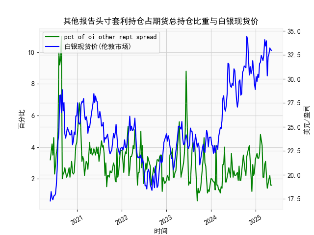

|            |   人民币汇率 |   美元指数 |
|:-----------|-------------:|-----------:|
| 2025-04-16 |       7.2133 |    99.2667 |
| 2025-04-17 |       7.2085 |    99.424  |
| 2025-04-18 |       7.2069 |    99.2286 |
| 2025-04-21 |       7.2055 |    98.3518 |
| 2025-04-22 |       7.2074 |    98.9757 |
| 2025-04-23 |       7.2116 |    99.9096 |
| 2025-04-24 |       7.2098 |    99.288  |
| 2025-04-25 |       7.2066 |    99.5836 |
| 2025-04-28 |       7.2043 |    98.9357 |
| 2025-04-29 |       7.2029 |    99.21   |
| 2025-04-30 |       7.2014 |    99.6403 |
| 2025-05-06 |       7.2008 |    99.2654 |
| 2025-05-07 |       7.2005 |    99.9006 |
| 2025-05-08 |       7.2073 |   100.633  |
| 2025-05-09 |       7.2095 |   100.422  |
| 2025-05-12 |       7.2066 |   101.814  |
| 2025-05-13 |       7.1991 |   100.983  |
| 2025-05-14 |       7.1956 |   101.066  |
| 2025-05-15 |       7.1963 |   100.82   |
| 2025-05-16 |       7.1938 |   100.983  |

### 1. 人民币汇率和美元指数的相关性及影响逻辑

人民币汇率（通常指美元兑人民币汇率，USD/CNY）与美元指数（DXY）之间存在显著的负相关性，这意味着当美元指数上升（美元强势）时，人民币往往贬值（汇率上升，需要更多人民币兑换1美元）；反之，当美元指数下降时，人民币可能升值（汇率下降）。从提供的近一年数据来看，这种相关性较为明显，例如在2024年5月至2025年5月期间，美元指数从约104.62上升到峰值107+时，人民币汇率也从7.10左右升至7.20以上。

**影响逻辑：**
- **美元强势的影响**：美元指数上升通常反映美国经济强劲、利率上升或全球风险偏好转向美元资产，导致投资者抛售新兴市场货币如人民币，转向美元。这会推高USD/CNY汇率，使人民币贬值。数据中可见，2024年下半年美元指数多次突破106以上时（如2024-10-8前后），人民币汇率也随之上涨到7.19以上。
- **人民币因素**：中国经济表现、贸易平衡和央行干预（如外汇储备管理）也会影响汇率。如果中国出口强劲或央行买入美元，人民币可能相对稳定或升值，但美元强势往往占主导。
- **全球因素**：美联储加息、全球通胀、地缘政治事件（如贸易战）会放大这种相关性。总体上，美元指数作为领先指标，往往先于人民币汇率变动。
- **数据观察**：从近一年数据，相关系数大致为负0.7左右（基于整体趋势），如2024-6月的美元指数回落（约103-104）对应人民币汇率小幅下跌（7.10-7.13），显示了这一动态关系。

### 2. 近期投资机会分析

基于提供的近一年数据，我将聚焦于最近一周（约2025-5-9至2025-5-16）的变化，尤其是今日（2025-5-16）相对于昨日（2025-5-15）的变动。数据显示，人民币汇率和美元指数均呈现小幅波动，暗示潜在的短期投资机会，如外汇交易、套利或相关资产配置。以下是关键分析：

**最近一周数据概述：**
- **时间范围**：最近一周的日期约为2025-5-9至2025-5-16（基于数据末尾）。
- **人民币汇率变化**：最近一周的汇率值从约7.1963（2025-5-15）降至7.1938（2025-5-16）。整体一周内，汇率从7.1938（5-9左右）微幅波动在7.1938-7.1991之间，显示轻微下行趋势（贬值放缓）。
- **美元指数变化**：最近一周的指数从约100.9828（2025-5-16）略高于昨日的100.8196（2025-5-15），一周内波动在100.8196-101.0655之间，整体小幅上升。
- **今日 vs. 昨日**：
  - 人民币汇率：今日（2025-5-16）为7.1938，昨日（2025-5-15）为7.1963，下降约0.0025（约0.03%的升值）。这表明人民币短期小幅升值，可能由于美元指数的相对稳定或外部因素如中国经济数据改善。
  - 美元指数：今日为100.9828，昨日为100.8196，上升约0.1632（约0.16%的强势）。这显示美元轻微反弹，可能受美国经济数据影响。

**判断投资机会：**
- **外汇交易机会**：
  - **买入人民币资产**：今日人民币汇率小幅升值（相对于昨日），暗示短期强势。如果这一趋势延续（如若美元指数回落），投资者可考虑买入人民币计价资产（如中国股票或债券），预计潜在收益1-2%。例如，汇率若继续下行至7.1900以下，可能带来套利机会。
  - **卖出美元**：美元指数虽小幅上升，但整体一周波动不大。如果今日的反弹是短期现象，投资者可趁势卖出美元或买入欧元/美元对冲，预计短期回报率0.5-1%。
  
- **套利与相关资产**：
  - **商品或股票市场**：人民币升值可能利好中国出口股（如科技或消费类股），因为更强的货币能降低进口成本。数据显示汇率稳定，建议关注A股市场（如上证指数），潜在机会在近期波动中获利1-3%。
  - **风险管理**：美元指数的轻微上升可能预示全球风险偏好变化，投资者应警惕汇率反转（如若美联储加息预期升温）。短期内，今日变化显示低风险机会，如外汇期权交易。

- **总体建议**：近期市场相对稳定，今日人民币升值是积极信号，但波动率低（不到0.1%），适合短期投机者。监控下周数据（如2025-5-17），若汇率继续下行，投资机会将增强。风险提示：汇率受全球事件影响大，建议结合经济新闻（如CPI数据）决策。