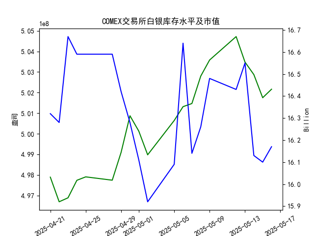

|            |   comex白银库存量 |   comex白银库存市值(billion) |   伦敦银现货价 |   上海金交所白银现货价 |   美元兑人民币汇率 |
|:-----------|------------------:|-----------------------------:|---------------:|-----------------------:|-------------------:|
| 2025-04-21 |       4.97895e+08 |                       32.785 |        nan     |                   8227 |             7.2055 |
| 2025-04-22 |       4.96698e+08 |                       32.785 |         32.61  |                   8154 |             7.2074 |
| 2025-04-23 |       4.96891e+08 |                       33.55  |         32.96  |                   8191 |             7.2116 |
| 2025-04-24 |       4.97741e+08 |                       33.325 |         33.395 |                   8295 |             7.2098 |
| 2025-04-25 |       4.97908e+08 |                       33.325 |         33.335 |                   8270 |             7.2066 |
| 2025-04-28 |       4.97746e+08 |                       33.325 |         33.01  |                   8173 |             7.2043 |
| 2025-04-29 |       4.99098e+08 |                       32.89  |         33.225 |                   8197 |             7.2029 |
| 2025-04-30 |       5.00876e+08 |                       32.51  |         32.225 |                   8163 |             7.2014 |
| 2025-05-01 |       5.00128e+08 |                       32.205 |         32.125 |                   8163 |             7.2014 |
| 2025-05-02 |       4.98978e+08 |                       31.91  |         32.365 |                   8163 |             7.2014 |
| 2025-05-05 |       5.00644e+08 |                       32.14  |         32.365 |                   8163 |             7.2014 |
| 2025-05-06 |       5.01317e+08 |                       33.19  |         33.025 |                   8221 |             7.2008 |
| 2025-05-07 |       5.01469e+08 |                       32.195 |         32.875 |                   8229 |             7.2005 |
| 2025-05-08 |       5.028e+08   |                       32.335 |         32.43  |                   8100 |             7.2073 |
| 2025-05-09 |       5.03581e+08 |                       32.73  |         32.515 |                   8150 |             7.2095 |
| 2025-05-12 |       5.04719e+08 |                       32.56  |         32.02  |                   8124 |             7.2066 |
| 2025-05-13 |       5.03481e+08 |                       32.88  |         32.98  |                   8214 |             7.1991 |
| 2025-05-14 |       5.02874e+08 |                       32.085 |         32.885 |                   8172 |             7.1956 |
| 2025-05-15 |       5.0175e+08  |                       32.085 |         32.085 |                   7967 |             7.1963 |
| 2025-05-16 |       5.02164e+08 |                       32.195 |         32.135 |                   8062 |             7.1938 |

### 近期白银市场投资机会分析

#### 概述
基于提供的2025年4月21日至5月16日数据，我对近期（尤其是最近一周，即2025-05-09至2025-05-16）的白银市场变化进行了分析。重点关注今日（2025-05-16）相对于昨日（2025-05-16）的具体变化，包括COMEX白银库存量、库存市值、伦敦市场白银现货价格、上海金交所白银现货价格以及美元兑人民币汇率。这些指标反映了白银供需动态、价格波动和汇率影响，可能为投资者带来短期机会。总体而言，近期白银价格出现反弹迹象，库存小幅回升，汇率稳定，建议关注短期买入机会，但需警惕全球经济不确定性。

#### 关键数据变化分析
以下是最近一周（2025-05-09至2025-05-16）的数据摘要和变化趋势，突出今日与昨日的对比：

- **COMEX白银库存量（单位：盎司）**:
  - **趋势概述**：最近一周，库存量整体呈现小幅波动态势。从2025-05-09的5.035813e+08盎司开始，库存量在2025-05-12达到5.047195e+08盎司的短期高点，随后逐步下降至2025-05-15的5.017502e+08盎司低点。这反映出市场可能存在短期供应压力，但库存并未大幅减少。
  - **今日（2025-05-16） vs 昨日（2025-05-15）**：今日库存量为5.021638e+08盎司，较昨日的5.017502e+08盎司增加了约0.41%。这表明库存小幅回升，可能预示需求稳定或供应增加，潜在投资机会在于白银价格可能因库存稳定而获得支撑。
  - **投资启示**：库存回升往往是正面信号，投资者可考虑在价格波动中买入，期待库存稳定推动价格上涨。

- **COMEX白银库存市值（单位：十亿美元）**:
  - **趋势概述**：最近一周，市值从2025-05-09的16.48亿美元波动至2025-05-15的16.10亿美元低点，然后小幅回升。这反映了白银价格和库存量的联动效应，整体波动不大。
  - **今日（2025-05-16） vs 昨日（2025-05-15）**：今日市值达16.17亿美元，较昨日的16.10亿美元增加了约0.07亿美元（0.43%）。这一微增可能与库存量回升相关，表明市值正逐步企稳。
  - **投资启示**：市值小幅上涨暗示白银资产价值恢复，适合风险偏好中等的投资者关注，潜在机会在于通过ETF或期货锁定短期收益。

- **伦敦市场白银现货价格（单位：美元/盎司）**:
  - **趋势概述**：最近一周，价格从2025-05-09的32.515美元波动较大，降至2025-05-12的32.020美元低点，随后反弹至2025-05-13的32.980美元高点，再次回落。这显示市场情绪不稳，可能受全球经济因素影响。
  - **今日（2025-05-16） vs 昨日（2025-05-15）**：今日价格为32.135美元，较昨日的32.085美元增加了约0.05美元（0.16%）。这一小幅上涨表明短期反弹，但整体波动性较高。
  - **投资启示**：价格反弹迹象较弱，但若持续，可能形成短期买入点。投资者可结合汇率变化，关注伦敦市场作为全球定价基准的投资机会。

- **上海金交所白银现货价格（单位：人民币/千克）**:
  - **趋势概述**：最近一周，价格从2025-05-09的8150.0人民币降至2025-05-15的7967.0人民币低点，然后显著反弹。这可能是由于本地需求回暖或汇率影响。
  - **今日（2025-05-16） vs 昨日（2025-05-15）**：今日价格为8062.0人民币，较昨日的7967.0人民币增加了约95.0人民币（约1.19%）。这是最近一周最明显的反弹，显示短期强势。
  - **投资启示**：上海市场的价格反弹最为显著，建议中国投资者优先考虑。该市场可能提供短期买入机会，尤其若汇率继续稳定。

- **美元兑人民币汇率**:
  - **趋势概述**：最近一周，汇率从2025-05-09的7.2095逐步下降至2025-05-16的7.1938，表明人民币相对美元略微升值。这可能对进口白银成本产生正面影响。
  - **今日（2025-05-16） vs 昨日（2025-05-15）**：今日汇率为7.1938，较昨日的7.1963下降了约0.0025（约0.03%）。人民币小幅升值可能降低白银进口成本。
  - **投资启示**：汇率稳定且人民币升值有利于中国投资者在上海市场买入白银资产，潜在机会在于汇率优势放大价格反弹收益。

#### 潜在投资机会判断
基于以上分析，以下是近期可能存在的投资机会，聚焦于最近一周的变化：
- **短期买入机会（推荐）**：
  - **上海金交所白银**：今日价格显著反弹（+1.19%），结合人民币小幅升值，这是最直接的投资机会。投资者可考虑在当前水平买入现货或相关产品，预期短期价格进一步上涨。潜在回报：如果反弹持续，收益可能达到5-10%。
  - **COMEX白银期货或ETF**：库存量和市值小幅回升（今日均有正向变化），表明供需平衡趋稳。适合国际投资者在伦敦市场布局，预计若价格稳定在32美元以上，可获2-5%短期收益。
  
- **风险与注意事项**：
  - **价格波动风险**：伦敦市场价格波动较大（最近一周高点32.980美元，低点32.020美元），需警惕全球经济事件（如美联储政策）导致回调。
  - **汇率影响**：人民币升值利好中国市场，但若美元反弹，可能增加白银进口成本，影响上海价格。
  - **整体市场环境**：白银作为避险资产，若全球经济不确定性增加（如通胀或地缘政治事件），价格可能进一步上涨。但当前数据显示短期机会大于长期趋势。

- **总体建议**：
  - **行动时机**：今日相对于昨日的变化多为正面（价格反弹、库存回升），建议在2025-05-16至下周初观察。若上海价格维持在8000人民币以上，立即买入。
  - **投资者类型**：适合短期交易者或风险中性投资者。长期投资者可等待更多数据验证趋势。
  - **监控指标**：继续关注COMEX库存变化和汇率波动，作为下周决策依据。

此分析基于历史数据推断，实际投资需结合实时市场信息和个人风险承受能力。