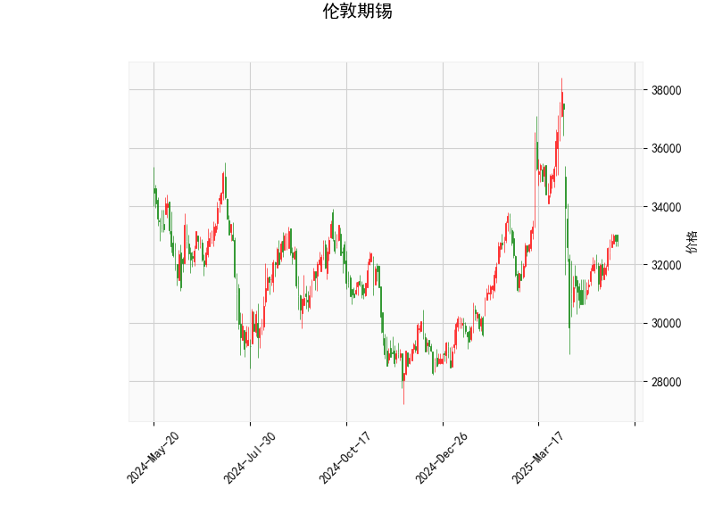

# 伦敦期锡技术分析结果详解

## 1. 对技术分析结果的分析
以下是对提供的伦敦期锡技术指标的逐一分析，这些指标共同描绘了当前市场的技术面状况。伦敦期锡（LME Tin）的当前价格为32816.0，整体指标显示市场可能处于中性偏多头的态势，但需警惕潜在波动。

### 关键指标解读
- **RSI（相对强弱指数）：54.69**  
  RSI是一个衡量价格波动速度和变化的动量指标，通常在0-100范围内。当前RSI值为54.69，处于中性区域（50以上表示多头势头，但未超过70的超买阈值）。这表明期锡价格近期没有过度买进或卖出，市场可能保持相对稳定。如果RSI持续上升，可能预示进一步的看涨趋势；反之，如果回落至30以下，则可能出现超卖反弹。

- **MACD（移动平均收敛散度）：MACD线36.97、信号线-179.81、直方图216.77**  
  MACD是用于识别趋势变化的指标，由MACD线、信号线和直方图组成。当前MACD线（36.97）高于零轴且高于信号线（-179.81），这通常是一个看涨信号，表示短期多头动能增强。直方图（216.77）为正值，进一步确认了价格可能的向上动力。然而，信号线仍处于负值，暗示潜在的多空分歧或短期回调风险。投资者应关注MACD线与信号线的交叉点——如果MACD线继续上穿信号线，看涨信号将更加强化。

- **布林带（Bollinger Bands）：上轨36984.40、中轨33004.36、下轨29024.33**  
  布林带帮助识别价格的波动范围和潜在突破点。当前价格（32816.0）位于中轨（33004.36）附近，略低于中轨，这表明价格处于相对均衡状态，但有轻微的多头倾向（中轨以上通常看涨）。上轨（36984.40）代表潜在阻力位，如果价格向上突破，可能触发强势上涨；下轨（29024.33）是支撑位，如果价格跌破，可能出现回调。布林带的收窄或扩张也能反映市场波动性——当前带宽适中，暗示短期内波动可能温和。

- **K线形态：CDLMATCHINGLOW（匹配低点）**  
  这是一种经典的K线模式，通常表示价格可能已触及短期底部，并预示潜在反弹。匹配低点形态类似于双底或W底，暗示卖家力量减弱，买家可能开始介入。结合其他指标，这进一步支持了看涨观点，但需等待后续K线确认（如价格向上突破）以避免假突破。

### 综合技术面评估
整体而言，伦敦期锡的技术指标显示当前市场偏向多头，但并非强势。RSI的中性水平、MACD的看涨信号、价格在中轨附近以及CDLMATCHINGLOW形态共同暗示短期内可能出现反弹或温和上涨。然而，MACD信号线的负值和价格未明显突破上轨，表明市场仍存在不确定性，可能面临回调风险（如全球经济因素或金属需求变化）。投资者应密切监控这些指标的动态变化，例如RSI是否突破70或MACD交叉，以判断趋势的延续性。

## 2. 近期可能存在的投资或套利机会和策略
基于上述分析，伦敦期锡市场短期内可能存在一定的投资机会，特别是多头策略，但需结合风险管理。以下是对潜在机会的判断和策略建议。

### 可能存在的投资或套利机会
- **投资机会：**  
  当前的技术面显示看涨信号，特别是在CDLMATCHINGLOW形态的支撑下，期锡价格可能向上测试上轨（36984.40）。如果全球经济复苏或电子行业需求增加（如锡用于电子元件），这将放大多头潜力。潜在机会包括直接买入期锡合约或相关衍生品，以捕捉价格反弹。另一方面，如果市场回调至下轨（29024.33）附近，可能提供低位买入机会。

- **套利机会：**  
  期锡作为大宗商品，其价格往往与铜、锌或其他金属相关联。近期套利机会可能包括：  
  - **跨市场套利：** 如果伦敦期锡相对其他金属（如LME铜）出现价格错位（如锡相对低估），投资者可通过多头锡和空头其他金属的组合策略获利。  
  - **波动率套利：** 布林带的相对稳定暗示低波动期，但如果RSI和MACD信号加强，短期波动可能增加。通过期权策略（如买入看涨期权、卖出看跌期权）捕捉波动率扩张。  
  - **季节性或事件驱动套利：** 锡需求受季节性因素（如电子产品旺季）影响，如果未来数据（如中国工业产出）显示需求回升，可进行跨期套利（买入近期合约、卖出远期合约）。

### 推荐策略
- **多头策略：**  
  建议在当前价格附近买入期锡合约，目标位设在上轨（36984.40）附近。止损位可放置在下轨（29024.33）下方，以控制风险。结合RSI和MACD的确认信号，例如等待RSI升至60以上或MACD直方图扩大时入场。

- **风险管理策略：**  
  鉴于市场不确定性，采用分批买入法（如分三次建仓）以降低波动风险。同时，设置动态止盈止损，例如如果价格跌破中轨，及时减仓。使用头寸大小控制，确保单笔投资不超过总资金的5-10%。

- **套利策略：**  
  对于经验丰富的投资者，可尝试跨商品套利策略，例如多头期锡和空头期铜（如果锡相对铜定价偏低）。监控宏观因素，如美联储利率决策或全球供应链动态，以及时调整。期权策略可用于保护多头头寸，例如购买看跌期权作为保险。

总体上，近期伦敦期锡的投资机会以多头为主，但需谨慎对待潜在回调。建议结合基本面分析（如锡矿供应和需求数据）进行决策，并保持对全球经济形势的关注，以最大化机会并最小化风险。