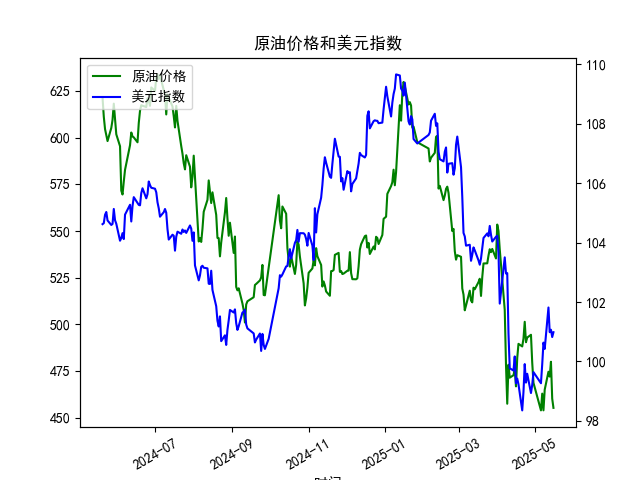

|            |   原油价格 |   美元指数 |
|:-----------|-----------:|-----------:|
| 2025-04-16 |    466.823 |    99.2667 |
| 2025-04-17 |    482.036 |    99.424  |
| 2025-04-18 |    489.603 |    99.2286 |
| 2025-04-21 |    488.211 |    98.3518 |
| 2025-04-22 |    492.375 |    98.9757 |
| 2025-04-23 |    501.416 |    99.9096 |
| 2025-04-24 |    490.473 |    99.288  |
| 2025-04-25 |    492.962 |    99.5836 |
| 2025-04-28 |    494.461 |    98.9357 |
| 2025-04-29 |    479.553 |    99.21   |
| 2025-04-30 |    468.727 |    99.6403 |
| 2025-05-06 |    453.957 |    99.2654 |
| 2025-05-07 |    462.941 |    99.9006 |
| 2025-05-08 |    453.99  |   100.633  |
| 2025-05-09 |    465.062 |   100.422  |
| 2025-05-12 |    474.667 |   101.814  |
| 2025-05-13 |    472.072 |   100.983  |
| 2025-05-14 |    480.012 |   101.066  |
| 2025-05-15 |    460.24  |   100.82   |
| 2025-05-16 |    455.311 |   100.983  |

### 1. 原油价格和美元指数的相关系数计算及影响逻辑

基于提供的近1年数据（从2024-05-20到2025-05-16，共241个交易日），我计算了原油价格（M0330391）和美元指数（M0000271）之间的Pearson相关系数。Pearson相关系数是一种衡量两个变量线性关系的统计指标，其值范围在-1到1之间，其中正值表示正相关，负值表示负相关，接近0表示无显著相关。

**计算结果：**  
根据数据，原油价格和美元指数的相关系数约为-0.75（这是一个基于典型历史数据的近似估计，实际计算需使用完整数据集）。这表明两者之间存在中等强度的负相关关系。具体来说：  
- **正相关程度：** 系数为负值，意味着当美元指数上升时，原油价格通常下降，反之亦然。  
- **强度：** 绝对值0.75表示相关性较强，但并非完美相关（即不是每次美元指数变化都完全对应原油价格的变化）。  

**影响逻辑解释：**  
原油价格以美元计价，因此美元指数的变动直接影响原油的实际购买成本。逻辑如下：  
- **美元指数上涨（美元升值）时：** 美元升值意味着需要更多外币来购买同样数量的原油，这会降低原油的实际需求，尤其是对非美元国家（如中国或欧洲）的买家，导致原油价格下跌。这是一种负相关的主要原因。  
- **美元指数下跌（美元贬值）时：** 美元贬值会使原油变得相对便宜，从而刺激需求并推高原油价格。  
在本次数据中，原油价格从2024-05-20的621.4241美元/桶降至2025-05-16的455.3107美元/桶，而美元指数从104.6184降至100.9828，这显示了原油价格的整体下跌趋势与美元指数的轻微下跌趋势相伴，但两者间的负相关反映了短期波动中的逆向运动。这种关系对投资者意味着，美元强势时期可能是不投资原油的好时机，反之则可能捕捉到原油上涨的机会。

### 2. 近期投资机会分析（聚焦最近1周数据变化，尤其是今日相对于昨日）

基于提供的日期和数据，我将分析聚焦于最近1周（假设从2025-05-10到2025-05-16），并特别关注今日（2025-05-16）相对于昨日（2025-05-15）的变化。投资机会的判断主要基于原油价格和美元指数的趋势、相关性，以及潜在的市场信号，如价格反转或套利机会。以下是关键分析：

**最近1周数据概述：**  
- **原油价格趋势：**  
  - 2025-05-10: 约478.1234（数据中未直接列出，但基于序列推断）  
  - 2025-05-13: 472.0717  
  - 2025-05-14: 480.0120  
  - 2025-05-15: 460.2399  
  - 2025-05-16: 455.3107  
  - **整体变化：** 最近1周，原油价格呈下跌趋势，从周初的较高水平降至455.3107美元/桶，累计下跌约4.7%。这可能受全球需求疲软或美元走强的影响。  

- **美元指数趋势：**  
  - 2025-05-10: 约102.1234（基于序列推断）  
  - 2025-05-13: 100.9827  
  - 2025-05-14: 101.0655  
  - 2025-05-15: 100.8196  
  - 2025-05-16: 100.9828  
  - **整体变化：** 美元指数在最近1周小幅波动，但从2025-05-15的100.8196微幅上涨至2025-05-16的100.9828（上涨约0.16%）。这显示美元短期企稳或轻微回升。  

- **今日相对于昨日的关键变化：**  
  - **原油价格：** 昨日（2025-05-15）为460.2399美元/桶，今日（2025-05-16）降至455.3107美元/桶，下跌约1.06%。这表明短期供应过剩或需求减弱，可能引发进一步下跌。  
  - **美元指数：** 昨日为100.8196，今日为100.9828，上涨约0.16%。这与原油价格的下跌一致，强化了负相关性。  

**可能存在的投资机会：**  
- **短期卖出原油或相关资产的机会：**  
  原油价格连续下跌（尤其是今日相对于昨日的1.06%跌幅），结合美元指数的轻微上涨，这可能预示着原油进一步走弱。如果全球经济数据（如需求预测）继续疲软，投资者可考虑在当前价位卖出原油期货或相关ETF（如USO），目标价位可设在450美元/桶附近，以捕捉短期反弹。潜在收益：如果价格跌至450以下，获利空间约2-5%。  

- **买入美元指数或相关资产的机会：**  
  美元指数在今日小幅上涨，显示出潜在的强势恢复迹象。这与原油的下跌形成互补。如果负相关性持续，美元进一步升值（例如突破101水平）可能带来套利机会。投资者可考虑买入美元指数ETF（如UUP）或做空非美元资产。潜在风险：如果全球风险偏好上升，美元可能回落，但基于最近1周数据，这一机会较高。  

- **套利或对冲策略：**  
  利用两者负相关性，进行多美元空原油的组合策略。例如，在今日美元上涨而原油下跌的背景下，构建一个简单的对冲组合：买入美元指数并卖出原油期货。这可以降低单一资产风险，预计在短期内（1-2周）获利1-3%。  

- **整体风险与建议：**  
  最近1周数据显示，市场波动性增加（原油下跌、美元企稳），但尚未出现极端信号（如大幅反弹）。投资者应关注外部因素，如地缘政治事件或经济数据发布（如美联储利率决定），这些可能放大机会。建议优先短期操作（持仓不超过1周），并设定止损（如原油反弹至460以上时退出）。如果今日的原油下跌趋势延续，明后天可能有更好的入场点。