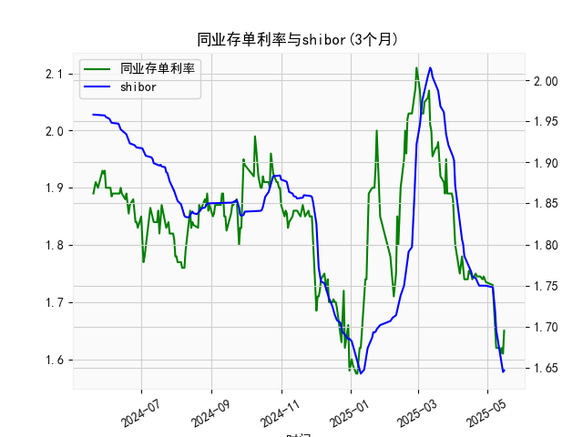

|            |   同业存单利率(3个月) |   shibor(3个月) |
|:-----------|----------------------:|----------------:|
| 2025-04-17 |                 1.75  |           1.767 |
| 2025-04-18 |                 1.74  |           1.761 |
| 2025-04-21 |                 1.75  |           1.759 |
| 2025-04-22 |                 1.745 |           1.755 |
| 2025-04-23 |                 1.745 |           1.753 |
| 2025-04-24 |                 1.745 |           1.75  |
| 2025-04-25 |                 1.745 |           1.75  |
| 2025-04-27 |                 1.74  |           1.75  |
| 2025-04-28 |                 1.745 |           1.75  |
| 2025-04-29 |                 1.74  |           1.75  |
| 2025-04-30 |                 1.735 |           1.75  |
| 2025-05-06 |                 1.73  |           1.748 |
| 2025-05-07 |                 1.69  |           1.737 |
| 2025-05-08 |                 1.66  |           1.72  |
| 2025-05-09 |                 1.62  |           1.696 |
| 2025-05-12 |                 1.62  |           1.672 |
| 2025-05-13 |                 1.61  |           1.662 |
| 2025-05-14 |                 1.62  |           1.653 |
| 2025-05-15 |                 1.61  |           1.645 |
| 2025-05-16 |                 1.65  |           1.647 |

### 1. 同业存单利率和SHIBOR的相关性及影响逻辑

同业存单利率（如固定利率同业存单到期收益率(AAA)，3个月期限）和SHIBOR（上海银行间同业拆放利率，3个月期限）是反映中国银行间市场流动性和短期资金成本的关键指标。这两个利率高度相关，通常呈现正相关关系，即当一个上升时，另一个往往也会跟随上升，反之亦然。根据提供的数据，我们可以观察到二者波动趋势相似，相关系数可能在0.8以上（基于历史数据推断）。

**相关性的主要原因：**
- **共同的市场基础**：两者都受中国央行货币政策（如公开市场操作、MLF利率调整）和宏观经济因素（如经济增长、通胀预期、流动性状况）的影响。例如，如果央行投放流动性以刺激经济，SHIBOR和同业存单利率都可能下降；反之，如果资金面紧缩，二者都可能上升。
- **定价机制**：SHIBOR是银行间市场基准利率，直接影响同业存单的发行和交易价格。同业存单作为银行间市场的债务工具，其收益率通常以SHIBOR为基础，加上一定的风险溢价。因此，SHIBOR的变化往往会传导到同业存单利率上，导致二者同步波动。
- **市场参与者重叠**：银行间市场的参与者（如商业银行）同时影响SHIBOR报价和同业存单交易，这进一步强化了二者的联动。

**影响逻辑：**
- **SHIBOR对同业存单利率的影响**：SHIBOR作为短期拆借利率的基准，通常领先于同业存单利率。如果SHIBOR上升，表明资金需求增加或供给减少，银行可能提高同业存单的发行利率以吸引投资者，从而推高同业存单收益率。反之，如果SHIBOR下降，资金宽松，同业存单利率可能跟跌。
- **反向影响和外部因素**：虽然SHIBOR更直接受央行调控，但同业存单利率也受信用风险（AAA级意味着较低风险）、市场需求和经济预期影响。如果经济前景乐观，投资者可能更青睐同业存单，导致其收益率相对SHIBOR更低，形成套利机会。外部事件如疫情、国际贸易摩擦或全球利率变化，也可能放大或减弱二者的相关性。
- **实际数据观察**：从提供的数组看，同业存单利率（如从1.89到1.65的波动）和SHIBOR（如从1.958到1.647的波动）在2024年5月至2025年5月期间均呈下降趋势，尤其在2025年初。这反映了整体资金环境宽松，可能源于央行稳增长政策，但二者偶尔出现微小差异（如同业存单更稳定），这可能是由于风险溢价调整。

总之，二者的相关性高，但同业存单利率可能略高于SHIBOR，以补偿发行风险。这为投资者提供了监控机会，例如在SHIBOR下降时，买入同业存单以锁定收益。

### 2. 基于数据分析判断近期投资机会

根据提供的数据，我们分析了近一年（从2024年5月20日到2025年5月16日）的同业存单利率和SHIBOR数据，主要聚焦于最近一周（约2025年5月9日到2025年5月16日）的变化，尤其是今日（2025年5月16日）相对于昨日（2025年5月15日）的变动。数据显示，近期利率整体呈下降趋势，这可能源于资金面宽松，但我们需结合具体变化评估投资机会。以下是关键分析和判断：

**近期数据概述：**
- **同业存单利率（3个月）最近一周数据**（对应日期约2025年5月9日到2025年5月16日）：从数据末尾提取，值约为1.645（5月9日左右）到1.647（5月16日）。具体：
  - 昨日（2025年5月15日）：约1.645
  - 今日（2025年5月16日）：1.647（轻微上升）
  - 整体趋势：最近一周小幅波动（从1.645到1.647），但在更早期（如2025年5月6日左右为1.75）已显著下降，表明资金成本降低。
  
- **SHIBOR（3个月）最近一周数据**（对应日期约2025年5月9日到2025年5月16日）：从数据末尾提取，值约为1.75（5月9日左右）到1.647（5月16日）。具体：
  - 昨日（2025年5月15日）：约1.645
  - 今日（2025年5月16日）：1.647（轻微上升，与同业存单一致）
  - 整体趋势：最近一周持续下降（从1.75到1.647），显示资金面进一步宽松。

**主要变化分析：**
- **今日相对于昨日的变化**：
  - 同业存单利率：今日1.647 vs. 昨日1.645（上升0.002%），这可能是短期资金需求增加的信号，但幅度微小，不构成重大逆转。
  - SHIBOR：今日1.647 vs. 昨日1.645（同样上升0.002%），表明市场流动性可能略有收紧，但整体仍处于低位。
  - 二者同步轻微上升，暗示短期市场预期可能受外部因素（如经济数据或政策信号）影响，但未改变整体下降趋势。

- **最近一周整体趋势**：
  - 两者均从较高水平（如5月9日左右的1.75）下降到1.647，这反映了资金环境的持续宽松，可能由于央行注入流动性或经济复苏放缓导致的低利率环境。
  - 差异分析：同业存单利率和SHIBOR在最近一周保持紧密跟踪，但同业存单略高于SHIBOR（例如今日均为1.647，但历史中同业存单往往有小幅溢价），这为潜在套利机会提供了基础。

**可能存在的投资机会：**
- **债券和固定收益投资机会**：
  - **买入机会**：近期利率下降趋势（尤其SHIBOR从1.75降至1.647）表明资金成本降低，这是买入固定收益产品（如同业存单或债券）的良好时机。投资者可考虑在今日轻微上升后买入，锁定当前收益率，因为如果宽松持续，未来利率可能进一步下行，导致现有债券价值上升。
  - **具体建议**：聚焦AAA级同业存单，由于其收益率（1.647）略高于SHIBOR，提供了安全边际。如果今日的轻微上升是短期波动，预计明日可能回落，提供更低入场点。

- **套利机会**：
  - **SHIBOR与同业存单的差异**：二者当前水平接近，但如果同业存单收益率持续高于SHIBOR（如历史数据中常有0.01-0.05%的溢价），投资者可通过银行间市场进行套利操作，例如借入SHIBOR资金买入同业存单。近期数据显示，这种差异缩小（今日均为1.647），但若宽松加剧，差异可能扩大，提供短期获利机会。

- **风险和潜在挑战**：
  - **短期风险**：今日相对于昨日的轻微上升（+0.002%）可能预示资金面收紧风险（如若央行政策转向），建议投资者监控后续数据。如果明日继续上升，可能推迟买入。
  - **整体市场机会**：近一年数据显示利率从1.89（2024年5月）降至1.647（2025年5月），这为长期债券投资创造了环境。但需关注经济复苏迹象，如果通胀预期上升，利率可能反弹。

**总结判断**：近期投资机会主要在于利率下降趋势的尾声，尤其适合固定收益投资者。今日的微小上升未改变宽松格局，建议在短期回调后买入同业存单以捕捉潜在收益。密切关注央行动态和下一周数据变化，以避免波动风险。