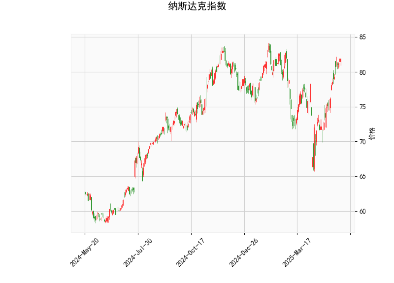

### 纳斯达克指数技术分析结果解读

#### 1. 对技术分析结果的详细分析
基于提供的纳斯达克指数数据，我们可以从多个技术指标角度进行解读，以评估当前市场趋势和潜在风险。以下是对各指标的逐一分析：

- **当前价格（81.9）**：  
  当前价格位于布林带中间带（75.85）和上带（83.31）之间，接近上带边缘。这表明指数处于相对强势区域，价格可能面临上行压力或潜在回调。如果价格突破上带（83.31），可能进一步确认强势趋势；反之，若回落至中间带附近，可能引发修正。

- **RSI（68.75）**：  
  RSI值已超过70的阈值，显示指数进入超买状态。这通常暗示短期内可能出现卖出压力，导致价格回调或横盘整理。投资者需警惕过度买入风险，尤其是如果市场情绪逆转，RSI过高往往是潜在逆转信号。

- **MACD指标（MACD线：2.037，信号线：1.425，柱状图：0.613）**：  
  MACD线高于信号线，且柱状图值为正（0.613），这反映出短期看涨信号，表明多头动能占优。MACD的正向差距暗示价格可能继续上行，但如果柱状图开始收窄或转为负值，将是潜在卖出信号。目前的MACD表现支持短期强势，但需结合RSI的超买警告，避免过度乐观。

- **布林带（上带：83.31，中带：75.85，下带：68.39）**：  
  价格接近上带，显示波动率可能增加。这通常是市场活跃期的特征：如果价格触及上带并反弹，可能延续涨势；但如果突破上带，波动性将放大，带来更高风险。中间带（75.85）作为支撑位，如果价格回落至此，可能提供买入机会。下带（68.39）作为潜在支撑，若价格跌破中带，则需关注进一步下行风险。

- **K线形态（CDLGAPSIDESIDEWHITE）**：  
  该形态是一个经典的看涨K线模式，涉及跳空缺口和实体阳线，表明多头控制了市场。CDLGAPSIDESIDEWHITE通常出现在强势上涨阶段，暗示短期内可能有进一步上行空间。但在RSI超买的背景下，这种形态也可能预示着回调风险，因此应结合其他指标验证其可持续性。

总体而言，技术指标显示纳斯达克指数当前处于强势上行趋势（MACD和K线形态支持），但RSI的超买信号和接近布林上带的价格位置增加了潜在逆转风险。市场可能在短期内继续上涨，但需防范修正或波动加剧。

#### 2. 近期可能存在的投资或套利机会及策略判断
基于上述分析，纳斯达克指数短期内存在投资机会，但也伴随较高风险。以下是针对近期可能的投资和套利机会的判断，以及相应的策略建议：

- **投资机会判断**：  
  - **看涨机会**：MACD的正向信号和K线形态显示，指数可能在短期内延续上行趋势，尤其如果市场情绪保持积极（如科技股驱动）。当前价格接近布林上带，潜在上行空间至85-90区间，但RSI超买风险较高，回调概率增加。  
  - **风险因素**：超买状态和潜在回调可能导致短期损失，如果全球经济数据（如通胀或利率变动）转弱，指数易受影响。总体而言，机会大于风险，但需短期操作。  
  - **套利机会**：纳斯达克作为指数，可通过衍生品（如期权或期货）进行套利。例如，当前波动率较高（布林带扩张），可利用现货与期货之间的价差进行套利操作。如果RSI超买导致价格回调，买入看涨期权与卖出看跌期权的组合策略可能产生收益。

- **投资策略建议**：  
  - **多头策略**：考虑在当前价格附近买入纳斯达克相关ETF（如QQQ）或指数基金，目标价位设在83-85。若价格回落至布林中带（75.85）附近，可加仓以低吸。止损位设在下带（68.39）以下，以控制风险。  
  - **风险管理策略**：由于RSI超买，优先采用短线操作（如日内交易），并设置动态止损（如价格跌破80）。结合MACD信号，当柱状图收窄时及时减仓，避免追高。  
  - **套利策略**：  
    - **波动率套利**：利用布林带的扩张，构建跨式期权策略（买入看涨和看跌期权），捕捉潜在回调或突破。如果现货价格与期货价格存在价差（如0.5-1点），可进行无风险套利（如期货多头 + 现货空头）。  
    - **组合策略**：在K线形态确认后，买入指数期货多头，同时卖出高估期权以对冲超买风险。预计短期内（1-2周），如果指数回调至75-80区间，套利机会将更明显。  
  - **总体建议**：投资者应根据个人风险偏好调整策略，例如保守型投资者可等待RSI回落至60以下再入场；激进型投资者可在当前强势期加仓，但需密切监控经济新闻（如美联储政策）。最终，结合基本面分析（如科技股业绩）可提升策略成功率。

请注意，技术分析并非绝对预测，市场受多种因素影响（如地缘政治或经济数据）。建议结合实时数据和专业咨询制定决策。