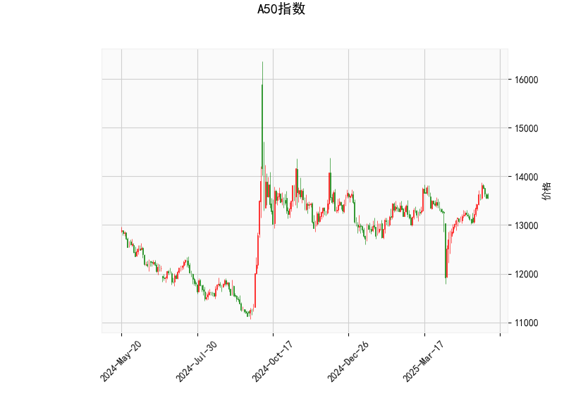

### 一、A50指数技术分析结果解读

#### 1. **价格与布林轨道分析**  
- **当前价（13555.0）**位于布林轨道中轨（13266.35）上方，接近上轨（13914.09），显示短期价格处于**偏强区域**。  
- **潜在信号**：若价格持续站稳中轨，可能进一步向上轨靠拢；但若无法突破上轨，需警惕回落风险。

#### 2. **RSI指标（57.29）**  
- RSI处于**中性偏强区域**（50-60），未进入超买区（>70），表明市场存在温和上涨动能，但未出现明显过热。  
- **需关注**：若RSI突破60，可能强化短期多头趋势；若跌破50，则可能转向震荡或回调。

#### 3. **MACD指标**  
- **MACD线（135.17）**高于**信号线（100.17）**，且**柱状图（35.0）**持续扩大，形成“金叉”后的加速发散，显示**短期多头动能强劲**。  
- **潜在风险**：若柱状图缩窄或MACD线拐头向下，可能预示回调。

#### 4. **K线形态**  
- **CDLMATCHINGLOW**：出现在下跌趋势中的底部反转信号，暗示空头衰竭后多头反攻。  
- **CDLSHORTLINE**：短实体K线，通常表示市场犹豫或盘整，需结合其他指标确认方向。  
- **综合解读**：短期可能处于**底部震荡后的反弹初期**，但需验证后续K线是否确认反转。

---

### 二、投资或套利机会与策略建议

#### 1. **趋势跟随策略**  
- **做多机会**：若价格站稳中轨（13266）且MACD保持金叉，可逢低布局多单，目标上轨（13914）。  
- **止损设置**：跌破中轨或MACD柱状图缩窄时止损。

#### 2. **反转交易机会**  
- **信号触发条件**：若价格接近上轨（13914）后出现滞涨（如长上影线或RSI超买），可轻仓试空，目标中轨。  
- **风险提示**：需配合成交量放大确认反转有效性。

#### 3. **套利机会（波段交易）**  
- **区间操作**：在布林轨道上轨（13914）与中轨（13266）之间高抛低吸，利用价格均值回归特性。  
- **关键验证**：结合RSI超买/超卖（如RSI>70或<30）提高胜率。

#### 4. **事件驱动风险预警**  
- 近期需关注宏观经济数据（如中国PMI、美联储政策）对A50的冲击，若技术面与基本面背离，需优先规避风险。

---

### 三、总结  
**短期看涨但需谨慎追高**：当前技术指标显示多头占优，但布林上轨压力明显，建议以回调做多为主，结合止损保护。若K线形态确认反转（如放量突破上轨），可进一步加仓；反之，若价格滞涨回落，需及时止盈或转向防守策略。