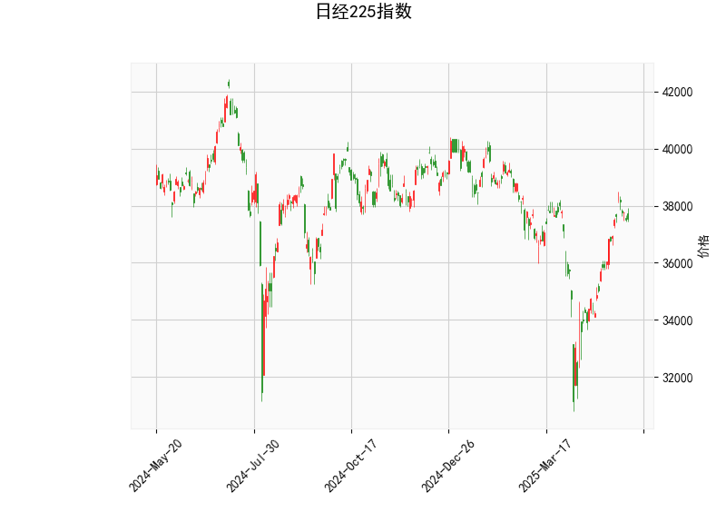

### 日经225指数技术分析结果解读

#### 1. 关键指标分析
- **当前价（37529.49）**：  
  当前价格位于布林带中轨（36276.29）与上轨（39661.77）之间，距离上轨约5.7%，距离中轨约3.4%，表明市场处于**温和上涨趋势**中，但尚未触及超买区域。

- **RSI（59.86）**：  
  处于中性偏多区域（50-70），未进入超买区间（70+），显示短期动能向上但未过热，可能仍有上行空间。

- **MACD（621.69 vs. 信号线466.42）**：  
  MACD线高于信号线，且柱状图（155.27）为正值并扩大，表明**上涨动能增强**，短期趋势偏多。

- **布林带**：  
  当前价接近中轨上方，布林带开口较宽（上轨与下轨差值达6760点），反映近期波动率较高。价格若突破上轨可能加速上涨，若回落至中轨附近则可能获得支撑。

- **K线形态**：  
  未显示明确反转或持续形态（如十字星、吞没等），当前趋势可能延续。

---

#### 2. 潜在投资机会与策略

##### **机会判断**：
- **趋势跟踪策略**：  
  - **多头信号**：MACD金叉（柱状图扩大）与RSI中性偏多，结合价格站稳中轨上方，短期可逢低布局多单，目标看向布林带上轨（39661附近）。  
  - **突破策略**：若价格放量突破布林带上轨，可能触发趋势加速，可顺势加仓。

- **回调防御策略**：  
  - **支撑位**：布林带中轨（36276）为关键支撑，若价格回落至该位置且RSI未跌破50，可视为低吸机会。  
  - **止损参考**：若跌破中轨且MACD柱状图转负，需警惕趋势反转风险。

- **套利机会**：  
  - **布林带均值回归**：若价格快速拉升至布林带上轨附近（如接近39600）且RSI超买（>70），可短线做空，目标中轨附近。  
  - **MACD背离观察**：若价格创新高但MACD柱状图缩量或RSI背离，可能预示回调，可结合反转K线布局空单。

##### **风险提示**：
- **波动率风险**：布林带开口较大，需防范价格急涨急跌导致的滑点或止损触发。  
- **外部事件**：日本央行政策、日元汇率波动及全球市场情绪可能放大短期波动。

---

**结论**：当前技术面偏向多头，建议以趋势跟随为主，关注布林带上轨突破与中轨支撑有效性，结合RSI超买/超卖信号灵活调整仓位。套利机会需快进快出，严控仓位与止损。