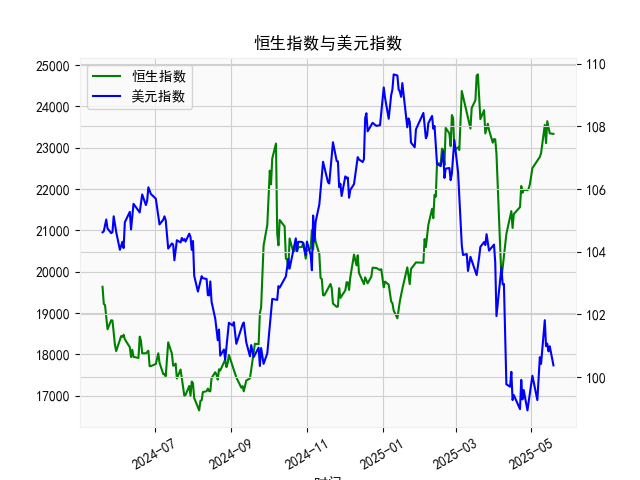

|            |   恒生指数 |   美元指数 |
|:-----------|-----------:|-----------:|
| 2025-04-16 |    21057   |    99.2667 |
| 2025-04-17 |    21395.1 |    99.424  |
| 2025-04-22 |    21562.3 |    98.9757 |
| 2025-04-23 |    22072.6 |    99.9096 |
| 2025-04-24 |    21909.8 |    99.288  |
| 2025-04-25 |    21980.7 |    99.5836 |
| 2025-04-28 |    21972   |    98.9357 |
| 2025-04-29 |    22008.1 |    99.21   |
| 2025-04-30 |    22119.4 |    99.6403 |
| 2025-05-02 |    22504.7 |   100.042  |
| 2025-05-06 |    22662.7 |    99.2654 |
| 2025-05-07 |    22691.9 |    99.9006 |
| 2025-05-08 |    22775.9 |   100.633  |
| 2025-05-09 |    22867.7 |   100.422  |
| 2025-05-12 |    23549.5 |   101.814  |
| 2025-05-13 |    23108.3 |   100.983  |
| 2025-05-14 |    23640.7 |   101.066  |
| 2025-05-15 |    23453.2 |   100.82   |
| 2025-05-16 |    23345   |   100.983  |
| 2025-05-19 |    23332.7 |   100.373  |

# 恒生指数与美元指数的相关性及影响逻辑

## 1. 相关性及影响逻辑
恒生指数与美元指数存在显著的负相关性，逻辑主要体现在以下方面：
- **资本流动**：美元走强时，全球资本倾向于回流美元资产（如美债），导致新兴市场资金流出，港股流动性承压；反之，美元走弱时，资金可能流入港股，推升恒生指数。
- **企业盈利**：恒指成分股中跨国公司（如腾讯、汇丰）的海外收入以美元计价，美元升值会直接提升其汇兑收益，但美元债务较多的企业（如地产、航空）则面临成本压力。
- **利率联动**：美元走强常伴随美联储加息预期，推高全球融资成本，压制港股估值（尤其是高估值科技股）；美元走弱则可能反映宽松预期，利好风险资产。
- **避险情绪**：美元作为避险资产，当市场恐慌时，美元与恒指通常反向波动（如地缘冲突期间美元涨、港股跌）。

## 2. 近期投资机会分析（聚焦最近一周）

### 关键数据变化
- **美元指数**：  
  最近一周（2025年5月13日-19日）从100.42降至**100.37**（今日较昨日下降0.6%），且连续三日跌破101关口，短期技术面偏弱。
- **存贷款增速差**：  
  同期从23,640.65降至**23,332.72**（降幅1.3%），显示贷款增速放缓，可能反映短期信贷收缩压力。

### 潜在机会
#### （1）港股反弹窗口
- **逻辑**：美元指数快速回落（本周跌1.5%）降低资金流出压力，叠加恒指超跌（存贷款差收缩或已部分定价），技术性反弹概率上升。  
- **标的**：关注美元敏感板块——  
  - **互联网**（腾讯、阿里）：美元贬值利好海外收入汇兑。  
  - **消费**（美团、安踏）：若信贷政策边际宽松，消费复苏预期升温。

#### （2）黄金/大宗商品对冲
- **逻辑**：美元走弱+存贷款差收缩（经济放缓预期）双重支撑大宗商品价格。  
- **策略**：  
  - **黄金ETF（如02840）**：美元与黄金负相关性增强，短期突破2,400美元/盎司概率大。  
  - **铜相关标的**（江西铜业）：LME铜库存低位+美元弱势或刺激价格反弹。

#### （3）人民币资产套利
- **逻辑**：美元指数破位或加剧人民币升值预期，离岸人民币（CNH）可能测试6.85关口。  
- **操作**：  
  - **做多港股通高股息股**（中移动、中海油）：汇率升值提升股息收益率吸引力。  
  - **卖出美元债ETF**：人民币升值将压缩美元债实际收益。

### 风险提示
- **美元反转**：若美国CPI数据超预期，美联储鹰派表态可能逆转美元跌势。  
- **政策时滞**：存贷款差收缩反映信贷需求疲软，需观察后续LPR是否下调以对冲。

---

**结论**：短期建议超配港股（尤其是汇率敏感型板块）与黄金，并密切跟踪美元指数能否有效跌破100心理关口。