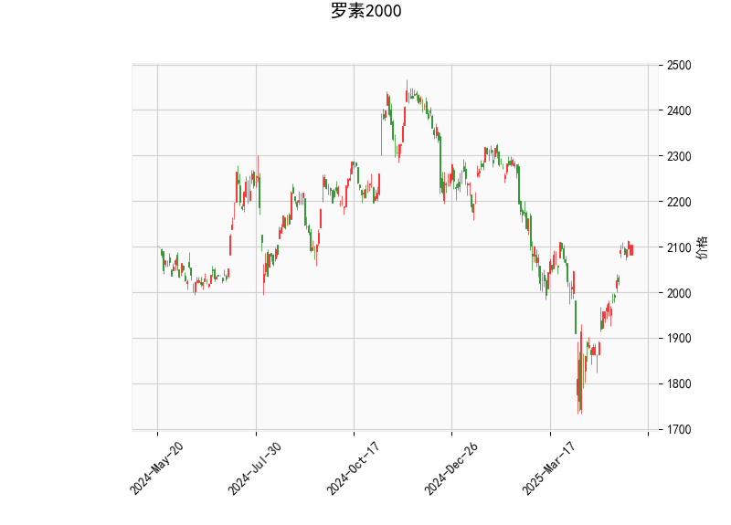

### 罗素2000指数技术分析结果解读

#### 1. 核心指标分析
- **当前价（2104.43）与布林带关系**  
  当前价格位于布林带中轨（2004.74）与上轨（2194.45）之间，且高于中轨约5%，表明市场处于**温和上涨趋势**。距离上轨仍有约4%的空间，短期内可能继续向上试探阻力，但需警惕上轨附近的回调压力。

- **RSI（64.42）**  
  相对强弱指数接近超买阈值（70），但尚未进入超买区间，显示买方力量占优但未极端化。若RSI突破70并伴随价格新高，需警惕短期回调风险；若回撤至50附近则可能提供买入机会。

- **MACD（38.99）与信号线（22.64）**  
  MACD线大幅高于信号线，柱状图（16.35）持续扩大，表明**上涨动能强劲**，市场处于多头主导阶段。但需观察未来是否出现MACD与价格顶背离（价格新高但MACD未新高），这可能暗示趋势反转。

- **K线形态**  
  - **CDLBELTHOLD**：可能预示趋势延续，但需结合其他信号验证。  
  - **CDLCLOSINGMARUBOZU**（收盘秃线）：显示收盘价接近日内高点，买方强势。  
  - **CDLMARUBOZU**（光头光脚大阳线）：确认短期看涨动能。  
  - **CDLLONGLINE**（长影线）：暗示局部卖压，需关注后续是否出现回调。  
  综合来看，K线形态整体偏多，但需警惕局部波动。

---

#### 2. 近期投资/套利机会与策略

##### **机会判断**  
- **多头趋势延续**：MACD金叉、布林带中轨支撑、K线看涨形态均支持短期上行，目标可看向布林带上轨（2194）。  
- **回调买入机会**：若价格回踩中轨（2004）或RSI回落至50附近，可能提供低吸窗口。  
- **潜在风险点**：布林带上轨阻力、RSI接近超买区，需防范技术性回调。

##### **策略建议**  
1. **趋势跟随策略**  
   - **入场**：当前价附近轻仓做多，止损设于中轨下方（如1980）。  
   - **加仓条件**：若价格突破上轨且MACD持续扩张，可追加仓位，目标看向前高延伸位（如2250）。  
   - **止盈**：分批止盈于上轨附近（2194）及整数关口（如2150、2200）。

2. **均值回归策略**  
   - **做空套利**：若RSI突破70且价格触及上轨，可尝试短线做空，止损设于上轨上方（如2200），目标中轨（2004）。  
   - **期权对冲**：买入看跌期权或构建熊市价差组合，对冲潜在回调风险。

3. **事件驱动策略**  
   - 关注美国中小盘股财报季、美联储政策动向，若基本面利好与技术面共振，可能加速趋势。

---

##### **风险提示**  
- **流动性风险**：罗素2000成分股以中小盘为主，波动率通常高于大盘指数。  
- **背离信号**：密切监控MACD与价格的背离迹象，若出现则需及时减仓。  
- **经济数据**：通胀、就业数据超预期可能引发市场风格切换，需动态调整仓位。