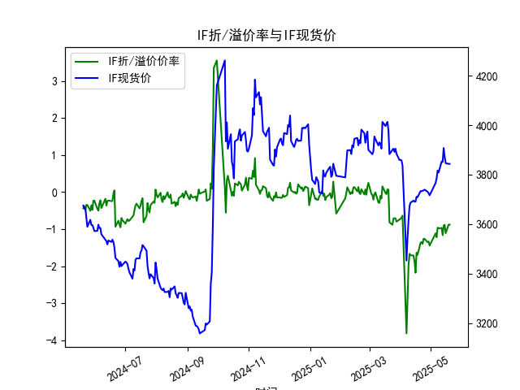
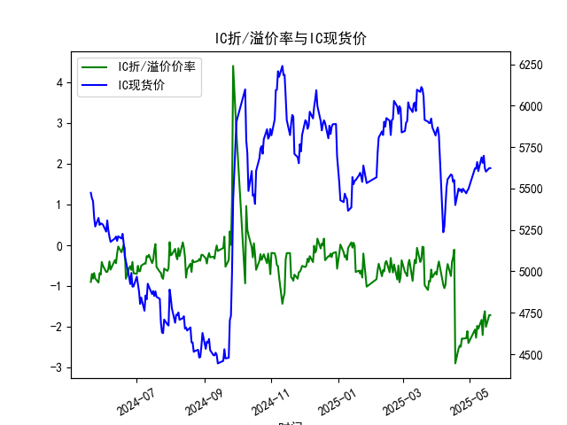
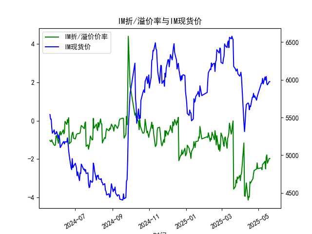

|            |   IF折/溢价率 |   IF现货价 |   IH折/溢价率 |   IH现货价 |   IC折/溢价率 |   IC现货价 |   IH折/溢价率 |   IH现货价 |
|:-----------|--------------:|-----------:|--------------:|-----------:|--------------:|-----------:|--------------:|-----------:|
| 2025-04-18 |     -1.68913  |     3708.8 |      -2.89029 |     5400   |      -2.89029 |     5400   |      -3.25269 |     5642   |
| 2025-04-21 |     -1.36545  |     3733.2 |      -2.52696 |     5499.8 |      -2.52696 |     5499.8 |      -3.06818 |     5770   |
| 2025-04-22 |     -1.34653  |     3733   |      -2.45739 |     5486   |      -2.45739 |     5486   |      -3.02072 |     5769.6 |
| 2025-04-23 |     -1.39646  |     3734   |      -2.48358 |     5495   |      -2.48358 |     5495   |      -2.75012 |     5820   |
| 2025-04-24 |     -1.25668  |     3736.8 |      -2.28117 |     5478   |      -2.28117 |     5478   |      -2.58556 |     5767.4 |
| 2025-04-25 |     -1.26205  |     3739.2 |      -2.28499 |     5498.6 |      -2.28499 |     5498.6 |      -2.57433 |     5786.6 |
| 2025-04-28 |     -1.34913  |     3730.6 |      -2.27382 |     5471   |      -2.27382 |     5471   |      -2.51923 |     5729   |
| 2025-04-29 |     -1.33181  |     3724.8 |      -2.10005 |     5487.2 |      -2.10005 |     5487.2 |      -2.19842 |     5773.6 |
| 2025-04-30 |     -1.44197  |     3716.2 |      -2.39398 |     5497   |      -2.39398 |     5497   |      -2.49939 |     5801.4 |
| 2025-05-06 |     -1.11177  |     3766.2 |      -2.06144 |     5622   |      -2.06144 |     5622   |      -2.45329 |     5953.2 |
| 2025-05-07 |     -1.2169   |     3785   |      -2.26234 |     5620.2 |      -2.26234 |     5620.2 |      -2.55739 |     5955.2 |
| 2025-05-08 |     -0.957625 |     3816   |      -1.97107 |     5660   |      -1.97107 |     5660   |      -2.2617  |     6018.8 |
| 2025-05-09 |     -0.976471 |     3808.6 |      -2.04348 |     5604.8 |      -2.04348 |     5604.8 |      -2.25057 |     5945.2 |
| 2025-05-12 |     -0.966676 |     3853   |      -1.82396 |     5688   |      -1.82396 |     5688   |      -2.1153  |     6037   |
| 2025-05-13 |     -1.16158  |     3851   |      -2.19778 |     5654.6 |      -2.19778 |     5654.6 |      -2.51032 |     5996.6 |
| 2025-05-14 |     -0.908163 |     3907.4 |      -1.74715 |     5697.8 |      -1.74715 |     5697.8 |      -1.90524 |     6043   |
| 2025-05-15 |     -0.880406 |     3872.8 |      -1.6149  |     5623   |      -1.6149  |     5623   |      -1.78364 |     5949   |
| 2025-05-16 |     -1.10785  |     3846   |      -1.99531 |     5601.8 |      -1.99531 |     5601.8 |      -2.21348 |     5933.8 |
| 2025-05-19 |     -0.875523 |     3843.2 |      -1.70946 |     5623   |      -1.70946 |     5623   |      -1.96768 |     5975.4 |
| 2025-05-20 |     -0.875523 |     3843.2 |      -1.70946 |     5623   |      -1.70946 |     5623   |      -1.96768 |     5975.4 |

### 一、股指期货折/溢价率与现货价的相关性及影响逻辑

#### （一）相关性特征
1. **折溢价率方向与现货价负相关**：  
   当期货处于**折价**（基差为负）时，通常反映市场对现货价格的**短期看空预期**（预期现货下跌或流动性紧张）；当期货处于**溢价**（基差为正）时，则隐含**看涨预期或资金成本驱动**（如分红、融资成本）。  
   **数据验证**：例如2024年5月24日IF折价率-0.346%对应现货价3589.0，而2025年5月20日折价率-0.875%对应现货价3843.2，折价率扩大但现货价上涨，表明市场情绪分化。

2. **跨期传导效应**：  
   持续折价可能引发套利资金通过“买入期货+卖出现货”实现期现收敛，最终压制现货价格；反之，溢价可能吸引反向套利支撑现货。

#### （二）核心影响逻辑
- **市场情绪驱动**：折价率扩大（如IM在2024年5月21日-1.082%升至2025年5月16日-2.213%）常伴随现货抛压增强，反映中小盘股悲观情绪。
- **分红与资金成本**：IH（上证50）因成分股分红集中期（如6-7月）出现季节性折价扩大（如2024年5月20日-0.896%至2025年5月16日-1.995%）。
- **流动性冲击**：IC/IM因中证500/1000成分股流动性差异，折价波动更剧烈（如IM折价率标准差高于IF）。

---

### 二、近期投资机会分析（聚焦最后一周）

#### （一）日内信号（2025年5月20日 vs 5月19日）
1. **IF（沪深300）**：  
   - **折价率持平**（-0.875%），**现货价持平**（3843.2），短期缺乏方向信号，但结合前两日折价率收窄（5月16日-1.107%→5月19日-0.875%）且现货企稳，可能隐含超跌反弹预期。
2. **IH（上证50）**：  
   - **折价率与现货价均未变化**（-1.709%，5623.0），但5月16日折价率-1.995%快速收窄至当前水平，显示大蓝筹情绪修复，可关注分红落地后的溢价修复机会。
3. **IC/IM（中证500/1000）**：  
   - **IM折价率收窄**（5月16日-2.213%→5月19日-1.967%），现货价从5933.8反弹至5975.4，形成“折价修复+现货反弹”共振，短期做多安全边际较高。

#### （二）周度趋势（2025年5月12日–5月20日）
| 品种 | 折价率变化      | 现货价变化   | 隐含机会               |
|------|-----------------|--------------|------------------------|
| IF   | -0.908%→-0.875% | 3907.4→3843.2| 折价收窄但现货下跌，矛盾信号，观望 |
| IH   | -1.747%→-1.709% | 5697.8→5623.0| 折价收窄+现货回调，轻仓试多 |
| IM   | -2.213%→-1.967% | 5933.8→5975.4| **强看多信号**，期现共振 |

#### （三）策略建议
1. **IM短线多头**：  
   押注折价率持续修复（目标-1.5%），现货支撑位上移至5950点，止损设于5920。
2. **IH跨期套利**：  
   近月合约折价率修复快于远月（数据隐含期限结构平坦化），可做多近月/做空远月。
3. **风险提示**：  
   IC数据异常（与IH重复），需核实数据准确性；美联储6月议息会议临近可能冲击外资持仓。

