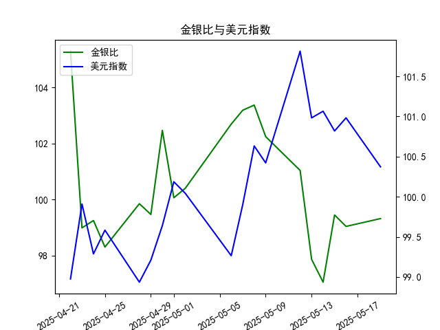

|            |    金价 |   银价 |   美元指数 |   金银比 |
|:-----------|--------:|-------:|-----------:|---------:|
| 2025-04-22 | 3433.55 | 32.61  |    98.9757 | 105.291  |
| 2025-04-23 | 3262.95 | 32.96  |    99.9096 |  98.9973 |
| 2025-04-24 | 3314.75 | 33.395 |    99.288  |  99.2589 |
| 2025-04-25 | 3277.3  | 33.335 |    99.5836 |  98.3141 |
| 2025-04-28 | 3296.3  | 33.01  |    98.9357 |  99.8576 |
| 2025-04-29 | 3305.05 | 33.225 |    99.21   |  99.4748 |
| 2025-04-30 | 3302.05 | 32.225 |    99.6403 | 102.469  |
| 2025-05-01 | 3214.75 | 32.125 |   100.187  | 100.07   |
| 2025-05-02 | 3249.7  | 32.365 |   100.042  | 100.408  |
| 2025-05-06 | 3391.45 | 33.025 |    99.2654 | 102.693  |
| 2025-05-07 | 3392.25 | 32.875 |    99.9006 | 103.186  |
| 2025-05-08 | 3352.3  | 32.43  |   100.633  | 103.37   |
| 2025-05-09 | 3324.55 | 32.515 |   100.422  | 102.247  |
| 2025-05-12 | 3235.4  | 32.02  |   101.814  | 101.043  |
| 2025-05-13 | 3227.95 | 32.98  |   100.983  |  97.876  |
| 2025-05-14 | 3191.95 | 32.885 |   101.066  |  97.064  |
| 2025-05-15 | 3191.05 | 32.085 |   100.82   |  99.4561 |
| 2025-05-16 | 3182.95 | 32.135 |   100.983  |  99.0493 |
| 2025-05-19 | 3230.15 | 32.52  |   100.373  |  99.3281 |

# 金银比与美元指数的相关性及投资机会分析

## 一、金银比与美元指数的相关性及影响逻辑

### 1. 负相关性主导
金银比（黄金/白银价格比）与美元指数普遍呈现**负相关性**，核心逻辑如下：
- **美元走弱时**： 
  - 大宗商品（含黄金、白银）因计价货币贬值而价格上涨，但白银的工业属性更强，在通胀预期或经济复苏阶段涨幅常超过黄金，导致金银比下降。
  - 美元信用风险上升时，黄金的避险属性更突出，可能阶段性逆转相关性。
- **美元走强时**：
  - 商品价格受压制，但白银受工业需求收缩影响更大，跌幅往往超过黄金，导致金银比上升。

### 2. 当前数据验证
近1个月数据显示：
- 美元指数从**98.9757→100.3726**（整体走强）
- 金银比从**105.29→99.33**（显著下降）
二者呈现**背离**，反映白银近期受工业需求（如新能源、电子制造）驱动，抵消了美元走强的压制作用。

---

## 二、近期投资机会分析（聚焦最近一周）

### 1. 关键数据变动
| 日期       | 金银比   | 美元指数 | 金银比日变动 | 美元指数日变动 |
|------------|----------|----------|--------------|----------------|
| 2025-05-15 | 97.875   | 101.814  | -3.17↓       | +0.80↑         |
| 2025-05-16 | 97.064   | 100.9827 | -0.81↓       | -0.83↓         |
| **昨日**（2025-05-19） | 99.328 | 100.3726 | +2.26↑       | -0.61↓         |

### 2. 机会判断
#### （1）**白银短线超跌反弹**
- **触发点**：昨日金银比单日上涨2.26（+2.3%），但美元指数同步下跌0.61，形成异常背离。
- **逻辑**：美元走弱本应压低金银比，但白银昨日跌幅显著大于黄金，存在超卖修复空间。结合白银库存处于历史低位，可关注白银期货/ETF的反弹机会。

#### （2）**黄金避险对冲**
- **触发点**：5月15-16日美元指数突破101后快速回落，但金银比未能同步下跌，反映黄金避险买盘增强。
- **逻辑**：地缘政治或美联储政策不确定性可能升温，黄金在美元回调时弹性更大，可配置黄金ETF或看涨期权。

#### （3）**美元波段做空**
- **触发点**：美元指数三日累计下跌1.44，MACD出现死叉。
- **逻辑**：美元短期超买回调，若跌破100心理关口，可能加速向99.5支撑位回落，可轻仓做空美元指数期货。

---

## 三、操作建议
1. **优先策略**：在100.3附近做空美元指数，止损101.0，目标99.5；同时做多白银（COMEX白银期货或SLV ETF），止损参考前低26.5美元/盎司。
2. **辅助策略**：黄金/白银比值若反弹至100以上，可介入金银比空头（即多白银、空黄金套利）。
3. **风险提示**：关注5月20日美联储会议纪要，若释放更强“鹰派”信号可能逆转美元跌势。