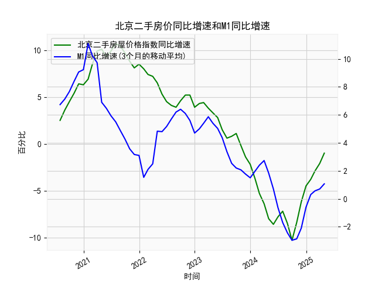

|            |   北京二手房屋价格指数同比增速 |   M1同比增速 |   M1同比增速(3个月的移动平均) |
|:-----------|-------------------------------:|-------------:|------------------------------:|
| 2023-09-30 |                            1.1 |          2.1 |                      2.2      |
| 2023-10-31 |                           -0.2 |          1.9 |                      2.06667  |
| 2023-11-30 |                           -1.4 |          1.3 |                      1.76667  |
| 2023-12-31 |                           -2.2 |          1.3 |                      1.5      |
| 2024-01-31 |                           -3.7 |          3.3 |                      1.96667  |
| 2024-02-29 |                           -5.3 |          2.6 |                      2.4      |
| 2024-03-31 |                           -6.4 |          2.3 |                      2.73333  |
| 2024-04-30 |                           -8   |          0.6 |                      1.83333  |
| 2024-05-31 |                           -8.6 |         -0.8 |                      0.7      |
| 2024-06-30 |                           -7.8 |         -1.7 |                     -0.633333 |
| 2024-07-31 |                           -7.2 |         -2.6 |                     -1.7      |
| 2024-08-31 |                           -8.5 |         -3   |                     -2.43333  |
| 2024-09-30 |                          -10.3 |         -3.3 |                     -2.96667  |
| 2024-10-31 |                           -8.4 |         -2.3 |                     -2.86667  |
| 2024-11-30 |                           -6.2 |         -0.7 |                     -2.1      |
| 2024-12-31 |                           -4.5 |          1.2 |                     -0.6      |
| 2025-01-31 |                           -3.8 |          0.4 |                      0.3      |
| 2025-02-28 |                           -2.9 |          0.1 |                      0.566667 |
| 2025-03-31 |                           -2.1 |          1.6 |                      0.7      |
| 2025-04-30 |                           -1   |          1.5 |                      1.06667  |

### 1. 北京二手房价指数同比增速与M1同比增速的相关性及影响逻辑

#### 相关性分析
从数据趋势看，北京二手房价同比增速与M1同比增速呈现**阶段性正相关**：
- **同步性**：在2020年7月至2021年初的扩张周期中，M1增速从6.73%升至11.1%，二手房价增速从2.5%升至10.7%，两者同步上行。而在2022-2023年紧缩周期中，M1增速转负（最低至-2.96%），二手房价增速也大幅下跌至-10.3%，显示流动性收缩与房价下行同步。
- **滞后性**：M1增速的拐点通常领先房价增速约1-3个月。例如，2023年底M1增速触底反弹（从-2.96%升至0.7%），二手房价增速随后在2024年收窄跌幅（从-8.5%升至-4.5%）。

#### 影响逻辑
- **流动性传导**：M1增速反映市场流动性的充裕程度。M1增长时，企业和居民持有更多活期资金，可能通过购房需求或投资行为推高房价；M1收缩时，流动性紧张会抑制购房意愿，导致房价增速下滑。
- **政策驱动**：M1增速与货币政策（如降准、公开市场操作）密切相关。宽松政策释放的流动性可能通过房贷利率下降或信贷额度放松直接刺激楼市需求，反之亦然。

---

### 2. 近期投资机会分析（基于最近4个月数据）

#### 数据变化特征
- **二手房价增速**：最近4个月（2025年1-4月）同比增速为**-4.5% → -3.8% → -2.9% → -2.1%**，降幅逐月收窄，显示房价下跌动能减弱。
- **M1增速**：同期M1增速从**0.3% → 0.57% → 0.7% → 1.07%**，流动性持续改善，且本月增速较上月（0.7%）显著提升。

#### 投资机会判断
1. **房地产市场触底反弹**：
   - **逻辑**：M1增速连续回升表明流动性宽松，结合二手房价降幅收窄，可能预示北京楼市接近底部。若政策端进一步放松（如限购优化、房贷利率下调），房价或于未来3-6个月内企稳回升。
   - **策略**：关注核心地段二手房价格企稳信号，优先布局学区房、地铁房等抗跌性强的资产。

2. **房地产产业链股票**：
   - **逻辑**：M1增速回升与房价企稳预期将提振房地产板块估值，开发商（尤其国资背景）、建材（如水泥、玻璃）及家居企业盈利预期改善。
   - **标的**：关注现金流稳健的头部房企、受益于“保交楼”政策的建材龙头。

3. **REITs与不动产基金**：
   - **逻辑**：若二手房价反弹，商业地产租金回报率可能修复，REITs（如仓储物流、长租公寓类）存在估值修复机会。

#### 风险提示
- **政策不确定性**：需警惕房地产税试点或限购政策加码的潜在风险。
- **经济复苏节奏**：若M1增速反弹后未能持续，楼市回暖可能延后。