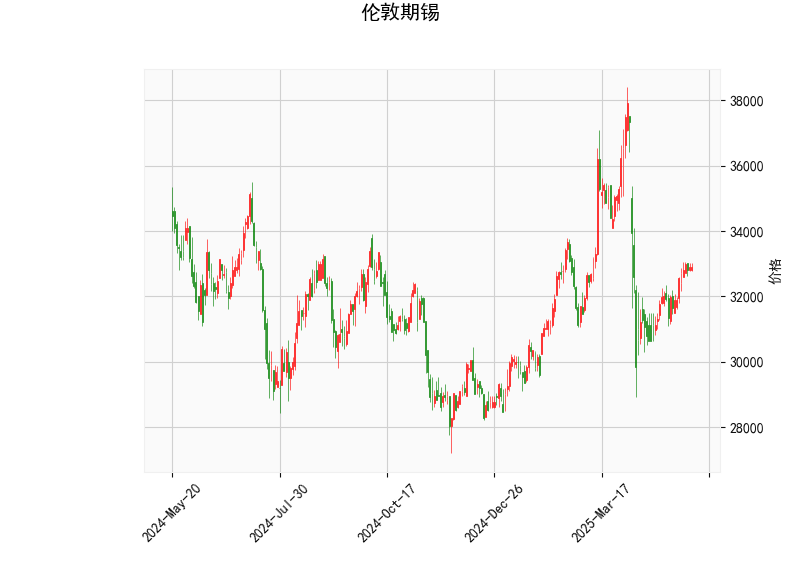

### 伦敦期锡技术分析解读

#### 1. 技术指标分析
- **当前价（32899.0）与布林轨道**：
  - 当前价格位于布林带中轨（33016.4）附近，略低于中轨，显示短期多空力量相对均衡。
  - **布林带上下轨**（上轨36991.96，下轨29040.84）的间距较宽，表明价格波动性较高，未来可能出现趋势性行情。若价格突破中轨并站稳，可能向上测试上轨；若跌破中轨，可能向下试探下轨。

- **RSI（55.46）**：
  - RSI处于中性区域（50-70之间），未进入超买（>70）或超卖（<30）区间，反映市场情绪偏向谨慎乐观。若后续RSI站稳55并继续上行，可能推动价格上涨；若回落至50以下，则需警惕短期回调风险。

- **MACD（77.03 vs. 信号线-127.38）**：
  - MACD线大幅高于信号线，且MACD柱状图（204.41）显著放大，显示短期多头动能强劲，存在反弹或趋势延续的可能。
  - 但信号线仍为负值，表明中长期趋势尚未完全转多，需警惕短期上涨后的回调压力。

- **K线形态**：
  - 暂无明确反转或持续形态，需结合后续价格走势确认方向。

---

#### 2. 潜在机会与策略建议

##### **机会方向**：
1. **趋势跟随策略**：
   - **多头机会**：若价格站稳中轨（33016）并伴随RSI向70靠近，可尝试轻仓做多，目标看向上轨（36991），止损设于中轨下方（如32500）。
   - **空头机会**：若价格跌破中轨且RSI下穿50，可考虑短空，目标下轨（29040），止损设于中轨上方（如33500）。

2. **区间套利**：
   - **高抛低吸**：当前价格接近中轨，若布林带持续收窄且波动率下降，可在价格触及下轨时买入，接近上轨时卖出，捕捉区间震荡收益。

3. **MACD动能策略**：
   - MACD柱状图持续扩大时，顺势跟随短期多头趋势；若柱状图开始缩量且价格滞涨，可平仓止盈。

##### **风险提示**：
- **高波动性风险**：布林带宽度较大，需警惕突发性突破后的反向波动，严格设置止损。
- **背离风险**：若价格创新高但RSI或MACD未同步走强，可能暗示趋势衰竭，需及时离场。
- **信号滞后性**：MACD和布林带均基于历史数据，需结合实时市场消息（如库存、供需变化）调整策略。

##### **总结**：
当前伦敦期锡处于多空博弈阶段，短期偏多但中长期趋势未明。建议以**轻仓试多+严格止损**为主，若价格站稳中轨可逐步加仓；若破位下行则转为观望或短空。套利机会需等待波动率收敛后的区间震荡信号。