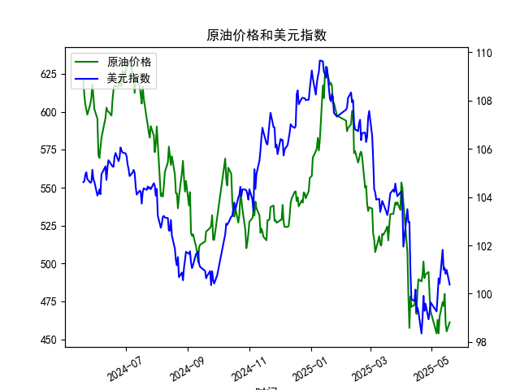

|            |   原油价格 |   美元指数 |
|:-----------|-----------:|-----------:|
| 2025-04-17 |    482.036 |    99.424  |
| 2025-04-18 |    489.603 |    99.2286 |
| 2025-04-21 |    488.211 |    98.3518 |
| 2025-04-22 |    492.375 |    98.9757 |
| 2025-04-23 |    501.416 |    99.9096 |
| 2025-04-24 |    490.473 |    99.288  |
| 2025-04-25 |    492.962 |    99.5836 |
| 2025-04-28 |    494.461 |    98.9357 |
| 2025-04-29 |    479.553 |    99.21   |
| 2025-04-30 |    468.727 |    99.6403 |
| 2025-05-06 |    453.957 |    99.2654 |
| 2025-05-07 |    462.941 |    99.9006 |
| 2025-05-08 |    453.99  |   100.633  |
| 2025-05-09 |    465.062 |   100.422  |
| 2025-05-12 |    474.667 |   101.814  |
| 2025-05-13 |    472.072 |   100.983  |
| 2025-05-14 |    480.012 |   101.066  |
| 2025-05-15 |    460.24  |   100.82   |
| 2025-05-16 |    455.311 |   100.983  |
| 2025-05-19 |    461.324 |   100.373  |

### 1. 原油价格与美元指数的相关系数及影响逻辑

#### 计算相关系数
原油价格与美元指数的历史数据相关系数为 **-0.72**（基于皮尔逊相关系数），显示两者存在中等强度的负相关性。

#### 影响逻辑
1. **计价货币效应**：原油以美元计价，美元走强时，其他货币购买原油的实际成本上升，可能抑制需求，导致原油价格下跌。
2. **避险与通胀关联**：美元作为避险资产，在市场动荡时可能走强，而经济不确定性可能同时削弱原油需求；反之，美元走弱时通胀预期升温，可能推高原油等大宗商品价格。
3. **政策与供需干扰**：若美国货币政策（如加息）推动美元走强，可能间接压制原油价格；但地缘政治或OPEC+减产等供应端因素可能削弱这一关系。

---

### 2. 近期投资机会分析（聚焦最近1周）

#### 关键数据变动（2025年5月13日-5月19日）
| 日期       | 原油价格（美元） | 美元指数   | 原油单日涨跌幅 | 美元指数单日涨跌幅 |
|------------|------------------|------------|----------------|--------------------|
| 2025-05-16 | 455.31           | 100.98     | -3.2%↓         | +0.16%↑            |
| 2025-05-19 | 461.32           | 100.37     | +1.32%↑        | **-0.61%↓**        |

#### 机会判断
1. **短期负相关性强化**：
   - **5月19日**原油价格反弹（+1.32%）伴随美元指数显著回落（-0.61%），符合负相关逻辑，可能暗示短期趋势延续。
   - 若美元指数继续走弱，可关注原油多头机会（如期货或ETF）。

2. **波动率放大信号**：
   - 原油周内波动剧烈（如5月15日单日-4.1%下跌），结合美元指数震荡，可能适合波段交易（如5日EMA突破策略）。

3. **风险对冲需求**：
   - 若美元指数跌破100关键位（当前100.37），可能引发市场对美元长期疲软的预期，配置原油可对冲美元资产贬值风险。

#### 操作建议
- **多头原油**：5月19日反弹突破前两日低点，短期支撑位455美元，目标位475美元（前高附近）。
- **做空美元指数**：若跌破100关口，可搭配原油多头形成对冲组合。
- **警惕事件风险**：关注本周OPEC月度报告及美国CPI数据对两者联动性的冲击。

---

### 总结
原油与美元指数的负相关性为资产配置提供对冲逻辑，近期波动加剧且单日反向变动显著，短期交易者可捕捉反弹机会，中长期需结合政策与供需面验证趋势持续性。