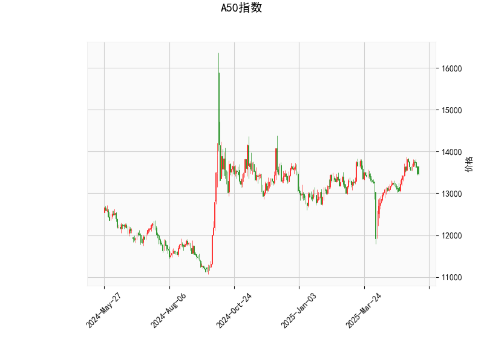

### A50指数技术分析结果解读

#### 1. 对技术分析结果的详细分析
基于提供的A50指数技术指标数据，我们可以从多个角度对当前市场状况进行评估。以下是对各指标的逐一分析：

- **当前价格（Current Price）**：A50指数当前报价为13471.0点。该价格处于相对稳定的区间，接近中性水平，没有显示出明显的极端波动。

- **RSI（Relative Strength Index）**：RSI值为51.30，这是一个中性的读数。RSI通常在0-100范围内波动，50以上表示市场轻微强势，而70以上则为超买信号。当前的RSI表明A50指数近期未出现过度买入或卖出行为，市场动力较为平衡，适合观望或小幅操作。

- **MACD（Moving Average Convergence Divergence）**：MACD线为110.59，信号线为122.99，MACD直方图（Hist）为-12.40（负值）。MACD是用于识别趋势变化的关键指标。其中，MACD线低于信号线且直方图为负，暗示短期内存在看跌信号。这可能表示卖方力量正在增强，潜在的修正或回调风险增加。如果直方图继续恶化，可能会确认更强的下行趋势。

- **布林带（Bollinger Bands）**：上轨（Upper Band）为13983.90，中轨（Middle Band）为13306.60，下轨（Lower Band）为12629.30。当前价格（13471.0）位于中轨附近，这表明指数处于一个相对窄幅的波动区间，没有突破上轨（超买）或下轨（超卖）。这种格局通常代表市场不确定性，中轨作为动态支撑位，可能在短期内起到关键作用。如果价格跌破中轨，可能会测试下轨水平，引发进一步回调。

- **K线形态**：检测到的形态包括“CDLLONGLINE”（长线）和“CDLMATCHINGLOW”（匹配低点）。CDLLONGLINE通常表示价格经历了一段强劲的单向运动，可能暗示前期趋势的延续或反转。CDLMATCHINGLOW则显示价格可能在某个支撑水平附近测试底部，这往往是潜在反弹的信号。结合其他指标，这些形态可能预示短期修正后出现支撑，但需警惕MACD的看跌提示。

总体而言，A50指数当前呈现出混合信号：RSI和布林带显示中性稳定，而MACD的负直方图和K线形态的潜在支撑点暗示短期下行风险与反弹机会并存。市场可能处于一个十字路口，需要进一步的确认信号来判断方向。

#### 2. 近期可能存在的投资或套利机会和策略分析
基于上述技术分析，我们可以推断A50指数的近期走势，并提出相应的投资或套利策略。以下是针对当前情况的判断和建议：

- **可能的机会**：
  - **短期回调机会**：MACD直方图为负且低于信号线，表明可能出现价格下行。如果A50指数跌向布林带下轨（约12629.30），这可能是一个低风险买入点，尤其如果K线形态的“CDLMATCHINGLOW”确认支撑。另一方面，如果价格反弹至上轨（约13983.90），RSI的中性水平可能提供逢高卖出的机会。
  - **套利潜力**：A50指数作为大盘指标，可能与相关衍生品（如期货、期权或ETF）存在价差。当前的中性RSI和布林带位置，暗示跨市场套利机会，例如在A50期货和现货之间进行价差交易。如果MACD信号恶化，期现套利（如卖出期货对冲现货头寸）可能降低风险。
  - **风险因素**：如果MACD负值加剧或价格跌破中轨，短期内可能出现更深回调（目标下轨附近），这为逆势投资者提供潜在机会，但也需注意全球经济事件（如利率变动或地缘风险）可能放大波动。

- **推荐策略**：
  - **观望与等待策略**：鉴于混合信号，建议短期内采取保守观望。监控MACD直方图是否转为正值（可能信号反弹），或RSI是否接近70（超买预警）。如果价格稳定在中轨以上，可考虑小仓位多头操作。
  - **做空或卖出策略**：如果MACD负值持续扩大，并伴随K线形态确认下行（如跌破中轨），可考虑做空A50指数期货或相关期权。这是一种短期套利策略，目标设在下轨附近，止损位可置于上轨以上以控制风险。
  - **多头反弹策略**：若“CDLMATCHINGLOW”形态发挥作用，价格从当前水平反弹，可在布林带中轨附近买入，目标指向上轨。结合RSI的中性，建议搭配止盈止损（如5-10%的波动范围），以捕捉潜在反弹。
  - **风险管理建议**：任何策略均应结合仓位控制（如不超过总仓位的20-30%用于单笔操作）和多元化（如结合其他资产类如债券或商品）。此外，关注外部因素，如中国经济数据或全球股市动态，以调整策略。

总之，近期A50指数的投资机会主要围绕短期回调与潜在反弹展开，但需谨慎对待MACD的看跌信号。投资者应根据个人风险偏好和市场动态实时调整策略，优先确保风险控制。