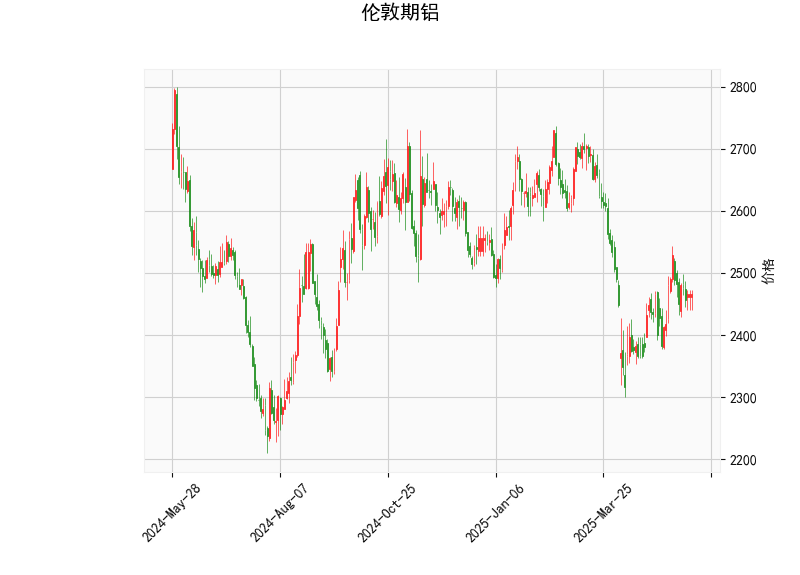

# 伦敦期铝技术分析结果详解

## 1. 对技术分析结果的整体分析
基于提供的伦敦期铝技术指标数据，我们可以从多个维度评估当前市场状况。以下是对各指标的逐一解释，并结合整体趋势进行综合评估。

### 关键指标解读
- **当前价格（Current Price）**: 2466.0  
  当前价格位于布林带的中轨（2499.81）附近，表明铝价处于相对稳定的波动区间内。这可能反映市场缺乏强烈的趋势方向，价格正围绕中轨震荡。

- **RSI（Relative Strength Index）: 50.88**  
  RSI值处于中性水平（通常50为分界线，低于30为超卖，高于70为超买）。这表示铝价近期没有明显的超买或超卖信号，市场力量相对均衡，投资者可能需要关注后续RSI变化来判断潜在的买卖点。

- **MACD（Moving Average Convergence Divergence）指标**:
  - MACD线: 3.16（正值）  
    MACD线为正且高于信号线，暗示短期内存在看涨动量。这可能意味着价格有向上突破的潜力，尤其如果MACD线继续上升。
  - MACD信号线: -0.38（负值）  
    信号线为负，但MACD线高于信号线，形成了一个金叉形态，表明短期多头力量占优。不过，这一信号仍需进一步确认，以避免假突破。
  - MACD直方图（Hist）: 3.54（正值）  
    直方图正值表示价格动量向上，潜在的上涨趋势正在积聚。但如果直方图开始缩小，可能预示动量减弱。

- **布林带（Bollinger Bands）**:
  - 上轨（Upper Band）: 2730.73  
  - 中轨（Middle Band）: 2499.81  
  - 下轨（Lower Band）: 2268.89  
    当前价格（2466.0）位于中轨下方但接近中轨，显示价格处于布林带的中间区域。这通常表示市场波动性较低，价格可能在该范围内横盘。如果价格向上突破上轨（2730.73），可能触发强势上涨；反之，若跌破下轨（2268.89），则可能出现回调。

- **K线形态（K-line Pattern）: CDLSPINNINGTOP（纺锤线）**  
  这是一种中性K线形态，通常显示市场不确定性和犹豫情绪。纺锤线暗示买卖力量均衡，可能预示潜在反转或延续现有趋势。在当前背景下，由于MACD显示轻微看涨，纺锤线可能表示短期调整后向上突破的可能，但也需警惕向下反转的风险。

### 综合市场状况评估
整体来看，伦敦期铝的技术指标呈现出中性偏看涨的特征：
- RSI的中性水平和MACD的看涨信号（如金叉和正直方图）共同暗示短期内存在向上趋势的潜力，但力度有限。
- 布林带的窄幅震荡和K线形态的犹豫性表明市场缺乏强烈方向，可能处于盘整阶段。外部因素（如全球经济数据、供应需求变化或地缘政治事件）可能成为触发突破的关键。
- 如果未来几天RSI上升至60以上或MACD直方图进一步扩大，价格可能测试上轨（2730.73）。反之，若RSI跌破40，市场可能转向回调。

## 2. 近期可能存在的投资或套利机会和策略
基于上述分析，伦敦期铝市场短期内可能存在有限的投资机会，特别是针对看涨信号的捕捉。以下是对潜在机会的判断及策略建议，重点考虑风险管理。

### 可能存在的投资机会
- **看涨机会**:  
  MACD的正值和潜在金叉形态暗示短期上涨空间。如果价格突破布林中轨（2499.81）并向上轨（2730.73）靠拢，投资者可能抓住反弹机会。预计上涨目标在2500-2700区间，基于当前动量。

- **套利机会**:  
  - **跨市场套利**: 伦敦期铝与纽约期铜或其他金属期货的相关性较高。如果铝价相对其他金属（如铜或锌）被低估（例如，通过比较历史相关系数），可考虑多头铝、空头其他金属的套利策略。当前铝价在中性水平，可能存在季节性套利机会（如夏季需求旺季）。
  - **期权套利**: 利用看涨期权（Call Option）布局。如果隐含波动率较低（从布林带窄幅可推断），购买近月看涨期权可能提供杠杆效应，尤其当价格向上突破时。
  - **价差交易**: 在铝价盘整期，考虑买进远月合约、卖出近月合约的牛市价差策略，以捕捉潜在的向上趋势。

- **风险与潜在下行机会**:  
  如果K线形态转为更多空头信号（如持续纺锤线后出现下跌K线），或RSI跌破40，市场可能回调至下轨（2268.89）以下，提供逢低买入或空头机会。但当前信号不支持强空头。

### 投资策略建议
- **短期策略（1-5天）**:  
  - **观望为主**: 由于市场犹豫（纺锤线），建议等待确认信号。例如，待MACD直方图扩大或价格站稳中轨后再入场。  
  - **多头进场策略**: 若价格突破2500，可小仓位买入现货或期货，设置止损在下轨（2260）以下。目标位设在2650附近。  
  - **风险控制**: 采用1:2的盈亏比，确保仓位不超过总资金的10%。

- **中期策略（1-3周）**:  
  - **趋势跟踪**: 监测RSI和MACD的动态。如果RSI升至55以上，考虑加仓多头头寸。同时，结合基本面（如中国需求数据或全球库存水平）确认趋势。  
  - **套利组合**: 实施跨市场套利，如多头伦敦铝、短头LME铜。如果价差收窄，可获利了结。  
  - **多元化**: 结合期权策略，例如购买看涨期权作为保险，以降低波动风险。

- **总体风险提示**:  
  铝价受宏观经济影响较大（如美联储利率决策或全球制造业数据），投资者需结合新闻监控。建议使用技术止损（如跌破布林下轨时平仓），并在多头策略中控制杠杆，以避免MACD信号失效带来的损失。

总之，近期伦敦期铝的投资机会以轻微看涨为主，但需谨慎对待市场不确定性。通过密切跟踪指标变化，投资者可抓住潜在反弹或套利窗口。