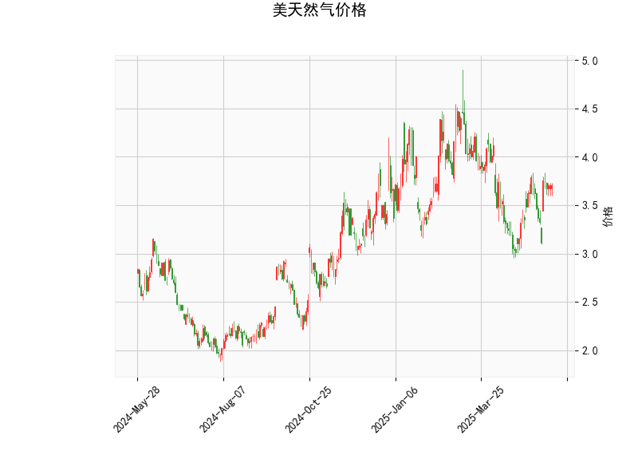

# 美天然气价格的技术分析结果解读

## 1. 对技术分析结果的详细分析
以下是对提供的美天然气价格技术指标的逐一分析，这些指标基于当前价位（3.706）和相关技术工具。整体来看，市场呈现中性偏看涨的态势，但尚未出现强烈信号。

### 关键指标概述
- **当前价格（Current Price）**: 价格为3.706美元。这是一个中性位置，位于近期波动范围的中部，没有显示出明显的超买或超卖迹象。
  
- **RSI（Relative Strength Index，相对强弱指数）**: 值约为55.25。这表明市场处于中性区域（RSI通常在30-70之间为正常）。高于50的RSI暗示轻微的强势，表明买方力量略占上风，但尚未达到70的超买阈值，因此短期内可能不会有急剧回调。

- **MACD（Moving Average Convergence Divergence，移动平均收敛散度）**: 
  - MACD线为0.039，信号线为-0.001，直方图为0.040。
  - MACD线高于信号线（正直方图），这是一个看涨信号，表明短期内多头动能正在增强。这可能预示价格可能向上突破，但强度较弱，因为值较小。如果MACD直方图继续扩大，价格上涨的可能性会增加。

- **Bollinger Bands（布林带）**:
  - 上带（Upper Band）: 4.436
  - 中带（Middle Band）: 3.688
  - 下带（Lower Band）: 2.939
  - 当前价格（3.706）紧邻中带（3.688），这表示价格处于一个相对稳定的区间。价格靠近中带通常意味着市场波动性较低，可能即将出现突破。如果价格向上触及上带（4.436），可能触发买盘；反之，向下触及下带（2.939）则可能出现卖压。目前的布林带宽度显示出中等波动性，没有极端扩张或收缩。

- **K线形态**: 提供的形态列表为空（[]），表示近期未出现明显的K线模式（如锤头线、吞没形态等）。这可能意味着市场缺乏短期强势信号，需要结合其他指标进行判断。

### 整体市场解读
从以上指标来看，美天然气价格目前处于一个均衡状态：
- RSI和MACD的组合显示轻微看涨信号，但力度有限（RSI未超买，MACD未大幅扩张）。
- 布林带位置表明价格可能在短期内测试上带（4.436），如果突破成功，可能引发进一步上涨。
- 总体风险较低，但缺乏强烈趋势，市场可能继续在3.5-4.5美元区间震荡。投资者应关注外部因素，如天气变化、地缘政治事件或全球能源需求，这些可能放大技术信号。

## 2. 近期可能存在的投资或套利机会与策略
基于上述分析，以下是对近期投资或套利机会的判断。机会主要源于MACD的看涨信号和布林带的潜在突破，但需谨慎，因为RSI和K线形态未提供强力确认。策略建议结合风险管理，适合中短期交易者。

### 可能的机会
- **投资机会**:
  - **看涨潜力**: MACD的正直方图和价格接近布林带中带暗示短期上涨机会。如果价格突破上带（4.436），可能测试4.5-5.0美元水平，特别是在需求季节（如冬季取暖期）到来时。这为多头投资者提供买入点。
  - **回调风险**: 如果RSI接近70或价格回落至下带（2.939），可能出现修正机会，但当前信号不支持强烈卖出。

- **套利机会**:
  - **跨品种套利**: 美天然气与相关商品（如原油或电力期货）存在相关性。如果天然气价格相对原油出现低估（当前价3.706低于历史平均），可考虑天然气-原油价差套利。例如，利用期货合约进行多头天然气和空头原油的组合，以捕捉季节性价差。
  - **季节性套利**: 天然气价格易受季节影响（如夏季库存积累或冬季需求激增）。当前中性信号可能预示在秋季前进行套利布局，例如买入现货天然气并卖出期货合约，以锁定潜在价差。
  - **波动率套利**: 布林带的窄幅波动暗示低 volatility，可通过期权策略（如卖出看涨期权）获利，但需注意突发事件（如飓风）可能放大波动。

### 推荐策略
- **买入策略（看涨）**:
  - **条件**: 如果价格突破布林带上带（4.436）并MACD直方图继续上升，考虑买入现货或期货合约。目标价位可设为4.5-5.0美元。
  - **风险管理**: 设置止损在3.5美元以下（接近下带），以防范回调。仓位控制在总资金的5-10%，并结合RSI监控超买风险。
  
- **观望或卖出策略（中性偏防御）**:
  - **条件**: 如果RSI升至60以上，价格未突破上带，可选择观望或轻仓卖出。适用于风险厌恶者。
  - **行动**: 短期内避免大额交易，等待K线形态出现（如阳线吞没）作为确认信号。

- **套利策略**:
  - **价差套利**: 监控天然气与原油的价差（如NG-CL价差）。如果当前差值低于历史均值，可建立多头天然气和空头原油的头寸，目标在差值回归时获利。使用期货合约执行，持有期1-3个月。
  - **期权策略**: 卖出短期看涨期权（strike price在4.0以上），利用当前低波动率赚取溢价。但需准备备兑，以应对价格上涨。

### 总体建议
近期投资机会以短期多头为主，套利则更适合经验丰富的交易者。始终结合基本面分析（如EIA库存报告），并使用工具如止盈止损来管理风险。市场不确定性较高，建议小额测试水温，避免过度杠杆。