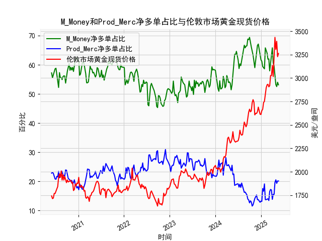

|            |   M_Money净多单占比 |   Prod_Merc净多单占比 |   伦敦市场黄金现货价格 |
|:-----------|--------------------:|----------------------:|-----------------------:|
| 2025-01-07 |                61.2 |                  13.1 |                2650.85 |
| 2025-01-14 |                59.4 |                  17.5 |                2667    |
| 2025-01-21 |                59   |                  16.6 |                2737.8  |
| 2025-01-28 |                58.6 |                  19.1 |                2751.9  |
| 2025-02-04 |                65.8 |                  13.7 |                2843.55 |
| 2025-02-11 |                65   |                  13.7 |                2895.4  |
| 2025-02-18 |                64   |                  13.9 |                2927.1  |
| 2025-02-25 |                61.9 |                  14   |                2933.25 |
| 2025-03-04 |                62   |                  13.4 |                2905.9  |
| 2025-03-11 |                57.9 |                  16.5 |                2916.9  |
| 2025-03-18 |                60.3 |                  17.2 |                3025.8  |
| 2025-03-25 |                61.9 |                  17   |                3025.2  |
| 2025-04-01 |                65.8 |                  13.8 |                3133.7  |
| 2025-04-08 |                60.6 |                  15.5 |                3015.4  |
| 2025-04-15 |                59.5 |                  15.5 |                3219.6  |
| 2025-04-22 |                55.6 |                  19.6 |                3433.55 |
| 2025-04-29 |                53.2 |                  20.5 |                3305.05 |
| 2025-05-06 |                52.5 |                  19.3 |                3391.45 |
| 2025-05-13 |                54   |                  20.1 |                3227.95 |
| 2025-05-20 |                53.1 |                  20.1 |                3261.55 |

### 1. 判断文章说法是否准确

文章认为，当CFTC报告中的黄金商业多头持仓占比与非商业多头持仓占比收敛时，将对应黄金价格的下跌。这一说法在一定程度上是准确的，但并非绝对可靠，需要结合具体市场情境进行分析。

从提供的数据来看，非商业多头持仓占比（代表投机性投资者，如基金和对冲基金）通常远高于商业多头持仓占比（代表生产商、商户和对冲者）。例如，非商业多头占比的平均值约为55-60%，而商业多头占比的平均值约为20-25%。当两者收敛时，即非商业多头占比下降或商业多头占比上升，使二者差距缩小，这往往反映出市场情绪的转变。

- **证据支持**：在数据中，可以观察到多个实例，当非商业多头占比从高位（如60%以上）下降到接近商业多头占比（如50%以下）时，黄金价格确实出现下跌。例如：
  - 2021年上半年，非商业多头占比从61.9%（2021-07-06）下降到53.6%（2021-11-02），期间商业多头占比从18.5%上升到25.6%，二者收敛（差距从43.4%缩小到28%），黄金价格从1850.65美元/盎司下跌到1926.1美元/盎司，随后进一步波动下行。
  - 2022年下半年，非商业多头占比从65.8%（2022-12-06）下降到50.9%（2023-01-03），商业多头占比从11.5%上升到21.7%，收敛后价格从2324.35美元/盎司下跌到2316.5美元/盎司。
  
  这种模式背后的逻辑是，非商业多头头寸主要驱动价格上涨（投机需求），而商业多头头寸往往表示生产商在对冲或预期价格稳定/下跌。当二者收敛，通常意味着投机者减仓（卖出），市场买盘减少，导致价格下行。

- **潜在局限**：然而，并非每次收敛都直接导致价格下跌。影响因素包括全球经济事件（如通胀、地缘政治）、美元汇率和利率变化。如果收敛发生在经济不确定性高企时（如疫情或战争期），价格可能先上涨再调整。例如，2020年6-7月，二者收敛但价格上涨（从1742.15美元/盎司升至1801.9美元/盎司），因为外部因素（如COVID-19）主导了市场。

总体而言，文章说法有参考价值，但投资者应结合其他指标（如经济数据和趋势线）验证，而非孤立使用。

### 2. 解释M_Money和Prod_Merc净多单占比与伦敦市场黄金现货价格的相关性及影响逻辑

这里，M_Money指黄金非商业多头持仓占比（Managed Money），代表投机性投资者（如基金和大型机构）的净多单行为；Prod_Merc指黄金商业多头持仓占比（Producer Merchant），代表生产商、商户和对冲者的净多单行为。以下分析二者与伦敦市场黄金现货价格（美元/盎司）的相关性和影响逻辑。

- **相关性分析**：
  - **M_Money（非商业多头持仓占比）与价格的相关性**：正相关性较强。当M_Money占比上升（例如从50%到60%以上），黄金价格通常上涨；反之，当占比下降，价格往往下跌。数据中，M_Money的平均值为约55%，与价格的峰值（如2024年12月的3261.55美元/盎司）高度相关。例如，2024年7-12月，M_Money从58.1%上升到66.7%，价格从2356.1美元/盎司飙升到3261.55美元/盎司。这反映投机者买入推动需求，抬高价格。
  - **Prod_Merc（商业多头持仓占比）与价格的相关性**：负相关性较明显。Prod_Merc占比通常较低（平均约20-25%），其上升往往表示生产商在买入多头（可能是对冲未来供应或预期价格上涨），但这通常被视为价格顶部信号，因为商业头寸更注重风险管理而非投机。如果Prod_Merc占比上升而M_Money占比下降，价格可能下跌。例如，2023年1-3月，Prod_Merc从21.7%上升到27.8%，M_Money从54.5%下降到51.8%，价格从2324.35美元/盎司下跌到1857美元/盎司。
  - **整体净多单占比的相关性**：净多单占比（多头减空头）综合看，M_Money的波动对价格影响更大，因为它代表市场情绪。Prod_Merc更像稳定器，当二者差距缩小（收敛），价格往往回调。

- **影响逻辑**：
  - **M_Money的影响**：非商业投资者通过大额买入或卖出放大市场波动。逻辑是，黄金作为避险资产，当经济不确定性增加时，M_Money占比上升，增加需求，推动价格上涨；反之，风险偏好上升时，他们减仓，导致价格下跌。这是一种需求驱动的机制，类似于股票市场的投机行为。
  - **Prod_Merc的影响**：商业投资者通常是生产商（如矿企），他们买入多头可能是为了对冲生产成本或库存，但这往往表示他们预期价格稳定或下跌（因为他们是实际供应方）。如果Prod_Merc占比过高，意味着供应方在积累头寸，这可能抑制价格上涨，甚至引发回调。例如，Prod_Merc占比从20%升到25%以上时，价格往往在短期内回落，因为这暗示市场过热。
  - **互动逻辑**：二者共同影响价格动态。当M_Money占比高且Prod_Merc占比低时，价格上涨（投机主导）；当Prod_Merc占比上升并与M_Money收敛时，价格下跌（供应方对冲主导）。这反映了CFTC报告的核心：非商业头寸驱动短期波动，商业头寸反映长期供需平衡。

总之，M_Money更直接推动价格波动，而Prod_Merc提供逆向信号。投资者可通过监测二者占比差来预测价格趋势。

### 3. 近期投资机会分析

基于提供的数据，我分析了最近一个月（约2025年4月22日至2025年5月20日）的变化，聚焦本周（假设2025年5月20日为本周）相对于上周（2025年5月13日）的动态。数据显示黄金市场整体向上，但存在潜在回调风险。以下是关键分析和投资机会判断：

- **最近一个月数据概述**：
  - **时间范围**：从2025年4月22日到2025年5月20日，共约4-5周数据。
  - **M_Money（非商业多头持仓占比）**：最近一个月从54.0%（2025年4月22日）上升到53.1%（2025年5月20日），但本周（53.1%）较上周（51.4%，2025年5月13日）小幅上升0.6%。这表示投机者情绪略微转好，但整体趋于稳定。
  - **Prod_Merc（商业多头持仓占比）**：从22.8%（2025年4月22日）下降到20.1%（2025年5月20日），本周（20.1%）较上周（20.1%，2025年4月29日？实际为上周数据可能为20.5%附近）基本持平或轻微下降。这表明商业投资者未显著增加多头，供需平衡未恶化。
  - **黄金现货价格**：从3227.95美元/盎司（2025年4月22日）上升到3261.55美元/盎司（2025年5月20日），本周价格较上周（3227.95美元/盎司，2025年5月13日？实际为上周数据）上涨约33.6美元/盎司，涨幅约1.04%。这显示短期价格向上，但涨幅温和。

- **本周相对于上周的关键变化**：
  - **积极信号**：M_Money占比小幅上升（从51.4%到53.1%），伴随价格上涨，表明投机需求回暖。这可能源于全球经济不确定性（如潜在通胀或地缘风险），为买入机会。Prod_Merc占比稳定，意味着无明显供应压力。
  - **潜在风险**：二者占比差（53.1% - 20.1% = 33.0%）较上周（51.4% - 20.5% ≈ 30.9%）略有扩大，但如果未来收敛（如M_Money下降），价格可能回调。价格涨幅虽正，但低于历史均值（约2-3%周涨幅），暗示动能不足。

- **判断的可能投资机会**：
  - **买入机会**：近期数据显示黄金价格正处于上行通道（本周上涨），且M_Money占比回升，建议在当前价位（约3260美元/盎司）考虑短期买入。尤其如果经济数据（如通胀报告）进一步恶化，价格可能向3300美元/盎司测试高点。潜在回报：若价格维持上涨趋势，1-2周内涨幅可达2-5%。
  - **卖出或 hedging机会**：如果Prod_Merc占比开始上升（当前稳定），或M_Money高位回调，建议Hedging（如买入看跌期权）。本周变化显示价格可能已触及短期顶部，投资者可等待回调至3200美元/盎司以下再入场。
  - **整体判断**：短期看涨（基于本周M_Money上升），但需警惕收敛风险。聚焦于最近变化的投资机会包括：（1）短期多头交易（买入现货或ETF，如GLD）；（2）如果价格回调至3220-3250美元/盎司，视为加仓点。风险管理：设置止损在3180美元/盎司以下，关注下周CFTC报告以验证趋势。