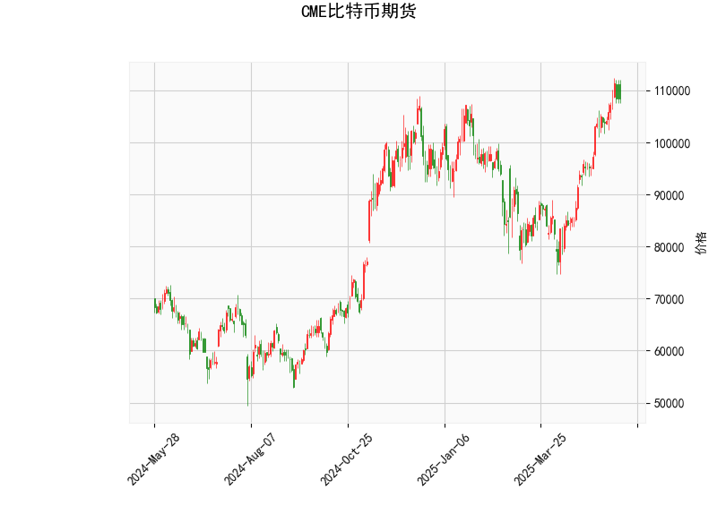

# CME 比特币期货技术分析结果分析

## 1. 对技术分析结果的详细分析

基于提供的CME比特币期货数据，我们对各个技术指标进行逐一分析，以评估当前市场态势。总体而言，这些指标显示比特币价格处于强势上涨阶段，但也显现出潜在的超买风险，需警惕回调可能性。

### 关键指标概述
- **当前价格 (108370.0 USD)**:  
  当前价格已接近历史高位，表明市场处于强势牛市环境中。但与布林带上轨 (110808.90 USD) 相比，仅有微小差距，这暗示价格可能已触及短期阻力位。如果价格无法突破上轨，回调风险将增加。

- **RSI (70.09)**:  
  RSI (Relative Strength Index) 衡量价格变动速度和变化率，目前值为70.09，远高于70的超买阈值。这通常表示市场过度买入，卖出压力可能积聚，导致短期修正或回调。投资者应密切关注RSI是否回落至50-70区间，以寻找潜在买入机会。

- **MACD (4969.17, Signal: 4847.17, Histogram: 122.01)**:  
  MACD (Moving Average Convergence Divergence) 指标显示MACD线 (4969.17) 高于信号线 (4847.17)，且直方图 (122.01) 为正值，这反映出短期看涨动能强劲，价格可能继续上行。然而，直方图值相对较小，表明多头动能可能正在减弱。如果MACD线开始向下交叉信号线，将发出潜在卖出信号，预示回调。

- **布林带 (Upper: 110808.90, Middle: 91489.64, Lower: 72170.37)**:  
  布林带基于移动平均线和标准差构建，目前价格 (108370.0) 紧邻上轨 (110808.90)，这往往是超买信号，暗示价格可能从高位回落至中轨 (91489.64) 或更低。布林带的扩张（上轨与下轨间距加大）表明市场波动性增加，投资者需防范突发逆转。如果价格跌破中轨，将可能测试下轨支撑。

- **K线形态 (CDLLONGLINE 和 CDLMATCHINGLOW)**:  
  - CDLLONGLINE 表示一根实体较长的蜡烛线，通常反映强势上涨趋势，显示多头控制市场。这支持当前价格的强势表现。  
  - CDLMATCHINGLOW 则暗示价格可能在特定低点形成支撑，可能预示短期修正后反弹。这两种形态结合，表明市场虽强势，但存在潜在支撑位，如果价格回调至这些水平，可能吸引买盘。

### 总体市场解读
当前技术指标整体偏向看涨，但超买信号（如RSI > 70 和价格接近布林上轨）增加了短期风险。比特币期货市场往往受全球经济事件和加密货币新闻影响，如果无新催化剂，价格可能进入盘整或回调期。建议结合基本面分析（如美联储政策或比特币ETF动态）以增强判断。

## 2. 近期可能存在的投资或套利机会和策略

基于上述分析，我们评估近期投资和套利机会。比特币期货市场波动性高，机会与风险并存。以下策略以技术指标为主导，强调风险管理，并适合经验丰富的投资者。注意，市场预测并非确定性，实际操作应结合个人风险承受能力和实时数据。

### 潜在投资机会
- **看涨机会**:  
  如果MACD直方图保持正值且价格突破布林上轨（约110809 USD），短期上行潜力较大。可能的投资策略包括：  
  - **买入并持有**: 在当前价位附近买入期货合约，目标设在115000 USD以上。设置止损在布林中轨（约91490 USD）以下，以防范回调。  
  - **动量交易**: 利用CDLLONGLINE的强势信号，在RSI回落至65以下时加仓，捕捉进一步上涨。

- **看跌或回调机会**:  
  超买信号（如RSI > 70）提示短期修正风险。如果价格回落至布林中轨（约91490 USD）或CDLMATCHINGLOW支撑位，投资者可考虑：  
  - **卖出或做空**: 在价格接近上轨时卖出期货合约，目标下探至95000 USD。结合MACD交叉信号作为入场触发。  
  - **均值回归策略**: 等待价格回调到中轨附近买入，预计反弹至上轨。这适合风险厌恶者。

### 潜在套利机会
比特币期货市场常有跨市场或期现套利机会，尤其在CME与其他交易所（如Binance或 CBOE）间价格差异时。以下基于技术分析的策略：
- **跨市场套利**:  
  如果CME比特币期货价格高于现货市场（如Coinbase），可进行期现套利：在CME卖出期货，同时在现货市场买入比特币。当前超买状态可能放大这种差异，预计获利空间在1-3%。监控指标：若RSI回落，价格差异可能扩大。

- **期货合约套利**:  
  CME提供不同到期合约，利用布林带和K线形态识别：  
  - **价差交易**: 如果近期合约（e.g., 12月合约）价格高于远期合约（e.g., 3月合约），可买入远期并卖出近期合约。当前强势形态可能导致价差扩大，但回调风险需注意。  
  - **波动率套利**: 价格接近上轨时，市场波动率上升，可通过期权结合期货进行波动率套利（如买入看跌期权保护）。

### 推荐策略和风险提示
- **核心策略**:  
  - **短期策略**: 采用“买入回调，卖出超买”的方法。例如，在RSI回落至60以下时买入，MACD交叉时卖出。  
  - **长期策略**: 若相信牛市延续，构建多元化头寸（如结合期权 hedging）。  
  - **风险管理**: 始终设置止损（e.g., 基于布林中轨），并控制仓位大小（不超过总资金的10%）。使用CDLMATCHINGLOW作为支撑位参考。

- **风险与注意事项**:  
  比特币市场受宏观因素（如利率变动或地缘政治事件）影响极大，当前超买状态可能引发急剧回调。投资机会基于历史数据推断，非保证。建议使用模拟交易测试策略，并咨询专业顾问以符合本地法规。始终优先考虑风险控制，避免过度杠杆。