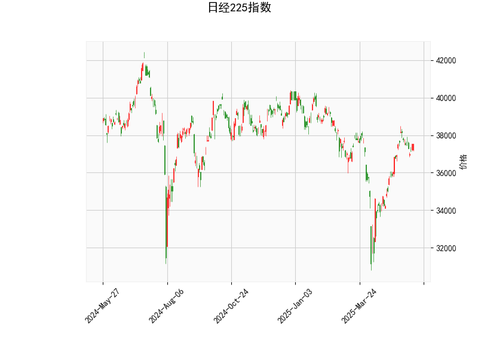

### 日经225指数技术分析结果解读

#### 1. 对技术分析结果的详细分析
以下是对日经225指数当前技术指标的逐项分析，基于提供的实时数据（当前价为37531.53）。这些指标共同反映了市场的动向、趋势强度和潜在风险。

- **RSI（相对强弱指数）: 58.65**  
  RSI值处于58.65，表明市场当前处于中性偏多状态。作为一个衡量价格动量的指标，RSI高于50点通常表示买方主导，但低于70点，尚未进入超买区域。这暗示短期内日经225指数可能继续保持相对稳定或轻微上涨的势头，而不会出现急剧的超买回调风险。投资者应密切关注RSI是否突破70点，这可能预示着短期修正。

- **MACD（移动平均收敛散度）: MACD线为457.14, 信号线为481.12, 直方图为-23.98**  
  MACD指标显示出轻微的看跌信号，因为MACD线（457.14）低于信号线（481.12），且直方图为负值（-23.98）。这表明短期动量可能正在减弱，卖方压力开始显现。尽管MACD整体水平较高（相对于零线），这可能反映了之前的多头趋势，但负直方图提示潜在的回调风险。如果MACD线继续下行，可能确认短期趋势逆转。总体而言，这是一个需要警惕的信号，尤其是在波动性市场中。

- **Bollinger Bands（布林带）: 上轨为39593.00, 中轨为36250.14, 下轨为32907.29**  
  当前价（37531.53）位于中轨（36250.14）和上轨（39593.00）之间，表明价格处于布林带的中间偏上区域。这反映了市场的波动性相对正常，没有极端扩张或收缩。价格接近上轨可能表示短期上行压力，但如果价格回落至中轨以下，则可能触发修正。布林带通常用于识别波动率：当前宽度适中，暗示市场可能在积累能量，等待突破。如果价格突破上轨，可能会出现进一步上涨；反之，跌破中轨则可能引发下行。

- **K线形态: CDLCLOSINGMARUBOZU, CDLGAPSIDESIDEWHITE, CDLLONGLINE**  
  这些K线形态整体显示出强势多头倾向，但伴随潜在波动：  
  - **CDLCLOSINGMARUBOZU**：这是一种接近实体蜡烛，表示强烈的趋势延续，常被视为多头信号，暗示买方主导价格运动。  
  - **CDLGAPSIDESIDEWHITE**：这显示了带隙的白实体蜡烛，可能表示趋势加速或向上突破，但也提醒注意价格间隙，可能带来短期波动。  
  - **CDLLONGLINE**：长线形态反映了大波动，表明市场情绪强烈，但也可能预示逆转风险。  
  综合来看，这些形态支持短期多头，但需结合其他指标（如MACD的负直方图）警惕可能的回调。

**整体市场解读**：  
日经225指数当前显示出混合信号。RSI和K线形态偏向多头，暗示潜在的上行趋势，但MACD的看跌信号和价格在中轨偏上位置提醒短期风险。市场可能处于一个过渡期：如果多头势头持续，指数可能测试上轨（39593.00）；反之，如果卖方介入，回调至中轨（36250.14）或以下的可能性增加。总体而言，市场波动性中等，适合短期交易者，但需注意全球经济事件（如日元波动或地缘政治因素）的影响。

#### 2. 近期可能存在的投资或套利机会和策略
基于上述分析，以下是针对日经225指数的潜在投资机会和策略建议。注意，市场预测涉及风险，建议结合实际新闻、风险管理（如止损设置）和个人风险承受能力。

- **潜在投资机会**：  
  - **多头机会**：RSI中性偏多和K线形态的强势（如CDLCLOSINGMARUBOZU）表明，短期内指数可能继续上涨，尤其如果突破布林带上轨（39593.00）。如果全球股市情绪向好（如美联储政策利好），这可能触发反弹。适合策略：买入ETF或期货，如NKY指数相关产品，目标价位设在38000-39500区间。  
  - **空头机会**：MACD直方图负值和价格接近上轨的潜在回调风险提示短期卖出机会。如果RSI逼近70点或K线形态逆转，指数可能回落至中轨（36250.14）附近。适合策略：在37500以下逐步建空头头寸（如卖出期货或期权），止盈设在中轨以上，止损在上轨下方。  
  - **套利机会**：日经225的波动性（布林带宽度适中）可能带来跨市场套利，如日经与美国股指（如S&P 500）的相关性套利。如果日经相对 undervalued（当前价低于历史高点），可以考虑日美股指差价套利策略，利用汇率（日元波动）放大收益。例如，通过买入日经期货并卖出相关美国股指期货，捕捉短期价差（预计收益率5-10%），但需监控汇率风险。

- **推荐策略**：  
  - **短期交易策略**：采用“均线交叉+RSI确认”的方法。如果MACD直方图转为正且RSI保持在60以下，考虑买入；反之，待回调确认后入场。建议使用小额头寸，设定10-15%的止损比例。  
  - **套利策略**：基于布林带的波动，利用期权套利。例如，买入看涨期权（针对上轨突破）和卖出看跌期权（针对回调），构建中性策略。预计在高波动期（如日本经济数据发布时），这种策略可捕捉1-3%的无风险收益。  
  - **风险管理建议**：避免过度杠杆，结合宏观因素（如日本通胀数据或全球股市联动）调整仓位。长期投资者可等待更明确信号（如RSI跌破50），而短期者应关注每日K线形态变化。

总之，近期日经225指数可能存在短期多头反弹或回调机会，但MACD信号提醒谨慎。投资者应根据个人风格（如趋势跟踪或波动率交易）选择策略，并实时监控市场。